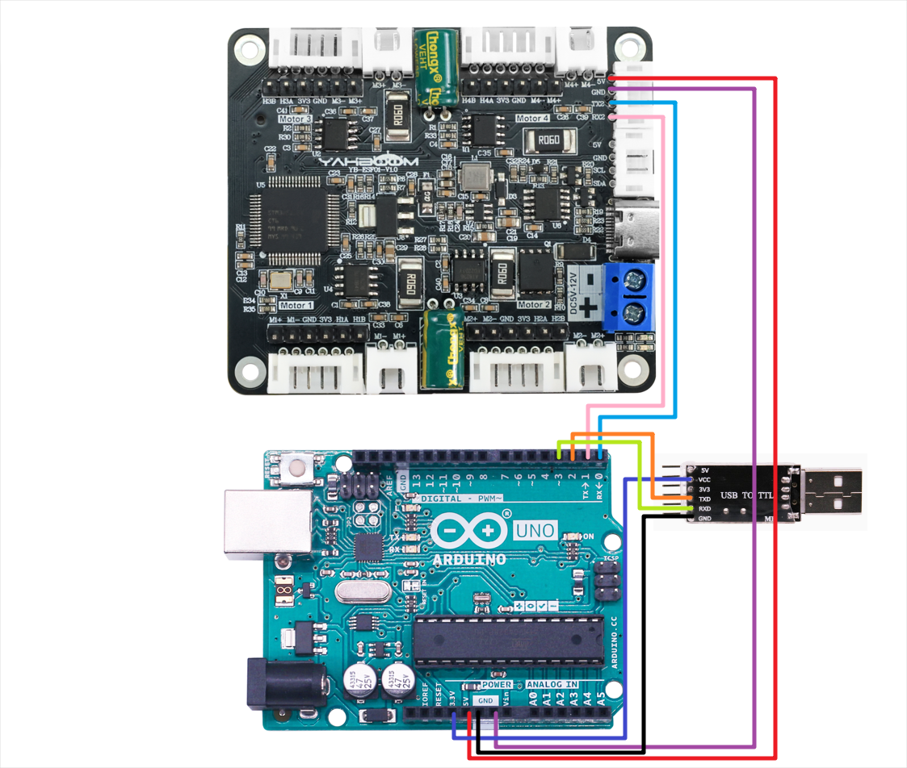

## Untuk Arduino

# Menggerakkan motor dan membaca encoder-USART

## 1.1 Penjelasan

**Harap baca 《0. Pengenalan dan penggunaan motor》 terlebih dahulu untuk memahami parameter motor, metode perkabelan, dan tegangan catu daya yang saat ini Anda gunakan. Untuk menghindari operasi yang tidak tepat dan kerusakan pada board driver atau motor.**

I2C dan komunikasi serial tidak dapat dibagikan, hanya satu yang dapat dipilih.

Kursus ini menggunakan board Arduino UNO. Dan menggunakan Arduino 1.8.5 IDE 

**Sebelum menulis program, jangan hubungkan board driver ke pin RX pada Arduino, jika tidak program tidak dapat ditulis ke board.**

**Setelah program ditulis, hubungkan pin RX pada Arduino.**

##### Perkabelan perangkat keras:



| Motor | **Board driver motor 4-channel**(Motor) |
| :---: | :-------------------------------------: |
|  M2   |                   M-                    |
|   V   |                   3V3                   |
|   A   |                   H1A                   |
|   B   |                   H1B                   |
|   G   |                   GND                   |
|  M1   |                   M+                    |

| **Board driver motor 4-channel** | Arduino UNO |
| :------------------------------: | :---------: |
|               RX2                |     TX      |
|               TX2                |     RX      |
|               GND                |     GND     |
|                5V                |     5V      |

Karena port serial perangkat keras pada board Arduino digunakan untuk berkomunikasi dengan board driver, kasus ini memerlukan port serial USB ke TTL tambahan untuk mencetak data.

| USB TO TTL | Arduino UNO |
| :--------: | :---------: |
|    VCC     |     3V3     |
|    GND     |     GND     |
|    RXD     |      3      |
|    TXD     |      2      |

Konfigurasi port serial: **Baud rate 115200, tanpa pemeriksaan paritas, tanpa kontrol aliran perangkat keras, 1 stop bit**

## 1.2 Analisis kode

```c++
#define UPLOAD_DATA 3  //0: Tidak menerima data 1: Menerima data encoder total 2: Menerima encoder real-time 3: Menerima kecepatan motor saat ini mm/s
#define MOTOR_TYPE 1   //1: motor 520 2: motor 310 3: motor TT disk kode kecepatan 4: motor reduksi DC TT 5: motor 520 tipe L
```

- UPLOAD_DATA: digunakan untuk mengatur data enkoder motor. Atur 1 ke jumlah total pulsa enkoder dan 2 ke data pulsa waktu nyata 10 ms.
- MOTOR_TYPE: digunakan untuk mengatur jenis motor yang digunakan. Cukup ubah angka yang sesuai dengan komentar sesuai motor yang sedang Anda gunakan. Anda tidak perlu mengubah sisa kode.

Jika Anda perlu menggerakkan motor dan mengamati data, cukup ubah dua angka di awal program. Sisa kode tidak perlu diubah.

```c++
#if MOTOR_TYPE == 1
    send_motor_type(1);  // Konfigurasi tipe motor
    delay(100);
    send_pulse_phase(30);  // Konfigurasi rasio reduksi. Periksa manual motor untuk mengetahuinya
    delay(100);
    send_pulse_line(11);  // Konfigurasi garis cincin magnetik. Periksa manual motor untuk mendapatkan hasilnya
    delay(100);
    send_wheel_diameter(67.00);  // Konfigurasi diameter roda dan ukur
    delay(100);
    send_motor_deadzone(1900);  // Konfigurasi zona mati motor, dan eksperimen menunjukkan
    delay(100);
    
  #elif MOTOR_TYPE == 2
  send_motor_type(2);
    delay(100);
    send_pulse_phase(20);
    delay(100);
    send_pulse_line(13);
    delay(100);
    send_wheel_diameter(48.00);
    delay(100);
    send_motor_deadzone(1600);
    delay(100);
    
  #elif MOTOR_TYPE == 3
  send_motor_type(3);
    delay(100);
    send_pulse_phase(45);
    delay(100);
    send_pulse_line(13);
    delay(100);
    send_wheel_diameter(68.00);
    delay(100);
    send_motor_deadzone(1250);
    delay(100);
    
  #elif MOTOR_TYPE == 4
  send_motor_type(4);
    delay(100);
    send_pulse_phase(48);
    delay(100);
    send_motor_deadzone(1000);
    delay(100);
    
  #elif MOTOR_TYPE == 5
  send_motor_type(1);
    delay(100);
    send_pulse_phase(40);
    delay(100);
    send_pulse_line(11);
    delay(100);
    send_wheel_diameter(67.00);
    delay(100);
    send_motor_deadzone(1900);
    delay(100);
  #endif
```

Ini digunakan untuk menyimpan parameter motor Yahboom. Dengan memodifikasi parameter MOTOR_TYPE di atas, konfigurasi sekali klik dapat dilakukan. Biasanya, jangan mengubah kode di sini saat menggunakan motor Yahboom.

Jika Anda menggunakan motor Anda sendiri, atau jika data tertentu perlu dimodifikasi sesuai kebutuhan Anda, Anda dapat memeriksa kursus《1.2 Perintah kontrol》 untuk memahami arti spesifik dari setiap perintah.

```
void loop(){
  
      Motor_USART_Recieve();
      if(g_recv_flag == 1)
    {
      g_recv_flag = 0;
      #if MOTOR_TYPE == 4
        Contrl_Pwm(i*2,i*2,i*2,i*2);
      #else
        Contrl_Speed(i,i,i,i);   // Nilainya adalah -1000~1000
      #endif
        Deal_data_real();
        //delay(100);
      #if UPLOAD_DATA == 1
        sprintf(buffer,"M1:%d,M2:%d,M3:%d,M4:%d\r\n",Encoder_Now[0],Encoder_Now[1],Encoder_Now[2],Encoder_Now[3]);
        printSerial.println(buffer);
      #elif UPLOAD_DATA == 2
        sprintf(buffer,"M1:%d,M2:%d,M3:%d,M4:%d\r\n",Encoder_Offset[0],Encoder_Offset[1],Encoder_Offset[2],Encoder_Offset[3]);
        printSerial.println(buffer);
      #elif UPLOAD_DATA == 3
        dtostrf(g_Speed[0], 4, 2, string1);
        dtostrf(g_Speed[1], 4, 2, string2);
        dtostrf(g_Speed[2], 4, 2, string3);
        dtostrf(g_Speed[3], 4, 2, string4);
        sprintf(buffer,"M1:%s,M2:%s,M3:%s,M4:%s\r\n",string1,string2,string3,string4);
        printSerial.println(buffer);
      #endif
      i++;
      if (i == 1000) i = 0;
      
    }
}
```

Dalam program loop, kecepatan keempat motor akan ditingkatkan secara perlahan dari 0 hingga 1000. Jika tipe motornya 4, yaitu motor tanpa encoder, PWM motor dikontrol secara langsung.

Pada saat yang sama, data yang dikirim oleh papan pengemudi dibaca dan dicetak pada saat yang sama

```
// Memeriksa data yang dikirim dari board driver, dan menyimpan data yang memenuhi protokol komunikasi
void Deal_Control_Rxtemp(uint8_t rxtemp)
{
    static u8 step = 0;
    static u8 start_flag = 0;


    if(rxtemp == '$' &&     start_flag == 0)
    {
        start_flag = 1;
        memset(g_recv_buff,0,RXBUFF_LEN);  // Bersihkan data
    }
    
    else if(start_flag == 1)
    {
            if(rxtemp == '#')
            {
                start_flag = 0;
                step = 0;
                g_recv_flag = 1;
        // Periksa empat karakter pertama
    if (strncmp("MAll:",(char*)g_recv_buff,5)==0 ||
        strncmp("MTEP:",(char*)g_recv_buff,5)==0 ||
        strncmp("MSPD:",(char*)g_recv_buff,5)==0) {
        if (isValidNumbers((char*)g_recv_buff + 5)) {
                // Jika kondisi terpenuhi, cetak data
                memcpy(g_recv_buff_deal,g_recv_buff,RXBUFF_LEN);
            }
    } else {
        // Bersihkan buffer saat tidak cocok untuk menghindari data tidak valid yang tersisa
        memset(g_recv_buff, 0, RXBUFF_LEN);
    }
            }
            else
            {
                if(step > RXBUFF_LEN)
                {
                    start_flag = 0;
                    step = 0;
                    memset(g_recv_buff,0,RXBUFF_LEN);  // Bersihkan data yang diterima
                }
                else
                {
                    g_recv_buff[step] = rxtemp;
                    step++;
                }
            }
    }
    
}


// Memformat data yang disimpan dari board driver dan mempersiapkannya untuk dicetak
void Deal_data_real(void)
{
     static uint8_t data[RXBUFF_LEN];
   uint8_t  length = 0;
    // Encoder keseluruhan
     if ((strncmp("MAll",(char*)g_recv_buff_deal,4)==0))
    {
        length = strlen((char*)g_recv_buff_deal)-5;
        for (uint8_t i = 0; i < length; i++)
        {
            data[i] = g_recv_buff_deal[i+5];  // Hapus titik dua
        }  
                data[length] = '\0';    
                char* strArray[10];  // Array pointer Panjangnya didefinisikan oleh nomor pemisahan char 1 byte char* 4 byte
                char mystr_temp[4][10] = {'\0'}; 
                splitString(strArray,(char*)data, ", ");  // Pisahkan dengan koma
                for (int i = 0; i < 4; i++)
                {
                        strcpy(mystr_temp[i],strArray[i]);
                        Encoder_Now[i] = atoi(mystr_temp[i]);
                }
                
        }
        // Data encoder real-time 10ms
        else if ((strncmp("MTEP",(char*)g_recv_buff_deal,4)==0))
    {
        length = strlen((char*)g_recv_buff_deal)-5;
        for (uint8_t i = 0; i < length; i++)
        {
            data[i] = g_recv_buff_deal[i+5];  // Hapus titik dua
        }  
                data[length] = '\0';        


                char* strArray[10];  // Array pointer Panjangnya didefinisikan oleh nomor pemisahan char 1 byte char* 4 byte
                char mystr_temp[4][10] = {'\0'}; 
                splitString(strArray,(char*)data, ", ");  // Pisahkan dengan koma
                for (int i = 0; i < 4; i++)
                {
                        strcpy(mystr_temp[i],strArray[i]);
                        Encoder_Offset[i] = atoi(mystr_temp[i]);
                }
        }
        // Kecepatan
        else if ((strncmp("MSPD",(char*)g_recv_buff_deal,4)==0))
    {
        length = strlen((char*)g_recv_buff_deal)-5;
        for (uint8_t i = 0; i < length; i++)
        {
            data[i] = g_recv_buff_deal[i+5];  // Hapus titik dua
        }  
                data[length] = '\0';    
                
                char* strArray[10];  // Array pointer Panjangnya didefinisikan oleh nomor pemisahan char 1 byte char* 4 byte
                char mystr_temp[4][10] = {'\0'}; 
                splitString(strArray,(char*)data, ", ");  // Pisahkan dengan koma
                for (int i = 0; i < 4; i++)
                {
                        strcpy(mystr_temp[i],strArray[i]);
                        g_Speed[i] = atof(mystr_temp[i]);
                }
        }
}
```

- Deal_Control_Rxtemp: Saring data yang diterima dan simpan data yang memenuhi protokol komunikasi.
- Deal_data_real: Ekstrak data asli yang disimpan dan rekonstruksi format cetak baru.

## 1.3 Fenomena Eksperimental

Sebelum menulis program, jangan hubungkan papan driver ke pin RX pada Arduino, jika tidak, program tidak dapat ditulis ke papan. Setelah program ditulis, hubungkan pin RX pada Arduino.

Hubungkan modul USB ke TTL ke komputer, gunakan asisten debugging port serial komputer "UartAssist", buka port serial USB ke TTL, dan Anda dapat menerima data yang diproses.

Jika Anda membuka port serial motherboard Arduino, Anda mungkin melihat bahwa port serial tersebut mencetak data asli. Setelah dinyalakan kembali, Anda dapat melihat bahwa motor akan secara bertahap bertambah cepat, lalu berhenti, dan berulang.

Pada saat yang sama, Anda dapat melihat bahwa nilai motor cetak terus berubah dalam asisten port serial


## 