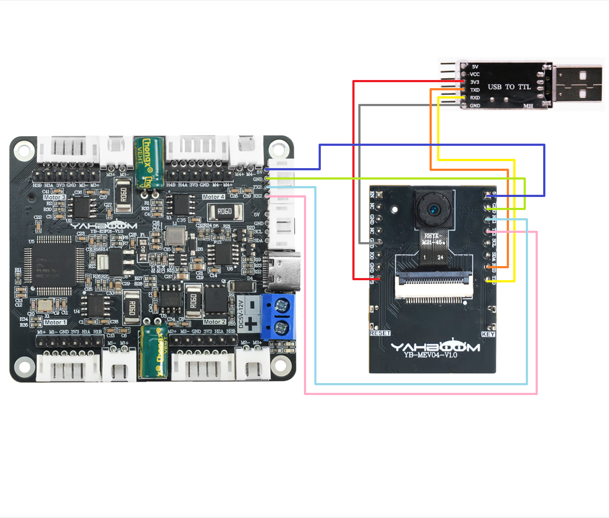
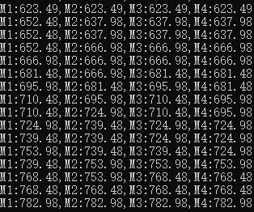

# Untuk ESP32

## Motor penggerak dan encoder pembaca-USART

## 1.1 Penjelasan

Harap baca "0. Pengenalan dan Penggunaan Motor" terlebih dahulu untuk memahami parameter motor, metode pengkabelan, dan tegangan catu daya yang Anda gunakan. Hal ini untuk menghindari pengoperasian yang tidak tepat dan kerusakan pada papan driver atau motor.

Komunikasi I2C dan serial tidak dapat dibagi, hanya satu yang dapat dipilih.

Kursus ini menggunakan modul transmisi gambar YahboomESP32 versi lite.

Jika Anda menggunakan papan ESP32-S3 lainnya, Anda perlu mengubah pengaturan pin dalam program sesuai dengan situasi pin papan Anda.

Gunakan ESP-IDF versi 5.4.0 untuk mengkompilasi proyek.

##### Pengkabelan perangkat keras:



| Motor | **4-channel motor drive board**(Motor) |
| :---: | :------------------------------------: |
|  M2   |                   M-                   |
|   V   |                  3V3                   |
|   A   |                  H1A                   |
|   B   |                  H1B                   |
|   G   |                  GND                   |
|  M1   |                   M+                   |

| **4-channel motor drive board** | ESP32S3 |
| :-----------------------------: | :-----: |
|               RX2               |   TX1   |
|               TX2               |   RX1   |
|               GND               |   GND   |
|               5V                |   5V    |

Modul port serial USB ke TTL perlu dihubungkan, terutama untuk mencetak data.

Saat menggunakan modul transmisi gambar Yahboom ESP32 versi lite, 3V3 dari modul port serial USB ke TTL harus diganti dengan 5V dan dihubungkan ke 5V pada papan ESP32 untuk menulis program secara normal. Setelah program ditulis, program dapat dialihkan kembali ke 3V3.

| USB TO TTL | ESP32S3 |
| :--------: | :-----: |
|    3V3     |   3V3   |
|    TXD     |   RX0   |
|    RXD     |   TX0   |
|    GND     |   GND   |

Konfigurasi port serial: **Baud rate 115200, tidak ada pemeriksaan paritas, tidak ada kontrol aliran perangkat keras, 1 stop bit**

## 1.2 Analisis kode

```
#define UART1_TX_PIN    36
#define UART1_RX_PIN    35
```

Kode ini didefinisikan dalam file `uart_module.h`.

Jika Anda perlu mengubah pin untuk port serial agar dapat berkomunikasi dengan papan penggerak motor empat arah, Anda dapat mengubah nomornya di sini.

```c++
#define UPLOAD_DATA 3  // 0: Tidak menerima data 1: Menerima data encoder total 2: Menerima encoder real-time 3: Menerima kecepatan motor saat ini mm/s
#define MOTOR_TYPE 1   // 1: motor 520 2: motor 310 3: motor TT disk kode kecepatan 4: motor reduksi DC TT 5: motor 520 tipe L
```

- UPLOAD_DATA: digunakan untuk mengatur data enkoder motor. Atur 1 ke jumlah total pulsa enkoder dan 2 ke data pulsa waktu nyata 10 ms.
- MOTOR_TYPE: digunakan untuk mengatur jenis motor yang digunakan. Cukup ubah angka yang sesuai dengan komentar sesuai motor yang sedang Anda gunakan. Anda tidak perlu mengubah sisa kode.

Jika Anda perlu menggerakkan motor dan mengamati data, cukup ubah dua angka di awal program. Sisa kode tidak perlu diubah.

```
#if MOTOR_TYPE == 1
    send_motor_type(1);  // Konfigurasi tipe motor
    delay(100);
    send_pulse_phase(30);  // Konfigurasi rasio reduksi. Periksa manual motor untuk mengetahuinya
    delay(100);
    send_pulse_line(11);  // Konfigurasi garis cincin magnetik. Periksa manual motor untuk mendapatkan hasilnya
    delay(100);
    send_wheel_diameter(67.00);  // Konfigurasi diameter roda dan ukur
    delay(100);
    send_motor_deadzone(1900);  // Konfigurasi zona mati motor, hasil eksperimen
    delay(100);
    
  #elif MOTOR_TYPE == 2
  send_motor_type(2);
    delay(100);
    send_pulse_phase(20);
    delay(100);
    send_pulse_line(13);
    delay(100);
    send_wheel_diameter(48.00);
    delay(100);
    send_motor_deadzone(1600);
    delay(100);
    
  #elif MOTOR_TYPE == 3
  send_motor_type(3);
    delay(100);
    send_pulse_phase(45);
    delay(100);
    send_pulse_line(13);
    delay(100);
    send_wheel_diameter(68.00);
    delay(100);
    send_motor_deadzone(1250);
    delay(100);
    
  #elif MOTOR_TYPE == 4
  send_motor_type(4);
    delay(100);
    send_pulse_phase(48);
    delay(100);
    send_motor_deadzone(1000);
    delay(100);
    
  #elif MOTOR_TYPE == 5
  send_motor_type(1);
    delay(100);
    send_pulse_phase(40);
    delay(100);
    send_pulse_line(11);
    delay(100);
    send_wheel_diameter(67.00);
    delay(100);
    send_motor_deadzone(1900);
    delay(100);
  #endif
```

Ini digunakan untuk menyimpan parameter motor Yahboom. Dengan memodifikasi parameter MOTOR_TYPE di atas, konfigurasi sekali klik dapat dilakukan.

Biasanya, jangan mengubah kode di sini saat menggunakan motor Yahboom.

Jika Anda menggunakan motor Anda sendiri, atau jika data tertentu perlu dimodifikasi sesuai kebutuhan Anda, Anda dapat memeriksa kursus《1.2 Perintah kontrol》 untuk memahami arti spesifik dari setiap perintah.

```
void MotorControl_Task(void *arg) {
    static int i = 0;
    while(1) {
        if(g_recv_flag == 1)  // Pemeriksaan flag penerimaan
        {
            g_recv_flag = 0;  // Reset flag
            // Pilih mode kontrol berdasarkan tipe motor
            #if MOTOR_TYPE == 4
            Contrl_Pwm(i*20,i*20,i*20,i*20);  // Mode kontrol PWM
            #else
            Contrl_Speed(i*10,i*10,i*10,i*10);  // Mode kontrol kecepatan
            #endif
            
            Deal_data_real();
            
            #if UPLOAD_DATA == 1
                printf("M1:%d,M2:%d,M3:%d,M4:%d\r\n",Encoder_Now[0],Encoder_Now[1],Encoder_Now[2],Encoder_Now[3]);
            #elif UPLOAD_DATA == 2
                printf("M1:%d,M2:%d,M3:%d,M4:%d\r\n",Encoder_Offset[0],Encoder_Offset[1],Encoder_Offset[2],Encoder_Offset[3]);
            #elif UPLOAD_DATA == 3
                printf("M1:%.2f,M2:%.2f,M3:%.2f,M4:%.2f\r\n",g_Speed[0],g_Speed[1],g_Speed[2],g_Speed[3]);
            #endif
            
            i = (i < 100) ? i+1 : 0;
            delay_ms(100);
        }
        delay_ms(1);  // Mencegah tugas macet
    }
}
```

Pada putaran program utama, kecepatan keempat motor akan ditingkatkan secara perlahan dari 0 hingga 1000. Jika jenis motornya adalah 4, yaitu motor tanpa enkoder, PWM motor akan dikontrol secara langsung.

Pada saat yang sama, data yang dikirim oleh papan pengemudi dibaca dan dicetak.

```c++
//Memeriksa data yang dikirim dari board driver, dan menyimpan data yang memenuhi protokol komunikasi
//Check the data sent from the driver board, and save the data that meets the communication protocol
void Deal_Control_Rxtemp(uint8_t rxtemp)
{
    static u8 step = 0;
    static u8 start_flag = 0;


    if(rxtemp == '$' &&     start_flag == 0)
    {
        start_flag = 1;
        memset(g_recv_buff,0,RXBUFF_LEN);//Bersihkan data Clear data
    }
    
    else if(start_flag == 1)
    {
            if(rxtemp == '#')
            {
                start_flag = 0;
                step = 0;
                g_recv_flag = 1;
        // Periksa empat karakter pertama  Check the first four characters
    if (strncmp("MAll:",(char*)g_recv_buff,5)==0 ||
        strncmp("MTEP:",(char*)g_recv_buff,5)==0 ||
        strncmp("MSPD:",(char*)g_recv_buff,5)==0) {
        if (isValidNumbers((char*)g_recv_buff + 5)) {
                // Jika kondisi terpenuhi, cetak data  If the conditions are met, print the data
                memcpy(g_recv_buff_deal,g_recv_buff,RXBUFF_LEN);
            }
    } else {
        // Bersihkan buffer saat tidak cocok untuk menghindari data tidak valid yang tersisa Clear the buffer when there is no match to avoid residual invalid data
        memset(g_recv_buff, 0, RXBUFF_LEN);
    }
            }
            else
            {
                if(step > RXBUFF_LEN)
                {
                    start_flag = 0;
                    step = 0;
                    memset(g_recv_buff,0,RXBUFF_LEN);//Bersihkan data yang diterima   Clear received data
                }
                else
                {
                    g_recv_buff[step] = rxtemp;
                    step++;
                }
            }
    }
    
}


//Memformat data yang disimpan dari board driver dan mempersiapkannya untuk dicetak
//Format the data saved from the driver board and prepare it for printing
void Deal_data_real(void)
{
     static uint8_t data[RXBUFF_LEN];
   uint8_t  length = 0;
    //Encoder keseluruhan    Overall encoder
     if ((strncmp("MAll",(char*)g_recv_buff_deal,4)==0))
    {
        length = strlen((char*)g_recv_buff_deal)-5;
        for (uint8_t i = 0; i < length; i++)
        {
            data[i] = g_recv_buff_deal[i+5]; //Hapus titik dua Remove the colon
        }  
                data[length] = '\0';    
                char* strArray[10];//Array pointer Panjangnya didefinisikan oleh nomor pemisahan char 1 byte char* 4 byte    Pointer array The length is defined by the split number char 1 byte char* 4 bytes
                char mystr_temp[4][10] = {'\0'}; 
                splitString(strArray,(char*)data, ", ");//Pisahkan dengan koma Split by comma
                for (int i = 0; i < 4; i++)
                {
                        strcpy(mystr_temp[i],strArray[i]);
                        Encoder_Now[i] = atoi(mystr_temp[i]);
                }
                
        }
        //Data encoder real-time 10ms  10ms real-time encoder data
        else if ((strncmp("MTEP",(char*)g_recv_buff_deal,4)==0))
    {
        length = strlen((char*)g_recv_buff_deal)-5;
        for (uint8_t i = 0; i < length; i++)
        {
            data[i] = g_recv_buff_deal[i+5]; //Hapus titik dua Remove the colon
        }  
                data[length] = '\0';        


                char* strArray[10];//Array pointer Panjangnya didefinisikan oleh nomor pemisahan char 1 byte char* 4 byte       Pointer array The length is defined by the split number char 1 byte char* 4 bytes
                char mystr_temp[4][10] = {'\0'}; 
                splitString(strArray,(char*)data, ", ");//Pisahkan dengan koma Split by comma
                for (int i = 0; i < 4; i++)
                {
                        strcpy(mystr_temp[i],strArray[i]);
                        Encoder_Offset[i] = atoi(mystr_temp[i]);
                }
        }
        //Kecepatan    Speed
        else if ((strncmp("MSPD",(char*)g_recv_buff_deal,4)==0))
    {
        length = strlen((char*)g_recv_buff_deal)-5;
        for (uint8_t i = 0; i < length; i++)
        {
            data[i] = g_recv_buff_deal[i+5]; //Hapus titik dua Remove the colon
        }  
                data[length] = '\0';    
                
                char* strArray[10];//Array pointer Panjangnya didefinisikan oleh nomor pemisahan char 1 byte char* 4 byte       Pointer array The length is defined by the split number char 1 byte char* 4 bytes
                char mystr_temp[4][10] = {'\0'}; 
                splitString(strArray,(char*)data, ", ");//Pisahkan dengan koma Split by comma
                for (int i = 0; i < 4; i++)
                {
                        strcpy(mystr_temp[i],strArray[i]);
                        g_Speed[i] = atof(mystr_temp[i]);
                }
        }
}
```

- Deal_Control_Rxtemp: Saring data yang diterima dan simpan data yang memenuhi protokol komunikasi.
- Deal_data_real: Ekstrak data asli yang disimpan dan rekonstruksi format cetak baru.

## 1.3 Fenomena Eksperimental

Setelah kabelnya terpasang dengan benar, tulis program ke motherboard. Setelah dinyalakan kembali, Anda dapat melihat bahwa motor akan secara bertahap bertambah cepat, lalu berhenti, dan berulang.

Pada saat yang sama, Anda dapat melihat nilai motor terus berubah di monitor serial.



# 