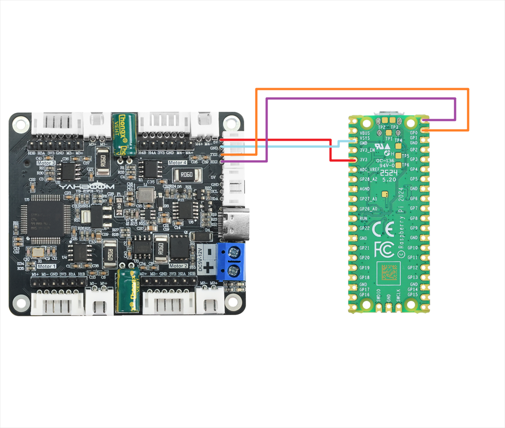
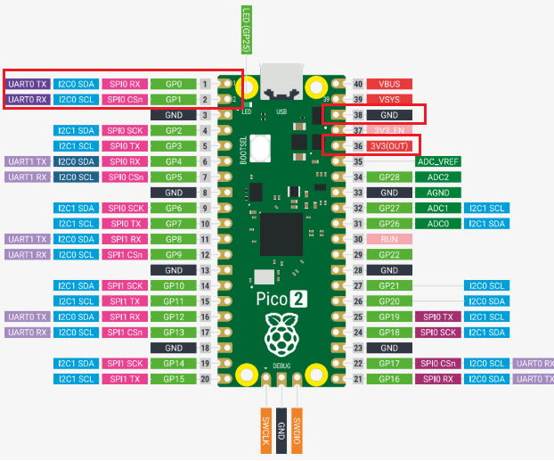
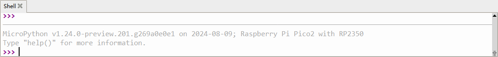
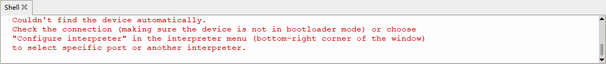
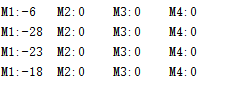

## For PICO2

# Motor penggerak dan encoder pembaca-USART

## 1.1 Penjelasan

Harap baca "0. Pengenalan dan Penggunaan Motor" terlebih dahulu untuk memahami parameter motor, metode pengkabelan, dan tegangan catu daya yang Anda gunakan. Hal ini untuk menghindari pengoperasian yang tidak tepat dan kerusakan pada papan driver atau motor.

Komunikasi I2C dan serial tidak dapat dibagi, hanya satu yang dapat dipilih.

##### Pengkabelan perangkat keras:



| Motor | **4-channel motor drive board**(Motor) |
| :---: | :------------------------------------: |
|  M2   |                   M-                   |
|   V   |                  3V3                   |
|   A   |                  H1A                   |
|   B   |                  H1B                   |
|   G   |                  GND                   |
|  M1   |                   M+                   |

| **4-channel motor drive board** | Pico2 |
| :-----------------------------: | :---: |
|               RX2               |  GP0  |
|               TX2               |  GP1  |
|               GND               |  GND  |
|               5V                |  3V3  |

 

## 1.2 Instructions

Buka kode menggunakan perangkat lunak Thonny, hubungkan ke Raspberry Pi pico2, dan klik tombol berhenti di ujung kanan bilah alat atas.


Kemudian, Anda dapat melihat informasi firmware saat ini di pico2 muncul di bilah pesan di bagian bawah, yang berarti perangkat lunak telah mengenali port serial.



Jika pesan di sini menunjukkan bahwa port serial tidak dapat dikenali, Anda perlu merujuk ke tutorial flashing firmware dan mem-flash firmware ke motherboard agar port serial dapat dikenali.



 Setelah berhasil mengidentifikasi port serial dan mencetak informasi firmware, klik tombol hijau untuk mulai menjalankan skrip.


## 1.3 Code analysis

```c++
UPLOAD_DATA = 3  #0: Tidak menerima data 1: Menerima data encoder total 2: Menerima encoder real-time 3: Menerima kecepatan motor saat ini mm/s
MOTOR_TYPE = 1  #1: motor 520 2: motor 310 3: motor TT disk kode kecepatan 4: motor reduksi DC TT 5: motor 520 tipe L
```

- UPLOAD_DATA: digunakan untuk mengatur data enkoder motor. Atur 1 ke jumlah total pulsa enkoder dan 2 ke data pulsa waktu nyata 10 ms.
- MOTOR_TYPE: digunakan untuk mengatur jenis motor yang digunakan. Cukup ubah angka yang sesuai dengan komentar sesuai motor yang sedang Anda gunakan. Anda tidak perlu mengubah sisa kode.

Jika Anda perlu menggerakkan motor dan mengamati data, cukup ubah dua angka di awal program. Sisa kode tidak perlu diubah.

```c++
def set_motor_parameter():
    if MOTOR_TYPE == 1:
        set_motor_type(1)  # Konfigurasi tipe motor
        time.sleep(0.1)
        set_pluse_phase(30)  # Konfigurasi rasio reduksi, periksa manual motor
        time.sleep(0.1)
        set_pluse_line(11)  # Konfigurasi garis cincin magnetik, periksa manual motor
        time.sleep(0.1)
        set_wheel_dis(67.00)  # Konfigurasi diameter roda, hasil pengukuran
        time.sleep(0.1)
        set_motor_deadzone(1600)  # Konfigurasi zona mati motor, hasil eksperimen
        time.sleep(0.1)
    elif MOTOR_TYPE == 2:
        set_motor_type(2)
        time.sleep(0.1)
        set_pluse_phase(20)
        time.sleep(0.1)
        set_pluse_line(13)
        time.sleep(0.1)
        set_wheel_dis(48.00)
        time.sleep(0.1)
        set_motor_deadzone(1200)
        time.sleep(0.1)
    elif MOTOR_TYPE == 3:
        set_motor_type(3)
        time.sleep(0.1)
        set_pluse_phase(45)
        time.sleep(0.1)
        set_pluse_line(13)
        time.sleep(0.1)
        set_wheel_dis(68.00)
        time.sleep(0.1)
        set_motor_deadzone(1250)
        time.sleep(0.1)
    elif MOTOR_TYPE == 4:
        set_motor_type(4)
        time.sleep(0.1)
        set_pluse_phase(48)
        time.sleep(0.1)
        set_motor_deadzone(1000)
        time.sleep(0.1)
    elif MOTOR_TYPE == 5:
        set_motor_type(1)
        time.sleep(0.1)
        set_pluse_phase(40)
        time.sleep(0.1)
        set_pluse_line(11)
        time.sleep(0.1)
        set_wheel_dis(67.00)
        time.sleep(0.1)
        set_motor_deadzone(1600)
        time.sleep(0.1)
```

Ini digunakan untuk menyimpan parameter motor Yahboom. Dengan memodifikasi parameter MOTOR_TYPE di atas, konfigurasi sekali klik dapat dilakukan.

Biasanya, jangan mengubah kode di sini saat menggunakan motor Yahboom.

Jika Anda menggunakan motor Anda sendiri, atau jika data tertentu perlu dimodifikasi sesuai kebutuhan Anda, Anda dapat memeriksa kursus《1.2 Perintah kontrol》 untuk memahami arti spesifik dari setiap perintah.

```c++
if __name__ == "__main__":
    try:
        t = 0
        print("please wait...")
        send_upload_command(UPLOAD_DATA)  # Kirim data yang perlu dilaporkan ke modul motor
        time.sleep(0.1)
        set_motor_parameter()  # Atur parameter motor
        while True:
            received_message = receive_data()  # Menerima pesan
            if received_message:  # Jika ada data yang dikembalikan
                parsed = parse_data(received_message)  # Parsing data
                if parsed:
                    print(parsed)  # Cetak data yang telah di-parsing
            t += 10
            M1 = t
            M2 = t
            M3 = t
            M4 = t
            
            if MOTOR_TYPE == 4:
                control_pwm(M1*2, M2*2, M3*2, M4*2)
            else:
                control_speed(M1, M2, M3, M4)  # Kirim perintah langsung untuk mengontrol motor
            if t> 1000 or t < -1000:
                t = 0
            time.sleep(0.1)
```

Dalam program loop, kecepatan keempat motor akan ditingkatkan secara perlahan dari 0 hingga 1000. Jika tipe motornya 4, yaitu motor tanpa encoder, PWM motor dikontrol secara langsung.

Pada saat yang sama, data yang dikirim oleh papan pengemudi dibaca dan dicetak pada saat yang sama.

```
# Menerima data
def receive_data():
    global recv_buffer
    if uart.any() > 0:  # Periksa apakah ada data di buffer port serial
        recv_buffer += uart.read(uart.any()).decode()  # Baca dan decode data
        
        # Pisahkan pesan berdasarkan karakter akhir "#"
        messages = recv_buffer.split("#")
        recv_buffer = messages[-1]
        
        if len(messages) > 1:
            return messages[0] + "#"  # Kembalikan satu pesan lengkap
    return None

# Parsing data yang diterima
def parse_data(data):
    data = data.strip()  # Hapus spasi atau baris baru di kedua ujung
    if data.startswith("$MAll:"):
        values_str = data[6:-1]  # Hapus "$MAll:" dan "#"
        values = list(map(int, values_str.split(',')))  # Pisahkan dan konversi ke integer
        parsed = ', '.join([f"M{i+1}:{value}" for i, value in enumerate(values)])
        return parsed
    elif data.startswith("$MTEP:"):
        values_str = data[6:-1]
        values = list(map(int, values_str.split(',')))
        parsed = ', '.join([f"M{i+1}:{value}" for i, value in enumerate(values)])
        return parsed
    elif data.startswith("$MSPD:"):
        values_str = data[6:-1]
        values = [float(value) if '.' in value else int(value) for value in values_str.split(',')]
        parsed = ', '.join([f"M{i+1}:{value}" for i, value in enumerate(values)])
        return parsed
```

Setelah mendapatkan data dari papan pengemudi, maka dilakukan pemindahan gigi, dan pemindahan gigi tersebut diperlukan untuk mendapatkan data yang benar.

 

## 1.4 Fenomena Eksperimental

Setelah kabel terpasang dengan benar, colokkan motherboard ke port USB komputer, lalu klik tombol berhenti berwarna merah pada perangkat lunak. Biasanya, Anda akan melihat informasi firmware muncul di bilah pesan di bawah.

Kemudian, klik tombol jalankan berwarna hijau, dan Anda dapat melihat bahwa motor akan secara bertahap menambah kecepatan, lalu berhenti, dan mengulanginya lagi.

Pada saat yang sama, Anda dapat melihat nilai motor yang dicetak pada bilah pesan terus berubah.



## 