# Welcome to 4-Channel Motor Drive Module repository

## 1.1 Pengenalan Board Driver Motor 4-Channel

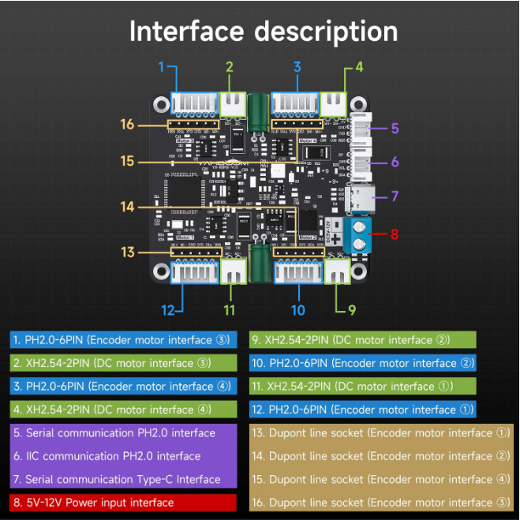

### Pengenalan Produk:

Modul driver motor encoder 4-channel mengintegrasikan koprosesor chip tunggal berkinerja tinggi, yang dapat terhubung dengan mulus dengan berbagai kontroler seperti MSPM0, STM32, Raspberry Pi dan Jetson melalui komunikasi port serial atau IIC, menyederhanakan proses penggerak.

Hanya membutuhkan empat kabel penghubung untuk mencapai komunikasi efisien dengan unit kontrol utama untuk dengan mudah mengontrol motor dan mendapatkan data encoder, mengurangi jumlah kabel dan mengurangi kesulitan operasi.

Pada saat yang sama, mendukung penggerak sebagian besar motor TT encoder Hall, motor reduksi DC 520/310 dan lainnya di pasaran.

### Tabel Parameter:

| Spesifikasi Teknis                         |             Parameter             |
| :----------------------------------------- | :-------------------------------: |
| Tegangan Input yang Direkomendasikan       |               5-12v               |
| Arus DC untuk Pin 5v                       |               0.7A                |
| Arus DC untuk Pin 3.3v                     |               500ma               |
| Arus penggerak berkelanjutan motor tunggal | Default 4A (output maksimum 5.5A) |
| Panjang * Lebar * Tinggi                   |         56 * 65 * 13.4mm          |
| Interface motor encoder                    |  PH2.0-6PIN、soket kabel Dupont   |
| Interface motor DC                         |            XH2.54-2PIN            |

## 4 interface motor pada modul sesuai dengan motor pada mobil robot, seperti ditunjukkan di bawah ini

M1 -> Motor kiri atas (roda depan kiri mobil) M2 -> Motor kiri bawah (roda belakang kiri mobil) M3 -> Motor kanan atas (roda depan kanan mobil) M4 -> Motor kanan bawah (roda belakang kanan mobil)

## Konfigurasi Port Serial

**Baud rate 115200, tanpa paritas, tanpa kontrol aliran perangkat keras, 1 stop bit**

 

### 1.Konfigurasi Tipe Motor

| Perintah  | Penjelasan  |  Contoh   |          Keterangan          | Default Firmware | Simpan saat mati |
| :-------: | :---------: | :-------: | :--------------------------: | :--------------: | :--------------: |
| $mtype:x# | Model motor | $mtype:1# | Model motor adalah motor 520 |    Motor 520     |        Y         |
|  Catatan  |             |           |                              |                  |                  |

1. Pemilihan tipe motor. Jika encoder motor A terhubung ke port A board, maka B terhubung ke B. Anda perlu memilih model motor 310. Jika tidak, Anda perlu memilih motor 520 atau motor TT.
2. Perintah dapat dikirim dalam huruf besar atau kecil semua.
3. Jika perintah di atas berhasil, akan mengembalikan pesan **perintah+OK**. Jika tidak ada pesan yang dikembalikan, periksa koneksi port serial.
4. x: adalah tipe motor. Tipe motor yang diwakili oleh nilai yang berbeda adalah sebagai berikut: 1: motor 520 2: motor 310 3: motor TT (dengan encoder) 4: motor TT (tanpa encoder)

Catatan: Jika Anda menggunakan motor tanpa encoder, Anda dapat memilih tipe 4, yaitu perintahnya adalah: $mtype:4# Jika Anda menggunakan motor dengan encoder, Anda dapat memilih salah satu dari 1, 2, dan 3.

### 2.Konfigurasi Deadband Motor

|    Perintah     |              Penjelasan               |     Contoh      |                          Keterangan                          | Default Firmware | Simpan saat mati |
| :-------------: | :-----------------------------------: | :-------------: | :----------------------------------------------------------: | :--------------: | :--------------: |
| $deadzone:xxxx# | Konfigurasi zona mati pulsa pwm motor | $deadzone:1650# | Saat mengontrol PWM, nilai zona mati akan ditambahkan secara default sehingga motor tidak akan memiliki area osilasi. |       1600       |        Y         |
|     Catatan     |                                       |                 |                                                              |                  |                  |

1. Perintah dapat dikirim dalam huruf besar atau kecil semua
2. Jika perintah di atas berhasil, akan mengembalikan pesan **perintah+OK**. Jika tidak ada pesan yang dikembalikan, periksa koneksi port serial
3. xxxx: adalah nilai zona mati, yang perlu diukur. Dengan mengubah nilai ini, getaran minimum motor dapat dihilangkan
4. Rentang nilai zona mati (0-3600)

### 3.Konfigurasi Garis Fase Motor

|  Perintah  |          Penjelasan          |   Contoh   |                      Keterangan                      | Default Firmware | Simpan saat mati |
| :--------: | :--------------------------: | :--------: | :--------------------------------------------------: | :--------------: | :--------------: |
| $mline:xx# | Konfigurasi garis fase motor | $mline:13# | Konfigurasi fase encoder Hall motor menjadi 13 garis |        11        |        Y         |
|  Catatan   |                              |            |                                                      |                  |                  |

1. Perintah dapat dikirim dalam huruf besar atau kecil semua
2. Perintah di atas akan mengembalikan informasi **perintah+OK** jika berhasil. Jika tidak ada informasi yang dikembalikan, periksa koneksi port serial
3. xx: Ini adalah fase encoder Hall untuk satu putaran. Nilai ini perlu diperoleh dengan memeriksa tabel parameter motor dari pedagang
4. Untuk motor dengan encoder: Nilai ini memainkan **peran utama** dalam mengontrol kecepatan. Nilai ini harus benar
5. Motor tanpa encoder: Konfigurasi nilai ini dapat diabaikan

### 4.Konfigurasi Rasio Reduksi Motor

|  Perintah   |           Penjelasan            |   Contoh    |                 Keterangan                 | Default Firmware | Simpan saat mati |
| :---------: | :-----------------------------: | :---------: | :----------------------------------------: | :--------------: | :--------------: |
| $mphase:xx# | Konfigurasi rasio reduksi motor | $mphase:40# | Konfigurasi rasio reduksi motor menjadi 40 |        30        |        Y         |
| **Catatan** |                                 |             |                                            |                  |                  |

1. Perintah dapat dikirim dalam huruf besar atau kecil semua
2. Perintah di atas akan mengembalikan informasi **perintah+OK** jika berhasil. Jika tidak ada informasi yang dikembalikan, periksa koneksi port serial
3. xx: Ini adalah parameter rasio reduksi motor. Nilai ini perlu diperoleh dengan memeriksa tabel parameter motor dari pedagang
4. Untuk motor dengan encoder: Nilai ini memainkan **peran utama** dalam mengontrol kecepatan. Nilai ini harus benar
5. Motor tanpa encoder: Konfigurasi nilai ini dapat diabaikan

### 5.Konfigurasi Diameter Roda (Opsional)

|    Perintah    |        Penjelasan         |     Contoh     |        Keterangan         | Default Firmware | Simpan saat mati |
| :------------: | :-----------------------: | :------------: | :-----------------------: | :--------------: | :--------------: |
| $wdiameter:xx# | Konfigurasi diameter roda | $wdiameter:50# | Diameter roda adalah 50mm |      67 mm       |        Y         |
|  **Catatan**   |                           |                |                           |                  |                  |

1. Perintah dapat dikirim dalam huruf besar atau kecil semua
2. Perintah di atas akan mengembalikan informasi **perintah+OK** jika berhasil. Jika tidak ada informasi yang dikembalikan, periksa koneksi port serial
3. xx: Ini adalah diameter roda. Nilai ini dapat diukur atau diperoleh menggunakan informasi pedagang
4. Untuk motor dengan encoder: Nilai ini memainkan **peran utama** dalam mengontrol kecepatan. Nilai ini harus benar dalam milimeter (mm); jika nilai ini salah, hanya akan mempengaruhi data kecepatan yang tidak akurat, dan tidak akan mempengaruhi data encoder
5. Motor tanpa encoder: Konfigurasi nilai ini dapat diabaikan

### 6.Konfigurasi Parameter PID untuk Kontrol Motor

|       Perintah        |        Penjelasan         |       Contoh        |                          Keterangan                          |  Default Firmware  | Simpan saat mati |
| :-------------------: | :-----------------------: | :-----------------: | :----------------------------------------------------------: | :----------------: | :--------------: |
| $MPID:x.xx,x.xx,x.xx# | Konfigurasi parameter PID | $MPID:1.5,0.03,0.1# | Konfigurasi kontrol kecepatan adalah P: 1.5, I: 0.03, D: 0.1 | P:0.8 I:0.06 D:0.5 |        Y         |
|      **Catatan**      |                           |                     |                                                              |                    |                  |

1. Perintah dapat dikirim dalam huruf besar atau kecil semua
2. Perintah di atas akan mengembalikan **perintah+OK** jika berhasil. Jika tidak ada informasi yang dikembalikan, periksa koneksi port serial
3. x.xx, x.xx, x.xx: Ini adalah parameter untuk mengontrol motor p, i, d masing-masing. **Setiap kali nilai diubah, chip akan restart dan menghentikan motor yang bergerak. Ini adalah situasi normal**
4. Untuk motor dengan encoder: parameter pid valid, dan nilai ini harus benar. **Umumnya, tidak perlu memodifikasi pid, dan nilai default dapat digunakan**
5. Motor tanpa encoder: parameter pid tidak valid, dan konfigurasi nilai ini dapat diabaikan

### 7.Reset Semua Variabel ke Nilai Default

|   Perintah    |           Penjelasan            | Contoh | Keterangan | Default Firmware | Simpan saat mati |
| :-----------: | :-----------------------------: | :----: | :--------: | :--------------: | :--------------: |
| $flash_reset# | Kembalikan nilai default pabrik |   -    |     -      |        -         |        -         |
|  **Catatan**  |                                 |        |            |                  |                  |

1. Perintah dapat dikirim dalam huruf besar atau kecil semua
2. Jika perintah di atas berhasil, akan mengembalikan pesan **perintah+OK**. Jika tidak ada pesan yang dikembalikan, periksa koneksi port serial
3. Eksekusi perintah ini dan modul akan restart sekali

### 8.Perintah Kontrol Kecepatan

|   Perintah    |        Penjelasan         |       Contoh        |                     Keterangan                      | Default Firmware | Simpan saat mati |
| :-----------: | :-----------------------: | :-----------------: | :-------------------------------------------------: | :--------------: | :--------------: |
| $spd:0,0,0,0# | Kontrol kecepatan 4 motor | $spd:100,-100,0,50# | Kontrol kecepatan 4 motor M1:100 M2:-100 M3:0 M4:50 |        -         |        N         |
|  **Catatan**  |                           |                     |                                                     |                  |                  |

1. Perintah dapat dikirim dalam huruf besar atau kecil semua
2. Jika perintah di atas berhasil, akan mengembalikan pesan **perintah+OK**. Jika tidak ada pesan yang dikembalikan, periksa koneksi port serial
3. Untuk motor dengan encoder: perintah ini berfungsi untuk mengontrol kecepatan motor
4. Motor tanpa encoder: perintah ini tidak valid
5. Perintah kontrol motor tidak perlu dikirim berulang kali; cukup kirim sekali, dan modul akan mengontrol motor menurut kecepatan yang ditetapkan, hingga perintah kontrol kecepatan baru diterima atau perintah berhenti dikirim.

Catatan: Setelah perintah ini dikirim, encoder atau data kecepatan akan secara otomatis dikirim balik menurut perintah yang telah dikonfigurasi sebelumnya.

### 9.Instruksi Kontrol PWM Langsung

|   Perintah    |            Penjelasan             |        Contoh        |                         Keterangan                         | Default Firmware | Simpan saat mati |
| :-----------: | :-------------------------------: | :------------------: | :--------------------------------------------------------: | :--------------: | :--------------: |
| $pwm:0,0,0,0# | Kontrol 4 motor dengan output PWM | $spd:0,-520,300,800# | Kontrol output PWM dari 4 motor M1:0 M2:-520 M3:300 M4:800 |        -         |        N         |
|  **Catatan**  |                                   |                      |                                                            |                  |                  |

1. Perintah dapat dikirim dalam huruf besar atau kecil semua
2. Jika perintah di atas berhasil, motor akan bergerak, dan tidak ada yang akan dikembalikan dari port serial
3. Rentang kecepatan adalah (-3600~3600) dan tidak valid jika melebihi rentang
4. Untuk kontrol motor tanpa encoder, **Anda dapat mengontrolnya melalui perintah ini**
5. 0,0,0,0: mewakili M1,M2,M3,M4 pada layar board

### 10.Laporan Data Encoder (Perintah ini hanya valid untuk motor dengan encoder)

|    Perintah    |     Penjelasan      |     Contoh     |                          Keterangan                          | Default Firmware | Simpan saat mati |
| :------------: | :-----------------: | :------------: | :----------------------------------------------------------: | :--------------: | :--------------: |
| $upload:0,0,0# | Terima data encoder | $upload:1,0,0# | Terima data encoder total dari putaran roda 1: buka, 0: tidak menerima |        -         |        N         |
|  **Catatan**   |                     |                |                                                              |                  |                  |

1. Perintah dapat dikirim dalam huruf besar atau kecil semua
2. $upload:0,0,0#: 0 pertama mewakili: data encoder total dari putaran roda. 0 kedua mewakili: data encoder real-time dari putaran roda (10ms). 0 ketiga mewakili: kecepatan roda
3. Informasi yang sesuai dapat diterima pada saat yang sama

- Data encoder total dari putaran roda mengembalikan informasi: "$MAll:M1,M2,M3,M4#"
- Data encoder real-time dari putaran roda mengembalikan informasi: "$MTEP:M1,M2,M3,M4#"
- Kecepatan roda mengembalikan informasi: "$MSPD:M1,M2,M3,M4#"

### 11.Query Variabel Flash

|   Perintah   |      Penjelasan      | Contoh | Keterangan | Default Firmware | Simpan saat mati |
| :----------: | :------------------: | :----: | :--------: | :--------------: | :--------------: |
| $read_flash# | Query variabel flash |   -    |     -      |        -         |        N         |
|   Catatan    |                      |        |            |                  |                  |

1. Perintah dapat dikirim dalam huruf besar atau kecil semua
2. Jika perintah di atas berhasil, akan mengembalikan pesan **perintah+OK**. Jika tidak ada pesan yang dikembalikan, periksa koneksi port serial

### 12.Cek Level Baterai

|  Perintah  |    Penjelasan     | Contoh | Keterangan | Default Firmware | Simpan saat mati |
| :--------: | :---------------: | :----: | :--------: | :--------------: | :--------------: |
| $read_vol# | Cek level baterai |   -    |     -      |        -         |        N         |
|  Catatan   |                   |        |            |                  |                  |

1. Perintah dapat dikirim dalam huruf besar atau kecil semua
2. Jika perintah di atas berhasil, akan mengembalikan informasi **daya baterai ($Battery:7.40V#)**. Jika tidak ada informasi yang dikembalikan, silakan periksa koneksi port serial

## Kontrol Protokol IIC

**Alamat perangkat IIC board driver motor 4-channel:** 0x26

| Alamat Register | R/W  |   Tipe   |                           Rentang                            |                          Penjelasan                          | Contoh                                                       |
| :-------------: | :--: | :------: | :----------------------------------------------------------: | :----------------------------------------------------------: | :----------------------------------------------------------- |
|      0x01       |  w   | uint8_t  | 1: motor 520 2: motor 310 3: motor TT (dengan encoder) 4: motor TT (tanpa encoder) |                       Tulis tipe motor                       | Alamat perangkat + alamat register + tipe motor              |
|      0x02       |  w   | uint16_t |                            0-3600                            |                  Konfigurasi deadband motor                  | Alamat perangkat + alamat register + nilai zona mati motor   |
|      0x03       |  w   | uint16_t |                           0-65535                            |        Konfigurasi jumlah garis cincin magnetik motor        | Alamat perangkat + alamat register + jumlah garis cincin magnetik motor |
|      0x04       |  w   | uint16_t |                           0-65535                            |               Konfigurasi rasio reduksi motor                | Alamat perangkat + alamat register + rasio reduksi motor     |
|      0x05       |  w   |  float   |                              -                               |              Masukkan diameter roda, satuan: mm              | Alamat perangkat + alamat register + diameter roda (perlu mengkonversi float ke bytes - little endian terlebih dahulu) |
|      0x06       |  w   | int16_t  |                          -1000~1000                          | Kontrol kecepatan, register ini hanya efektif untuk motor dengan encoder, satuan: mm | Alamat perangkat + alamat register + kecepatan (mentransmisikan data 4 motor setiap kali) **Mode big-endian** Setiap kecepatan menempati 2 bit Untuk uint8_t misalnya: kecepatan motor m1 200, kecepatan motor m2 -200, kecepatan motor m3 0, kecepatan motor m4 500 Yaitu: [0x00 0xC8 0xFF 0x38 0x00 0x00 0x01 0xf4] |
|      0x07       |  w   | int16_t  |                          -3600~3600                          | Kontrol PWM, kontrol ini tidak memerlukan data encoder dan dapat langsung mengontrol rotasi motor | Alamat perangkat + alamat register + kecepatan (mentransmisikan data 4 motor setiap kali) **Mode big-endian** Setiap kecepatan menempati 2 bit Untuk uint8_t misalnya: pwm motor m1 200, pwm motor m2 adalah -200, pwm motor m3 adalah 0, pwm motor m4 adalah 500 Yaitu: [0x00 0xC8 0xFF 0x38 0x00 0x00 0x01 0xf4] |
|      0x08       |  R   | uint16_t |                              -                               |                    Membaca level baterai                     | Data yang benar: data = (buf[0]<<8\|buf[1])/10.0             |
|      0x10       |  R   | int16_t  |                              -                               |      Baca data pulsa real-time encoder motor M1 - 10ms       | Data yang benar: data = buf[0]<<8\|buf[1]                    |
|      0x11       |  R   | int16_t  |                              -                               |      Baca data pulsa real-time encoder motor M2 - 10ms       | Data yang benar: data = buf[0]<<8\|buf[1]                    |
|      0x12       |  R   | int16_t  |                              -                               |      Baca data pulsa real-time encoder motor M3 - 10ms       | Data yang benar: data = buf[0]<<8\|buf[1]                    |
|      0x13       |  R   | int16_t  |                              -                               |      Baca data pulsa real-time encoder motor M4 - 10ms       | Data yang benar: data = buf[0]<<8\|buf[1]                    |
|      0x20       |  R   | int16_t  |                              -                               |     Baca data pulsa total encoder motor M1 (Bit tinggi)      | -                                                            |
|      0x21       |  R   | int16_t  |                              -                               |     Baca data pulsa total encoder motor M1 (Bit rendah)      | Data yang diperoleh perlu digeser untuk mendapatkan data yang benar. Bit tinggi mewakili: buf[0] buf[1] Bit rendah mewakili: bf[0] bf[1] (data = buf[0]<<24\|buf[1]<<16\|bf[0]<<8\|bf[1]) |
|      0x22       |  R   | int16_t  |                              -                               |     Baca data pulsa total encoder motor M2 (Bit tinggi)      | -                                                            |
|      0x23       |  R   | int16_t  |                              -                               |     Baca data pulsa total encoder motor M2 (Bit rendah)      | Metode perhitungan sama dengan M1                            |
|      0x24       |  R   | int16_t  |                              -                               |     Baca data pulsa total encoder motor M3 (Bit tinggi)      | -                                                            |
|      0x25       |  R   | int16_t  |                              -                               |     Baca data pulsa total encoder motor M3 (Bit rendah)      | Metode perhitungan sama dengan M1                            |
|      0x26       |  R   | int16_t  |                              -                               |     Baca data pulsa total encoder motor M4 (Bit tinggi)      | -                                                            |
|      0x27       |  R   | int16_t  |                              -                               |     Baca data pulsa total encoder motor M4 (Bit rendah)      | Metode perhitungan sama dengan M1                            |

# Cara Memperbarui Firmware

Buka software pembakaran FlyMcu yang disediakan dalam lampiran, hubungkan port typec dari board driver motor empat jalur ke komputer, kemudian klik Enumport di software tersebut. Dan pilih port serial yang digunakan oleh board driver Anda.

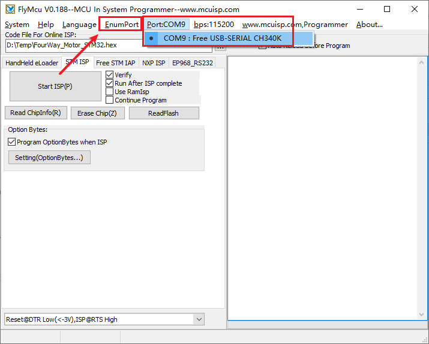

Pada file program, pilih file firmware yang telah diunduh, kemudian perhatikan bahwa pengaturan lain dalam kotak merah harus sama dengan yang ada di gambar.

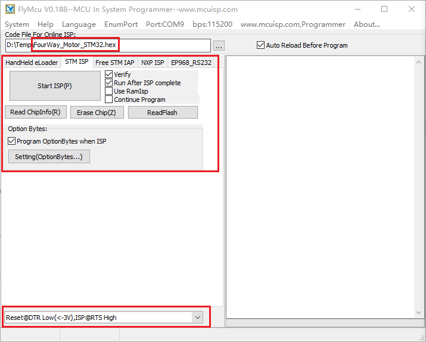

Terakhir, cukup klik Start Programming. Tidak diperlukan operasi lain dan firmware akan mulai dibakar. Gambar berikut menunjukkan informasi yang ditampilkan setelah pembakaran berhasil:

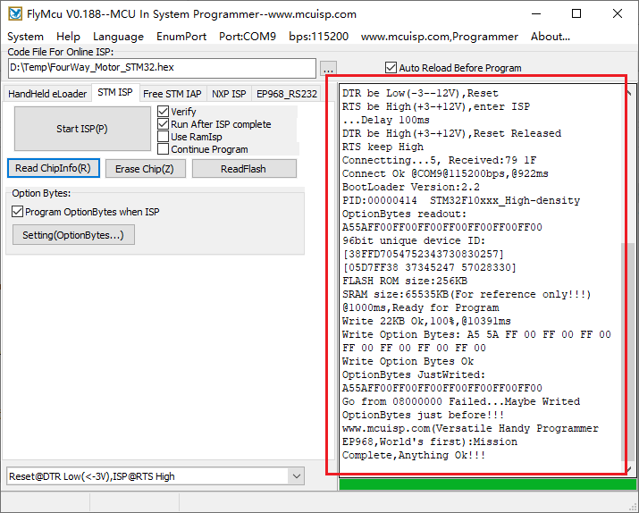

Terakhir, cabut dan colokkan kabel type-c lagi untuk me-restart board driver. Jika lampu merah selalu menyala dan lampu hijau berkedip dua kali setiap 3 detik, maka pembakaran berhasil.

# Pengenalan dan Penggunaan Motor

**Kursus ini digunakan untuk menjelaskan parameter motor, tegangan supply yang direkomendasikan, dan metode perkabelan yang direkomendasikan untuk menghubungkan motor ke board driver motor 4-channel.** 

## 1. Motor 520

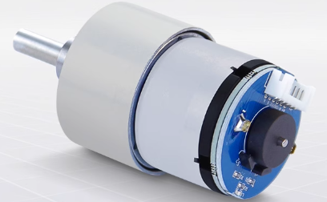

|         Parameter         |                         MD520Z19_12V                         |                         MD520Z30_12V                         |                         MD520Z56_12V                         |
| :-----------------------: | :----------------------------------------------------------: | :----------------------------------------------------------: | :----------------------------------------------------------: |
|      Tegangan rated       |                             12V                              |                             12V                              |                             12V                              |
|        Tipe motor         |                    Sikat magnet permanen                     |                    Sikat magnet permanen                     |                    Sikat magnet permanen                     |
|       Poros output        |             Poros eksentrik tipe-D diameter 6mm              |             Poros eksentrik tipe-D diameter 6mm              |             Poros eksentrik tipe-D diameter 6mm              |
|        Torsi stall        |                           3.1kg·cm                           |                           4.8kg·cm                           |                           8.3kg·cm                           |
|        Torsi rated        |                           2.2kg·cm                           |                           3.3kg·cm                           |                           6.5kg·cm                           |
| Kecepatan sebelum reduksi |                           11000rpm                           |                           11000rpm                           |                           12000rpm                           |
| Kecepatan setelah reduksi |                          550±10rpm                           |                          333±10rpm                           |                          205±10rpm                           |
|        Daya rated         |                             ≤4W                              |                             ≤4W                              |                             ≤4W                              |
|        Arus stall         |                              3A                              |                              3A                              |                              4A                              |
|        Arus rated         |                             0.3A                             |                             0.3A                             |                             0.3A                             |
|  Rasio reduksi gear set   |                             1:19                             |                             1:30                             |                             1:56                             |
|       Tipe encoder        |               Encoder Hall incremental fase AB               |               Encoder Hall incremental fase AB               |               Encoder Hall incremental fase AB               |
|  Tegangan supply encoder  |                            3.3-5V                            |                            3.3-5V                            |                            3.3-5V                            |
|   Jumlah loop magnetik    |                           11 garis                           |                           11 garis                           |                           11 garis                           |
|      Tipe interface       |                          PH2.0 6Pin                          |                          PH2.0 6Pin                          |                          PH2.0 6Pin                          |
|          Fungsi           | Dengan pembentukan pull-up built-in, MCU dapat langsung membaca pulsa sinyal | Dengan pembentukan pull-up built-in, MCU dapat langsung membaca pulsa sinyal | Dengan pembentukan pull-up built-in, MCU dapat langsung membaca pulsa sinyal |
|    Berat motor tunggal    |                           150g±1g                            |                           150g±1g                            |                           150g±1g                            |

Catu daya yang direkomendasikan: **12V**.

Ada tiga jenis motor 520, dan tegangan rated mereka adalah **12V**. Ketika kita menggerakkan motor 520, kita dapat menghubungkan tegangan antara 11 dan 16V, dan disarankan untuk menggunakan supply tegangan 12V**.

Jika Anda ingin membedakan model motor 520 yang Anda beli, Anda dapat langsung melihat label yang tercetak pada motor 520. Ada teks yang tercetak di atasnya bernama RPM, dan angka di depan RPM sesuai dengan angka **kecepatan setelah reduksi** dalam tabel parameter.

Misalnya, label motor 520 di tangan saya mengatakan 333RPM, jadi Anda harus memperhatikan parameter dalam kolom **MD520Z30_12V**. Khususnya, dua parameter **rasio reduksi dan jumlah garis cincin magnetik** mungkin perlu dimodifikasi saat menggunakan board driver motor 4-channel.

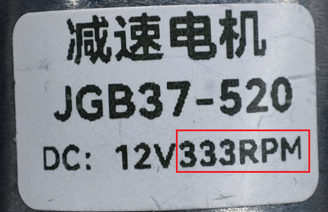

Perkabelan yang direkomendasikan:

Motor 520 yang Anda beli akan dilengkapi dengan dua jenis kabel. Di sini kami merekomendasikan agar Anda memilih kabel double-ended PH2.0-6PIN hitam, satu ujung terhubung ke motor, dan ujung lainnya langsung terhubung ke interface motor encoder PH2.0-6PIN pada board driver motor empat jalur. Kita dapat menemukan bahwa A pada motor sesuai dengan fase B dari board driver motor empat jalur.

Jadi saat mengkonfigurasi tipe motor pada board driver motor empat jalur, Anda harus memilih `$mtype:1#`, model motor 520.

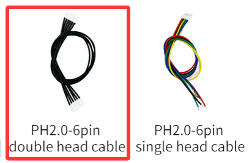

Instruksi perkabelan motor 520:

Jika Anda menggunakan koneksi PH2.0-6PIN ke kabel Dupont, Anda dapat menghubungkan sesuai dengan gambar di bawah ini. Dengan koneksi ini, fase A motor akan terhubung ke fase A board driver motor empat jalur, dan fase B akan terhubung ke fase B.

Namun, saat mengkonfigurasi tipe motor, Anda harus memilih `$mtype:2#`, model motor 310.

 

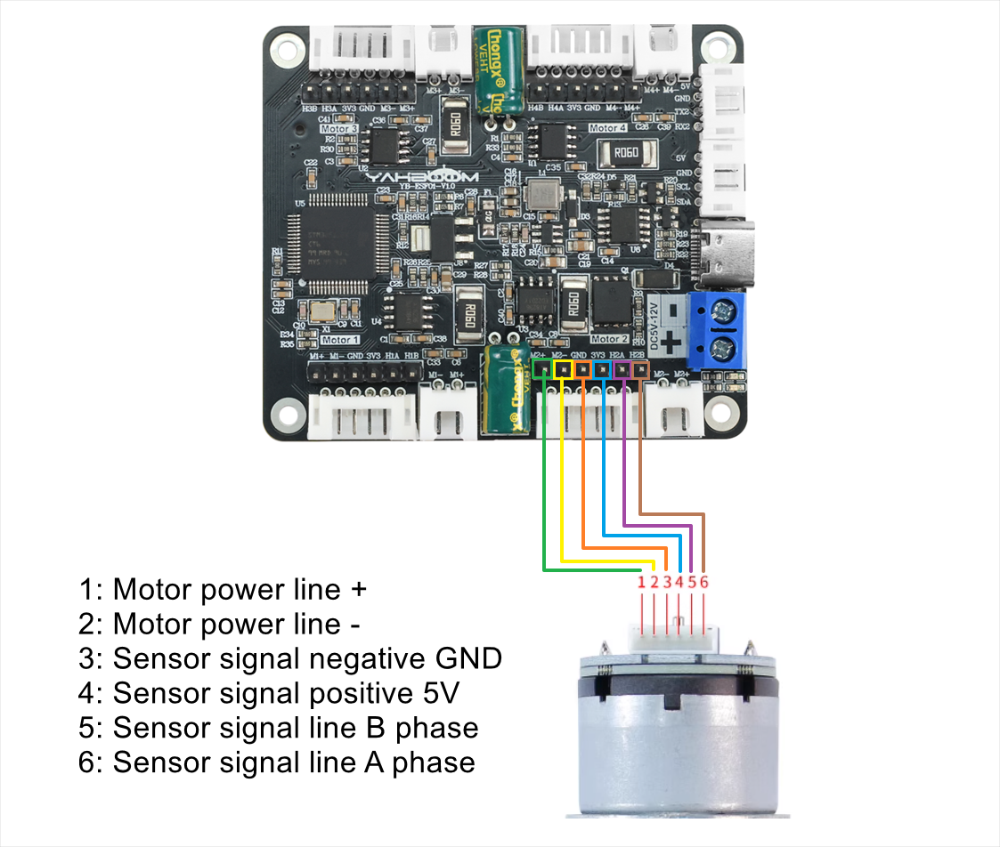

 

## 2. Motor 310

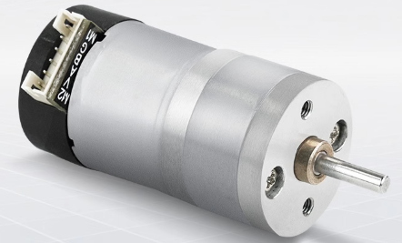

​	

| Parameter                 | Nilai/deskripsi                                              |
| ------------------------- | ------------------------------------------------------------ |
| Nama motor                | MD310Z20_7.4V                                                |
| Arus stall                | ≤1.4A                                                        |
| Tegangan rated motor      | 7.4V                                                         |
| Arus rated                | ≤0.65A                                                       |
| Tipe motor                | Sikat magnet permanen                                        |
| Rasio reduksi gear set    | 1:20                                                         |
| Poros output              | Poros eksentrik tipe-D diameter 3mm                          |
| Tipe encoder              | Encoder Hall incremental fase AB                             |
| Torsi stall               | ≥1.0kg·cm                                                    |
| Tegangan supply encoder   | 3.3-5V                                                       |
| Torsi rated               | 0.4kg·cm                                                     |
| Jumlah loop magnetik      | 13 garis                                                     |
| Kecepatan sebelum reduksi | 9000rpm                                                      |
| Tipe interface            | PH2.0 6Pin                                                   |
| Fungsi                    | Dengan pembentukan pull-up built-in, MCU dapat langsung membaca pulsa sinyal |
| Kecepatan setelah reduksi | 450±10rpm                                                    |
| Daya rated                | 4.8W                                                         |
| Berat motor tunggal       | 70g                                                          |

Catu daya yang direkomendasikan: **7.4V**. Dapat dihubungkan ke tegangan antara 4.2~8.4V, **direkomendasikan menggunakan tegangan 7.4V**.

Dua parameter **rasio reduksi dan jumlah garis cincin magnetik** dalam tabel parameter utama diperlukan. Dua parameter ini mungkin perlu dimodifikasi saat menggunakan board driver motor empat jalur.

Jika Anda membeli motor 310 sendiri, Anda akan menerima kabel PH2.0-6PIN ke DuPont. Saat menghubungkan board driver 4-channel, hubungkan ke soket IO-nya.

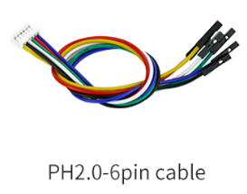


Instruksi perkabelan motor 310:

Ketika fase A motor 310 terhubung ke fase A board driver motor 4-channel, dan fase B terhubung ke fase B, maka saat mengkonfigurasi tipe motor, Anda harus memilih `$mtype:2#`, model motor 310.

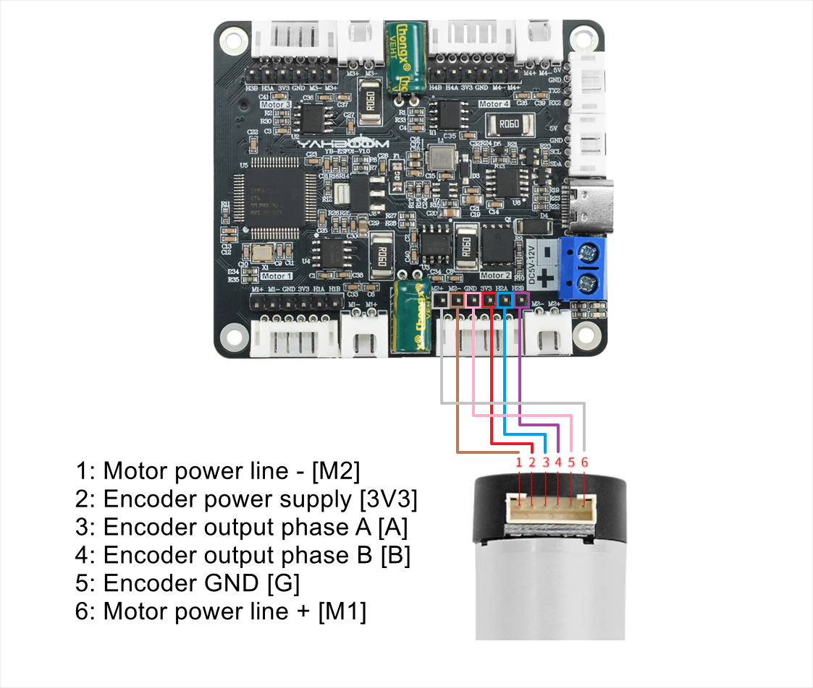

 

Jika Anda membeli motor 310 dalam kit chassis, motor ini memiliki kabel double-ended PH2.0-6PIN. Anda dapat menghubungkan ujung hitam ke motor 310 dan ujung putih ke interface motor encoder PH2.0-6PIN pada board driver motor 4-channel.

Pada saat ini, pilih `$mtype:2#` untuk mengkonfigurasi tipe motor, yaitu model motor 310.

 


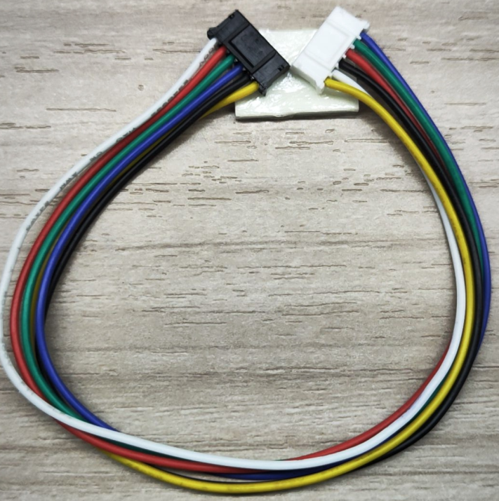

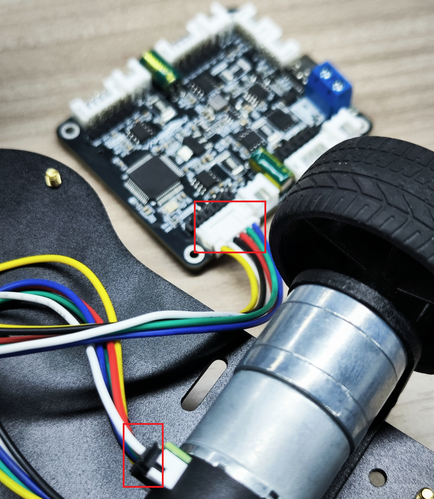

## 3. Motor TT DC

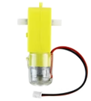

| Parameter                 | Nilai/Deskripsi |
| ------------------------- | --------------- |
| Model                     | Motor gear TT   |
| Material sikat            | Sikat karbon    |
| Rasio reduksi             | 1:48            |
| Tegangan rated            | 6V              |
| Arus idle                 | 200MA           |
| Arus stall                | 1.5A            |
| Torsi                     | 0.8N.m          |
| Kecepatan sebelum reduksi | 12000±10%rpm    |
| Kecepatan setelah reduksi | 245±10%rpm      |

Catu daya yang direkomendasikan: **7.4V**

Motor ini tidak memiliki encoder, jadi Anda hanya perlu memodifikasi **tipe motor** dan **rasio reduksi** di board driver motor empat jalur. Saat mengkonfigurasi tipe motor, pilih `$mtype:4#`, model motor TT tanpa encoder.

Perkabelan yang direkomendasikan: Hubungkan interface XH2.54-2PIN pada motor TT langsung ke soket XH2.54-2PIN pada board driver motor 4-channel.

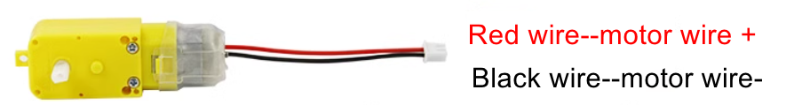

 

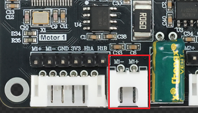

 

 

## 4. Motor TT dengan pengukuran kecepatan encoder

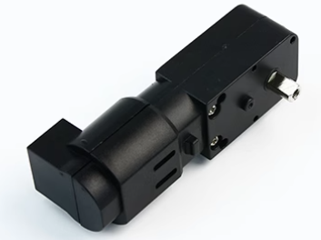

| Parameter                          | Nilai/Deskripsi                                              |
| ---------------------------------- | ------------------------------------------------------------ |
| Model                              | Motor TT poros tunggal logam 13-kawat                        |
| Tipe motor                         | Motor 130                                                    |
| Tipe motor/material sikat          | Sikat tembaga                                                |
| Rasio reduksi                      | 1:45                                                         |
| Tegangan rated                     | 6V                                                           |
| Arus tanpa beban                   | 0.08A                                                        |
| Arus rated                         | 0.3A                                                         |
| Arus stall                         | 1.1A                                                         |
| Torsi                              | 1.2N.m                                                       |
| Kecepatan sebelum reduksi          | 16000±5%rpm                                                  |
| Kecepatan setelah reduksi          | 355±5%rpm                                                    |
| Tipe encoder                       | Encoder fase AB Hall                                         |
| Catu daya encoder                  | 3.3-5V                                                       |
| Jumlah garis encoder               | 13 garis                                                     |
| Hitungan maksimum per putaran roda | 2340                                                         |
| Fitur                              | Dengan pembentukan pull-up built-in, MCU dapat membaca langsung |

Catu daya yang direkomendasikan: **7.4V**. Dapat dihubungkan ke 5~13V, **direkomendasikan menggunakan supply tegangan 7.4V**.

Dua parameter **rasio reduksi dan jumlah garis encoder** dalam tabel parameter utama diperlukan. Dua parameter ini mungkin perlu dimodifikasi saat menggunakan board driver motor 4-channel.

Perkabelan yang direkomendasikan: Gunakan kabel PH2.0-6PIN ke kabel Dupont dan hubungkan ke soket IO board driver motor 4-channel.


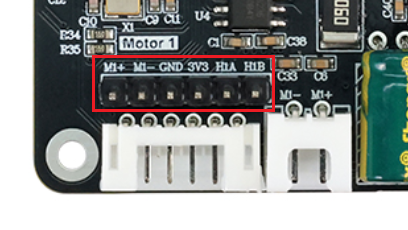

Instruksi perkabelan untuk motor TT pengukuran kecepatan encoder:

Ketika fase A motor TT encoder terhubung ke fase A board driver motor empat jalur, dan fase B terhubung ke fase B, maka saat mengkonfigurasi tipe motor, Anda harus memilih `$mtype:3#`, model motor TT dengan encoder.

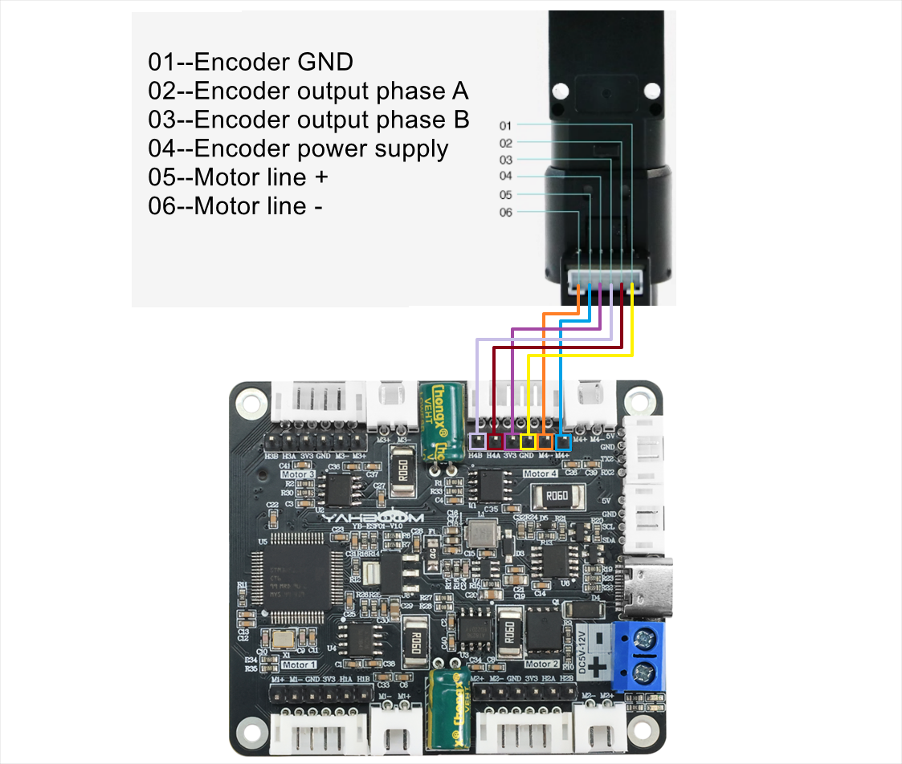

## 5. Motor 520 tipe-L

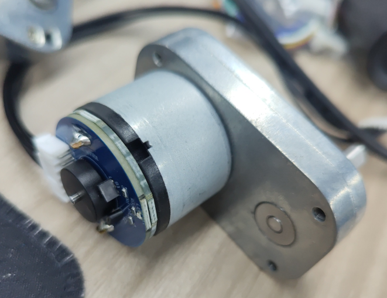

| Parameter             | Nilai/Deskripsi  |
| --------------------- | ---------------- |
| Model                 | Motor 520 tipe-L |
| Tegangan starting     | 6V               |
| Tegangan rated        | 12V              |
| Rasio reduksi         | 1:40             |
| Jumlah loop magnetik  | 11线             |
| Arus tanpa beban      | ≥450mA           |
| Kecepatan tanpa beban | 300r/min±5%      |
| Torsi rated           | 4.4KG.CM         |
| Kecepatan rated       | 150r/min         |
| Torsi stall           | 10KG.CM          |
| Arus stall            | 4A               |

Catu daya yang direkomendasikan: **12V**.

Dua parameter **rasio reduksi dan jumlah garis encoder** dalam tabel parameter utama diperlukan. Dua parameter ini mungkin perlu dimodifikasi saat menggunakan board driver motor 4-channel.

Perkabelan yang direkomendasikan: Motor 520 tipe-L yang dibeli akan dilengkapi dengan dua jenis kabel. Di sini kami merekomendasikan agar Anda memilih kabel double-headed PH2.0-6PIN hitam, satu ujung terhubung ke motor, dan ujung lainnya langsung terhubung ke interface motor encoder PH2.0-6PIN pada board driver motor 4-channel. 

Perkabelan ini adalah yang paling nyaman, tetapi dapat ditemukan bahwa A pada motor sesuai dengan fase B board driver motor 4-channel. Oleh karena itu, saat mengkonfigurasi tipe motor pada board driver motor 4-channel, Anda harus memilih `$mtype:1#`, model motor 520.

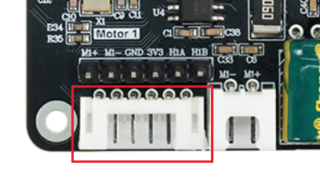

Instruksi perkabelan motor 520 tipe-L:

Jika Anda menggunakan koneksi PH2.0-6PIN ke kabel Dupont, Anda dapat menghubungkan sesuai dengan gambar di bawah ini. Dengan koneksi ini, fase A motor akan terhubung ke fase A board driver motor 4-channel, dan fase B akan terhubung ke fase B. 

Namun, saat mengkonfigurasi tipe motor, Anda harus memilih `$mtype:2#`, model motor 310.


## 1.PC host

# Komunikasi Serial

## 1.1 Penjelasan

**Harap baca 《0. Pengenalan dan penggunaan motor》 terlebih dahulu untuk memahami parameter motor, metode perkabelan, dan tegangan catu daya yang saat ini Anda gunakan. Untuk menghindari operasi yang tidak tepat dan kerusakan pada board driver atau motor.**

Hubungkan board driver ke komputer melalui port TYPE-C pada board driver, dan gunakan asisten port serial untuk mengirim perintah ke board driver untuk kontrol dan pembacaan data.

##### Perkabelan perangkat keras:

| **Motor** | **Board driver motor 4-channel**(Motor) |
| :-------: | :-------------------------------------: |
|    M2     |                   M-                    |
|     V     |                   3V3                   |
|     A     |                   H1A                   |
|     B     |                   H1B                   |
|     G     |                   GND                   |
|    M1     |                   M+                    |

 

## 1.2 Instruksi

Buka software asisten port serial di komputer. Di sini kita mengambil Uart Assistant sebagai contoh.

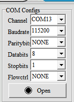

 

Konfigurasi port serial: **Baud rate 115200, tanpa pemeriksaan paritas, tanpa kontrol aliran perangkat keras, 1 stop bit**

Setelah konfigurasi, Anda dapat mengirim perintah di jendela kirim di bawah untuk mengontrol board driver. Semua perintah port serial dan penjelasan tercantum dalam kursus《1.2 Perintah kontrol》.

Selanjutnya, kami akan mendemonstrasikan cara memodifikasi parameter default untuk menggunakan **motor 310, ban diameter 48mm**.

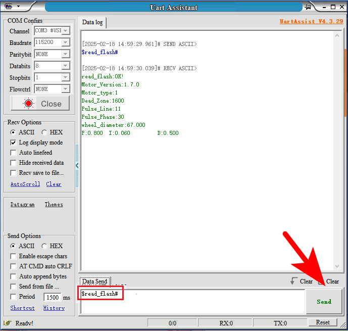

Pertama, keluarkan perintah `$read_flash#`, yang digunakan untuk query parameter penyimpanan power-off di flash. Ini dapat menyimpan tipe ban, zona mati motor, garis fase motor, rasio reduksi motor, diameter roda, dan parameter PID motor.

Kemudian, sesuai dengan parameter motor dan ban, masukkan perintah konfigurasi parameter kirim di kolom kirim di bawah.

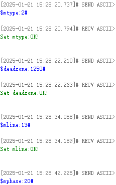

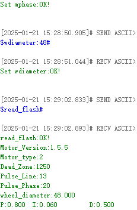

Kita dapat melihat bahwa setelah setiap perintah konfigurasi dikeluarkan, board driver akan mengirim kembali pesan 'OK!', menunjukkan bahwa pengaturan berhasil. Terakhir, gunakan perintah untuk melihat flash untuk melihat bahwa parameter yang baru saja dimodifikasi telah berlaku. Metode modifikasi parameter PID sama dengan ini, tetapi umumnya tidak perlu dimodifikasi, jadi tidak akan didemonstrasikan di sini.

Jika Anda ingin mengontrol gerakan motor, kirim perintah `$spd:0,0,0,0#` atau `$pwm:0,0,0,0#`. Perintah spd mengontrol motor dengan encoder, dan perintah pwm dapat mengontrol motor dengan atau tanpa encoder. Misalkan saya ingin mengontrol motor 310 yang dicolokkan ke Motor1 pada board driver, yang memiliki encoder, maka kirim `$spd:100,0,0,0#` untuk mengontrolnya. Untuk mengontrol motor yang terhubung ke Motor2, modifikasi nilai kedua: `$spd:0,100,0,0#`.

## Untuk Arduino

# Menggerakkan motor dan membaca encoder-USART

## 1.1 Penjelasan

**Harap baca 《0. Pengenalan dan penggunaan motor》 terlebih dahulu untuk memahami parameter motor, metode perkabelan, dan tegangan catu daya yang saat ini Anda gunakan. Untuk menghindari operasi yang tidak tepat dan kerusakan pada board driver atau motor.**

I2C dan komunikasi serial tidak dapat dibagikan, hanya satu yang dapat dipilih.

Kursus ini menggunakan board Arduino UNO. Dan menggunakan Arduino 1.8.5 IDE 

**Sebelum menulis program, jangan hubungkan board driver ke pin RX pada Arduino, jika tidak program tidak dapat ditulis ke board.**

**Setelah program ditulis, hubungkan pin RX pada Arduino.**

##### Perkabelan perangkat keras:

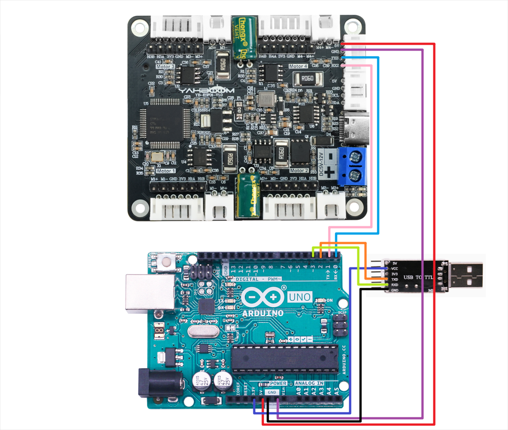

| Motor | **Board driver motor 4-channel**(Motor) |
| :---: | :-------------------------------------: |
|  M2   |                   M-                    |
|   V   |                   3V3                   |
|   A   |                   H1A                   |
|   B   |                   H1B                   |
|   G   |                   GND                   |
|  M1   |                   M+                    |

| **Board driver motor 4-channel** | Arduino UNO |
| :------------------------------: | :---------: |
|               RX2                |     TX      |
|               TX2                |     RX      |
|               GND                |     GND     |
|                5V                |     5V      |

Karena port serial perangkat keras pada board Arduino digunakan untuk berkomunikasi dengan board driver, kasus ini memerlukan port serial USB ke TTL tambahan untuk mencetak data.

| USB TO TTL | Arduino UNO |
| :--------: | :---------: |
|    VCC     |     3V3     |
|    GND     |     GND     |
|    RXD     |      3      |
|    TXD     |      2      |

Konfigurasi port serial: **Baud rate 115200, tanpa pemeriksaan paritas, tanpa kontrol aliran perangkat keras, 1 stop bit**

## 1.2 Analisis kode

```c++
#define UPLOAD_DATA 3  //0: Tidak menerima data 1: Menerima data encoder total 2: Menerima encoder real-time 3: Menerima kecepatan motor saat ini mm/s
#define MOTOR_TYPE 1   //1: motor 520 2: motor 310 3: motor TT disk kode kecepatan 4: motor reduksi DC TT 5: motor 520 tipe L
```

- UPLOAD_DATA: digunakan untuk mengatur data enkoder motor. Atur 1 ke jumlah total pulsa enkoder dan 2 ke data pulsa waktu nyata 10 ms.
- MOTOR_TYPE: digunakan untuk mengatur jenis motor yang digunakan. Cukup ubah angka yang sesuai dengan komentar sesuai motor yang sedang Anda gunakan. Anda tidak perlu mengubah sisa kode.

Jika Anda perlu menggerakkan motor dan mengamati data, cukup ubah dua angka di awal program. Sisa kode tidak perlu diubah.

```c++
#if MOTOR_TYPE == 1
    send_motor_type(1);  // Konfigurasi tipe motor
    delay(100);
    send_pulse_phase(30);  // Konfigurasi rasio reduksi. Periksa manual motor untuk mengetahuinya
    delay(100);
    send_pulse_line(11);  // Konfigurasi garis cincin magnetik. Periksa manual motor untuk mendapatkan hasilnya
    delay(100);
    send_wheel_diameter(67.00);  // Konfigurasi diameter roda dan ukur
    delay(100);
    send_motor_deadzone(1900);  // Konfigurasi zona mati motor, dan eksperimen menunjukkan
    delay(100);
    
  #elif MOTOR_TYPE == 2
  send_motor_type(2);
    delay(100);
    send_pulse_phase(20);
    delay(100);
    send_pulse_line(13);
    delay(100);
    send_wheel_diameter(48.00);
    delay(100);
    send_motor_deadzone(1600);
    delay(100);
    
  #elif MOTOR_TYPE == 3
  send_motor_type(3);
    delay(100);
    send_pulse_phase(45);
    delay(100);
    send_pulse_line(13);
    delay(100);
    send_wheel_diameter(68.00);
    delay(100);
    send_motor_deadzone(1250);
    delay(100);
    
  #elif MOTOR_TYPE == 4
  send_motor_type(4);
    delay(100);
    send_pulse_phase(48);
    delay(100);
    send_motor_deadzone(1000);
    delay(100);
    
  #elif MOTOR_TYPE == 5
  send_motor_type(1);
    delay(100);
    send_pulse_phase(40);
    delay(100);
    send_pulse_line(11);
    delay(100);
    send_wheel_diameter(67.00);
    delay(100);
    send_motor_deadzone(1900);
    delay(100);
  #endif
```

Ini digunakan untuk menyimpan parameter motor Yahboom. Dengan memodifikasi parameter MOTOR_TYPE di atas, konfigurasi sekali klik dapat dilakukan. Biasanya, jangan mengubah kode di sini saat menggunakan motor Yahboom.

Jika Anda menggunakan motor Anda sendiri, atau jika data tertentu perlu dimodifikasi sesuai kebutuhan Anda, Anda dapat memeriksa kursus《1.2 Perintah kontrol》 untuk memahami arti spesifik dari setiap perintah.

```
void loop(){
  
      Motor_USART_Recieve();
      if(g_recv_flag == 1)
    {
      g_recv_flag = 0;
      #if MOTOR_TYPE == 4
        Contrl_Pwm(i*2,i*2,i*2,i*2);
      #else
        Contrl_Speed(i,i,i,i);   // Nilainya adalah -1000~1000
      #endif
        Deal_data_real();
        //delay(100);
      #if UPLOAD_DATA == 1
        sprintf(buffer,"M1:%d,M2:%d,M3:%d,M4:%d\r\n",Encoder_Now[0],Encoder_Now[1],Encoder_Now[2],Encoder_Now[3]);
        printSerial.println(buffer);
      #elif UPLOAD_DATA == 2
        sprintf(buffer,"M1:%d,M2:%d,M3:%d,M4:%d\r\n",Encoder_Offset[0],Encoder_Offset[1],Encoder_Offset[2],Encoder_Offset[3]);
        printSerial.println(buffer);
      #elif UPLOAD_DATA == 3
        dtostrf(g_Speed[0], 4, 2, string1);
        dtostrf(g_Speed[1], 4, 2, string2);
        dtostrf(g_Speed[2], 4, 2, string3);
        dtostrf(g_Speed[3], 4, 2, string4);
        sprintf(buffer,"M1:%s,M2:%s,M3:%s,M4:%s\r\n",string1,string2,string3,string4);
        printSerial.println(buffer);
      #endif
      i++;
      if (i == 1000) i = 0;
      
    }
}
```

Dalam program loop, kecepatan keempat motor akan ditingkatkan secara perlahan dari 0 hingga 1000. Jika tipe motornya 4, yaitu motor tanpa encoder, PWM motor dikontrol secara langsung.

Pada saat yang sama, data yang dikirim oleh papan pengemudi dibaca dan dicetak pada saat yang sama

```
// Memeriksa data yang dikirim dari board driver, dan menyimpan data yang memenuhi protokol komunikasi
void Deal_Control_Rxtemp(uint8_t rxtemp)
{
    static u8 step = 0;
    static u8 start_flag = 0;


    if(rxtemp == '$' &&     start_flag == 0)
    {
        start_flag = 1;
        memset(g_recv_buff,0,RXBUFF_LEN);  // Bersihkan data
    }
    
    else if(start_flag == 1)
    {
            if(rxtemp == '#')
            {
                start_flag = 0;
                step = 0;
                g_recv_flag = 1;
        // Periksa empat karakter pertama
    if (strncmp("MAll:",(char*)g_recv_buff,5)==0 ||
        strncmp("MTEP:",(char*)g_recv_buff,5)==0 ||
        strncmp("MSPD:",(char*)g_recv_buff,5)==0) {
        if (isValidNumbers((char*)g_recv_buff + 5)) {
                // Jika kondisi terpenuhi, cetak data
                memcpy(g_recv_buff_deal,g_recv_buff,RXBUFF_LEN);
            }
    } else {
        // Bersihkan buffer saat tidak cocok untuk menghindari data tidak valid yang tersisa
        memset(g_recv_buff, 0, RXBUFF_LEN);
    }
            }
            else
            {
                if(step > RXBUFF_LEN)
                {
                    start_flag = 0;
                    step = 0;
                    memset(g_recv_buff,0,RXBUFF_LEN);  // Bersihkan data yang diterima
                }
                else
                {
                    g_recv_buff[step] = rxtemp;
                    step++;
                }
            }
    }
    
}


// Memformat data yang disimpan dari board driver dan mempersiapkannya untuk dicetak
void Deal_data_real(void)
{
     static uint8_t data[RXBUFF_LEN];
   uint8_t  length = 0;
    // Encoder keseluruhan
     if ((strncmp("MAll",(char*)g_recv_buff_deal,4)==0))
    {
        length = strlen((char*)g_recv_buff_deal)-5;
        for (uint8_t i = 0; i < length; i++)
        {
            data[i] = g_recv_buff_deal[i+5];  // Hapus titik dua
        }  
                data[length] = '\0';    
                char* strArray[10];  // Array pointer Panjangnya didefinisikan oleh nomor pemisahan char 1 byte char* 4 byte
                char mystr_temp[4][10] = {'\0'}; 
                splitString(strArray,(char*)data, ", ");  // Pisahkan dengan koma
                for (int i = 0; i < 4; i++)
                {
                        strcpy(mystr_temp[i],strArray[i]);
                        Encoder_Now[i] = atoi(mystr_temp[i]);
                }
                
        }
        // Data encoder real-time 10ms
        else if ((strncmp("MTEP",(char*)g_recv_buff_deal,4)==0))
    {
        length = strlen((char*)g_recv_buff_deal)-5;
        for (uint8_t i = 0; i < length; i++)
        {
            data[i] = g_recv_buff_deal[i+5];  // Hapus titik dua
        }  
                data[length] = '\0';        


                char* strArray[10];  // Array pointer Panjangnya didefinisikan oleh nomor pemisahan char 1 byte char* 4 byte
                char mystr_temp[4][10] = {'\0'}; 
                splitString(strArray,(char*)data, ", ");  // Pisahkan dengan koma
                for (int i = 0; i < 4; i++)
                {
                        strcpy(mystr_temp[i],strArray[i]);
                        Encoder_Offset[i] = atoi(mystr_temp[i]);
                }
        }
        // Kecepatan
        else if ((strncmp("MSPD",(char*)g_recv_buff_deal,4)==0))
    {
        length = strlen((char*)g_recv_buff_deal)-5;
        for (uint8_t i = 0; i < length; i++)
        {
            data[i] = g_recv_buff_deal[i+5];  // Hapus titik dua
        }  
                data[length] = '\0';    
                
                char* strArray[10];  // Array pointer Panjangnya didefinisikan oleh nomor pemisahan char 1 byte char* 4 byte
                char mystr_temp[4][10] = {'\0'}; 
                splitString(strArray,(char*)data, ", ");  // Pisahkan dengan koma
                for (int i = 0; i < 4; i++)
                {
                        strcpy(mystr_temp[i],strArray[i]);
                        g_Speed[i] = atof(mystr_temp[i]);
                }
        }
}
```

- Deal_Control_Rxtemp: Saring data yang diterima dan simpan data yang memenuhi protokol komunikasi.
- Deal_data_real: Ekstrak data asli yang disimpan dan rekonstruksi format cetak baru.

## 1.3 Fenomena Eksperimental

Sebelum menulis program, jangan hubungkan papan driver ke pin RX pada Arduino, jika tidak, program tidak dapat ditulis ke papan. Setelah program ditulis, hubungkan pin RX pada Arduino.

Hubungkan modul USB ke TTL ke komputer, gunakan asisten debugging port serial komputer "UartAssist", buka port serial USB ke TTL, dan Anda dapat menerima data yang diproses.

Jika Anda membuka port serial motherboard Arduino, Anda mungkin melihat bahwa port serial tersebut mencetak data asli. Setelah dinyalakan kembali, Anda dapat melihat bahwa motor akan secara bertahap bertambah cepat, lalu berhenti, dan berulang.

Pada saat yang sama, Anda dapat melihat bahwa nilai motor cetak terus berubah dalam asisten port serial


# Untuk ESP32

## Motor penggerak dan encoder pembaca-USART

## 1.1 Penjelasan

Harap baca "0. Pengenalan dan Penggunaan Motor" terlebih dahulu untuk memahami parameter motor, metode pengkabelan, dan tegangan catu daya yang Anda gunakan. Hal ini untuk menghindari pengoperasian yang tidak tepat dan kerusakan pada papan driver atau motor.

Komunikasi I2C dan serial tidak dapat dibagi, hanya satu yang dapat dipilih.

Kursus ini menggunakan modul transmisi gambar YahboomESP32 versi lite.

Jika Anda menggunakan papan ESP32-S3 lainnya, Anda perlu mengubah pengaturan pin dalam program sesuai dengan situasi pin papan Anda.

Gunakan ESP-IDF versi 5.4.0 untuk mengkompilasi proyek.

##### Pengkabelan perangkat keras:


| Motor | **4-channel motor drive board**(Motor) |
| :---: | :------------------------------------: |
|  M2   |                   M-                   |
|   V   |                  3V3                   |
|   A   |                  H1A                   |
|   B   |                  H1B                   |
|   G   |                  GND                   |
|  M1   |                   M+                   |

| **4-channel motor drive board** | ESP32S3 |
| :-----------------------------: | :-----: |
|               RX2               |   TX1   |
|               TX2               |   RX1   |
|               GND               |   GND   |
|               5V                |   5V    |

Modul port serial USB ke TTL perlu dihubungkan, terutama untuk mencetak data.

Saat menggunakan modul transmisi gambar Yahboom ESP32 versi lite, 3V3 dari modul port serial USB ke TTL harus diganti dengan 5V dan dihubungkan ke 5V pada papan ESP32 untuk menulis program secara normal. Setelah program ditulis, program dapat dialihkan kembali ke 3V3.

| USB TO TTL | ESP32S3 |
| :--------: | :-----: |
|    3V3     |   3V3   |
|    TXD     |   RX0   |
|    RXD     |   TX0   |
|    GND     |   GND   |

Konfigurasi port serial: **Baud rate 115200, tidak ada pemeriksaan paritas, tidak ada kontrol aliran perangkat keras, 1 stop bit**

## 1.2 Analisis kode

```
#define UART1_TX_PIN    36
#define UART1_RX_PIN    35
```

Kode ini didefinisikan dalam file `uart_module.h`.

Jika Anda perlu mengubah pin untuk port serial agar dapat berkomunikasi dengan papan penggerak motor empat arah, Anda dapat mengubah nomornya di sini.

```c++
#define UPLOAD_DATA 3  // 0: Tidak menerima data 1: Menerima data encoder total 2: Menerima encoder real-time 3: Menerima kecepatan motor saat ini mm/s
#define MOTOR_TYPE 1   // 1: motor 520 2: motor 310 3: motor TT disk kode kecepatan 4: motor reduksi DC TT 5: motor 520 tipe L
```

- UPLOAD_DATA: digunakan untuk mengatur data enkoder motor. Atur 1 ke jumlah total pulsa enkoder dan 2 ke data pulsa waktu nyata 10 ms.
- MOTOR_TYPE: digunakan untuk mengatur jenis motor yang digunakan. Cukup ubah angka yang sesuai dengan komentar sesuai motor yang sedang Anda gunakan. Anda tidak perlu mengubah sisa kode.

Jika Anda perlu menggerakkan motor dan mengamati data, cukup ubah dua angka di awal program. Sisa kode tidak perlu diubah.

```
#if MOTOR_TYPE == 1
    send_motor_type(1);  // Konfigurasi tipe motor
    delay(100);
    send_pulse_phase(30);  // Konfigurasi rasio reduksi. Periksa manual motor untuk mengetahuinya
    delay(100);
    send_pulse_line(11);  // Konfigurasi garis cincin magnetik. Periksa manual motor untuk mendapatkan hasilnya
    delay(100);
    send_wheel_diameter(67.00);  // Konfigurasi diameter roda dan ukur
    delay(100);
    send_motor_deadzone(1900);  // Konfigurasi zona mati motor, hasil eksperimen
    delay(100);
    
  #elif MOTOR_TYPE == 2
  send_motor_type(2);
    delay(100);
    send_pulse_phase(20);
    delay(100);
    send_pulse_line(13);
    delay(100);
    send_wheel_diameter(48.00);
    delay(100);
    send_motor_deadzone(1600);
    delay(100);
    
  #elif MOTOR_TYPE == 3
  send_motor_type(3);
    delay(100);
    send_pulse_phase(45);
    delay(100);
    send_pulse_line(13);
    delay(100);
    send_wheel_diameter(68.00);
    delay(100);
    send_motor_deadzone(1250);
    delay(100);
    
  #elif MOTOR_TYPE == 4
  send_motor_type(4);
    delay(100);
    send_pulse_phase(48);
    delay(100);
    send_motor_deadzone(1000);
    delay(100);
    
  #elif MOTOR_TYPE == 5
  send_motor_type(1);
    delay(100);
    send_pulse_phase(40);
    delay(100);
    send_pulse_line(11);
    delay(100);
    send_wheel_diameter(67.00);
    delay(100);
    send_motor_deadzone(1900);
    delay(100);
  #endif
```

Ini digunakan untuk menyimpan parameter motor Yahboom. Dengan memodifikasi parameter MOTOR_TYPE di atas, konfigurasi sekali klik dapat dilakukan.

Biasanya, jangan mengubah kode di sini saat menggunakan motor Yahboom.

Jika Anda menggunakan motor Anda sendiri, atau jika data tertentu perlu dimodifikasi sesuai kebutuhan Anda, Anda dapat memeriksa kursus《1.2 Perintah kontrol》 untuk memahami arti spesifik dari setiap perintah.

```
void MotorControl_Task(void *arg) {
    static int i = 0;
    while(1) {
        if(g_recv_flag == 1)  // Pemeriksaan flag penerimaan
        {
            g_recv_flag = 0;  // Reset flag
            // Pilih mode kontrol berdasarkan tipe motor
            #if MOTOR_TYPE == 4
            Contrl_Pwm(i*20,i*20,i*20,i*20);  // Mode kontrol PWM
            #else
            Contrl_Speed(i*10,i*10,i*10,i*10);  // Mode kontrol kecepatan
            #endif
            
            Deal_data_real();
            
            #if UPLOAD_DATA == 1
                printf("M1:%d,M2:%d,M3:%d,M4:%d\r\n",Encoder_Now[0],Encoder_Now[1],Encoder_Now[2],Encoder_Now[3]);
            #elif UPLOAD_DATA == 2
                printf("M1:%d,M2:%d,M3:%d,M4:%d\r\n",Encoder_Offset[0],Encoder_Offset[1],Encoder_Offset[2],Encoder_Offset[3]);
            #elif UPLOAD_DATA == 3
                printf("M1:%.2f,M2:%.2f,M3:%.2f,M4:%.2f\r\n",g_Speed[0],g_Speed[1],g_Speed[2],g_Speed[3]);
            #endif
            
            i = (i < 100) ? i+1 : 0;
            delay_ms(100);
        }
        delay_ms(1);  // Mencegah tugas macet
    }
}
```

Pada putaran program utama, kecepatan keempat motor akan ditingkatkan secara perlahan dari 0 hingga 1000. Jika jenis motornya adalah 4, yaitu motor tanpa enkoder, PWM motor akan dikontrol secara langsung.

Pada saat yang sama, data yang dikirim oleh papan pengemudi dibaca dan dicetak.

```c++
//Memeriksa data yang dikirim dari board driver, dan menyimpan data yang memenuhi protokol komunikasi
//Check the data sent from the driver board, and save the data that meets the communication protocol
void Deal_Control_Rxtemp(uint8_t rxtemp)
{
    static u8 step = 0;
    static u8 start_flag = 0;


    if(rxtemp == '$' &&     start_flag == 0)
    {
        start_flag = 1;
        memset(g_recv_buff,0,RXBUFF_LEN);//Bersihkan data Clear data
    }
    
    else if(start_flag == 1)
    {
            if(rxtemp == '#')
            {
                start_flag = 0;
                step = 0;
                g_recv_flag = 1;
        // Periksa empat karakter pertama  Check the first four characters
    if (strncmp("MAll:",(char*)g_recv_buff,5)==0 ||
        strncmp("MTEP:",(char*)g_recv_buff,5)==0 ||
        strncmp("MSPD:",(char*)g_recv_buff,5)==0) {
        if (isValidNumbers((char*)g_recv_buff + 5)) {
                // Jika kondisi terpenuhi, cetak data  If the conditions are met, print the data
                memcpy(g_recv_buff_deal,g_recv_buff,RXBUFF_LEN);
            }
    } else {
        // Bersihkan buffer saat tidak cocok untuk menghindari data tidak valid yang tersisa Clear the buffer when there is no match to avoid residual invalid data
        memset(g_recv_buff, 0, RXBUFF_LEN);
    }
            }
            else
            {
                if(step > RXBUFF_LEN)
                {
                    start_flag = 0;
                    step = 0;
                    memset(g_recv_buff,0,RXBUFF_LEN);//Bersihkan data yang diterima   Clear received data
                }
                else
                {
                    g_recv_buff[step] = rxtemp;
                    step++;
                }
            }
    }
    
}


//Memformat data yang disimpan dari board driver dan mempersiapkannya untuk dicetak
//Format the data saved from the driver board and prepare it for printing
void Deal_data_real(void)
{
     static uint8_t data[RXBUFF_LEN];
   uint8_t  length = 0;
    //Encoder keseluruhan    Overall encoder
     if ((strncmp("MAll",(char*)g_recv_buff_deal,4)==0))
    {
        length = strlen((char*)g_recv_buff_deal)-5;
        for (uint8_t i = 0; i < length; i++)
        {
            data[i] = g_recv_buff_deal[i+5]; //Hapus titik dua Remove the colon
        }  
                data[length] = '\0';    
                char* strArray[10];//Array pointer Panjangnya didefinisikan oleh nomor pemisahan char 1 byte char* 4 byte    Pointer array The length is defined by the split number char 1 byte char* 4 bytes
                char mystr_temp[4][10] = {'\0'}; 
                splitString(strArray,(char*)data, ", ");//Pisahkan dengan koma Split by comma
                for (int i = 0; i < 4; i++)
                {
                        strcpy(mystr_temp[i],strArray[i]);
                        Encoder_Now[i] = atoi(mystr_temp[i]);
                }
                
        }
        //Data encoder real-time 10ms  10ms real-time encoder data
        else if ((strncmp("MTEP",(char*)g_recv_buff_deal,4)==0))
    {
        length = strlen((char*)g_recv_buff_deal)-5;
        for (uint8_t i = 0; i < length; i++)
        {
            data[i] = g_recv_buff_deal[i+5]; //Hapus titik dua Remove the colon
        }  
                data[length] = '\0';        


                char* strArray[10];//Array pointer Panjangnya didefinisikan oleh nomor pemisahan char 1 byte char* 4 byte       Pointer array The length is defined by the split number char 1 byte char* 4 bytes
                char mystr_temp[4][10] = {'\0'}; 
                splitString(strArray,(char*)data, ", ");//Pisahkan dengan koma Split by comma
                for (int i = 0; i < 4; i++)
                {
                        strcpy(mystr_temp[i],strArray[i]);
                        Encoder_Offset[i] = atoi(mystr_temp[i]);
                }
        }
        //Kecepatan    Speed
        else if ((strncmp("MSPD",(char*)g_recv_buff_deal,4)==0))
    {
        length = strlen((char*)g_recv_buff_deal)-5;
        for (uint8_t i = 0; i < length; i++)
        {
            data[i] = g_recv_buff_deal[i+5]; //Hapus titik dua Remove the colon
        }  
                data[length] = '\0';    
                
                char* strArray[10];//Array pointer Panjangnya didefinisikan oleh nomor pemisahan char 1 byte char* 4 byte       Pointer array The length is defined by the split number char 1 byte char* 4 bytes
                char mystr_temp[4][10] = {'\0'}; 
                splitString(strArray,(char*)data, ", ");//Pisahkan dengan koma Split by comma
                for (int i = 0; i < 4; i++)
                {
                        strcpy(mystr_temp[i],strArray[i]);
                        g_Speed[i] = atof(mystr_temp[i]);
                }
        }
}
```

- Deal_Control_Rxtemp: Saring data yang diterima dan simpan data yang memenuhi protokol komunikasi.
- Deal_data_real: Ekstrak data asli yang disimpan dan rekonstruksi format cetak baru.

## 1.3 Fenomena Eksperimental

Setelah kabelnya terpasang dengan benar, tulis program ke motherboard. Setelah dinyalakan kembali, Anda dapat melihat bahwa motor akan secara bertahap bertambah cepat, lalu berhenti, dan berulang.

Pada saat yang sama, Anda dapat melihat nilai motor terus berubah di monitor serial.


# Untuk Jetson Nano

## Motor penggerak dan encoder pembaca-USART

## 1.1 Penjelasan

Harap baca "0. Pengenalan dan Penggunaan Motor" terlebih dahulu untuk memahami parameter motor, metode pengkabelan, dan tegangan catu daya yang Anda gunakan. Hal ini untuk menghindari pengoperasian yang tidak tepat dan kerusakan pada papan driver atau motor.

Komunikasi I2C dan serial tidak dapat dibagi, hanya satu yang dapat dipilih.

##### Pengkabelan perangkat keras:


Bila papan induk dan papan driver menggunakan komunikasi port serial, cukup sambungkan port USB pada papan induk ke port TYPE-C pada papan driver motor 4 saluran.

| Motor | **4-channel motor drive board**(Motor) |
| :---: | :------------------------------------: |
|  M2   |                   M-                   |
|   V   |                  3V3                   |
|   A   |                  H1A                   |
|   B   |                  H1B                   |
|   G   |                  GND                   |
|  M1   |                   M+                   |

 

## 1.2 Instruksi

Setelah papan Jetson tersambung ke antarmuka USB papan driver, Anda dapat menggunakan perintah berikut untuk memeriksa apakah port serial dikenali.

```
ll /dev/ttyUSB*
```

Biasanya, `/dev/ttyUSB0`akan ditampilkan. Jika tidak ada ttyUSB0 tetapi ttyUSB1, Anda perlu mengubah `port='/dev/ttyUSB0'`di awal kode menjadi`port='/dev/ttyUSB1'`

Kemudian, gunakan perangkat lunak transfer file, seperti WinSCP, yang perlu Anda cari dan unduh sendiri.

Pindahkan file py ke direktori root papan Jetson melalui perangkat lunak, lalu buka terminal dan jalankan perintah.

```
sudo python3 ~/USART.py
```

Jika sistem melaporkan kesalahan modul serial yang hilang.


After running the following two commands to install the module, try running again.

```
sudo apt update
sudo apt install python3-serial
```

 

## 1.3 Analisis kode

```c++
UPLOAD_DATA = 3  #0: Tidak menerima data 1: Menerima data encoder total 2: Menerima encoder real-time 3: Menerima kecepatan motor saat ini mm/s
MOTOR_TYPE = 1  #1:motor 520 2:motor 310 3:motor TT disk kode kecepatan 4:motor reduksi DC TT 5:motor 520 tipe L
```

- UPLOAD_DATA: digunakan untuk mengatur data enkoder motor. Atur 1 ke jumlah total pulsa enkoder dan 2 ke data pulsa waktu nyata 10 ms.
- MOTOR_TYPE: digunakan untuk mengatur jenis motor yang digunakan. Cukup ubah angka yang sesuai dengan komentar sesuai motor yang sedang Anda gunakan. Anda tidak perlu mengubah sisa kode.

Jika Anda perlu menggerakkan motor dan mengamati data, cukup ubah dua angka di awal program. Sisa kode tidak perlu diubah.

```c++
def set_motor_parameter():
    if MOTOR_TYPE == 1:
        set_motor_type(1)  # Konfigurasi tipe motor
        time.sleep(0.1)
        set_pluse_phase(30)  # Konfigurasi rasio reduksi, periksa manual motor
        time.sleep(0.1)
        set_pluse_line(11)  # Konfigurasi garis cincin magnetik, periksa manual motor
        time.sleep(0.1)
        set_wheel_dis(67.00)  # Konfigurasi diameter roda, hasil pengukuran
        time.sleep(0.1)
        set_motor_deadzone(1900)  # Konfigurasi zona mati motor, hasil eksperimen
        time.sleep(0.1)
    elif MOTOR_TYPE == 2:
        set_motor_type(2)
        time.sleep(0.1)
        set_pluse_phase(20)
        time.sleep(0.1)
        set_pluse_line(13)
        time.sleep(0.1)
        set_wheel_dis(48.00)
        time.sleep(0.1)
        set_motor_deadzone(1600)
        time.sleep(0.1)
    elif MOTOR_TYPE == 3:
        set_motor_type(3)
        time.sleep(0.1)
        set_pluse_phase(45)
        time.sleep(0.1)
        set_pluse_line(13)
        time.sleep(0.1)
        set_wheel_dis(68.00)
        time.sleep(0.1)
        set_motor_deadzone(1250)
        time.sleep(0.1)
    elif MOTOR_TYPE == 4:
        set_motor_type(4)
        time.sleep(0.1)
        set_pluse_phase(48)
        time.sleep(0.1)
        set_motor_deadzone(1000)
        time.sleep(0.1)
    elif MOTOR_TYPE == 5:
        set_motor_type(1)
        time.sleep(0.1)
        set_pluse_phase(40)
        time.sleep(0.1)
        set_pluse_line(11)
        time.sleep(0.1)
        set_wheel_dis(67.00)
        time.sleep(0.1)
        set_motor_deadzone(1900)
        time.sleep(0.1)
```

Ini digunakan untuk menyimpan parameter motor Yahboom. Dengan memodifikasi parameter MOTOR_TYPE di atas, konfigurasi sekali klik dapat dilakukan.

Biasanya, jangan mengubah kode di sini saat menggunakan motor Yahboom.

Jika Anda menggunakan motor Anda sendiri, atau jika data tertentu perlu dimodifikasi sesuai kebutuhan Anda, Anda dapat memeriksa kursus《1.2 Perintah kontrol》 untuk memahami arti spesifik dari setiap perintah.

```c++
if __name__ == "__main__":
    try:
        t = 0
        print("please wait...")
        send_upload_command(UPLOAD_DATA)  # Kirim data yang perlu dilaporkan ke modul motor
        time.sleep(0.1)
        set_motor_parameter()  # Atur parameter motor
        while True:
            received_message = receive_data()  # Menerima pesan
            if received_message:  # Jika ada data yang dikembalikan
                parsed = parse_data(received_message)  # Parsing data
                if parsed:
                    print(parsed)  # Cetak data yang telah di-parsing
            t += 10
            M1 = t
            M2 = t
            M3 = t
            M4 = t
            if MOTOR_TYPE == 4:
                control_pwm(M1*2, M2*2, M3*2, M4*2)
            else:
                control_speed(M1, M2, M3, M4)  # Kirim perintah langsung untuk mengontrol motor
            if t> 1000 or t < -1000:
                t = 0
            time.sleep(0.1)
```

Pada putaran program utama, kecepatan keempat motor akan ditingkatkan secara perlahan dari 0 hingga 1000. Jika jenis motornya adalah 4, yaitu motor tanpa enkoder, PWM motor akan dikontrol secara langsung.  Pada saat yang sama, data yang dikirim oleh papan pengemudi dibaca dan dicetak.

```
def parse_data(data):
    data = data.strip()  # Hapus spasi atau baris baru di kedua ujung
    if data.startswith("$MAll:"):
        values_str = data[6:-1]  # Hapus "$MAll:" dan "#"
        values = list(map(int, values_str.split(',')))  # Pisahkan dan konversi ke integer
        parsed = ', '.join([f"M{i+1}:{value}" for i, value in enumerate(values)])
        return parsed
    elif data.startswith("$MTEP:"):
        values_str = data[6:-1]
        values = list(map(int, values_str.split(',')))
        parsed = ', '.join([f"M{i+1}:{value}" for i, value in enumerate(values)])
        return parsed
    elif data.startswith("$MSPD:"):
        values_str = data[6:-1]
        values = [float(value) if '.' in value else int(value) for value in values_str.split(',')]
        parsed = ', '.join([f"M{i+1}:{value}" for i, value in enumerate(values)])
        return parsed
```

Extract the saved original data and reconstruct it into a new printing format.

## 1.4 Fenomena Eksperimental

Setelah menghubungkan port Tipe-C pada papan driver ke port USB pada motherboard, letakkan program di direktori root dan jalankan perintah `sudo python3 ~/USART.py`. Anda dapat melihat bahwa motor akan secara bertahap mempercepat, lalu berhenti, dan berulang.

Pada saat yang sama, Anda dapat melihat nilai motor tercetak di terminal yang terus berubah.

## For PICO2

# Motor penggerak dan encoder pembaca-USART

## 1.1 Penjelasan

Harap baca "0. Pengenalan dan Penggunaan Motor" terlebih dahulu untuk memahami parameter motor, metode pengkabelan, dan tegangan catu daya yang Anda gunakan. Hal ini untuk menghindari pengoperasian yang tidak tepat dan kerusakan pada papan driver atau motor.

Komunikasi I2C dan serial tidak dapat dibagi, hanya satu yang dapat dipilih.

##### Pengkabelan perangkat keras: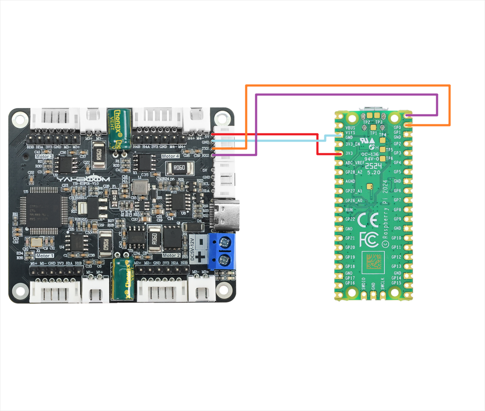

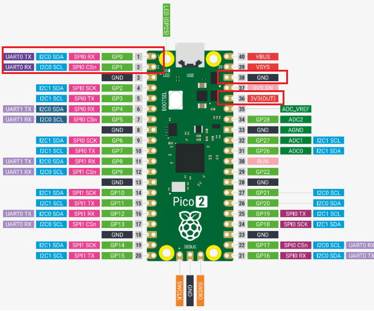

| Motor | **4-channel motor drive board**(Motor) |
| :---: | :------------------------------------: |
|  M2   |                   M-                   |
|   V   |                  3V3                   |
|   A   |                  H1A                   |
|   B   |                  H1B                   |
|   G   |                  GND                   |
|  M1   |                   M+                   |

| **4-channel motor drive board** | Pico2 |
| :-----------------------------: | :---: |
|               RX2               |  GP0  |
|               TX2               |  GP1  |
|               GND               |  GND  |
|               5V                |  3V3  |

 

## 1.2 Instructions

Buka kode menggunakan perangkat lunak Thonny, hubungkan ke Raspberry Pi pico2, dan klik tombol berhenti di ujung kanan bilah alat atas.


Kemudian, Anda dapat melihat informasi firmware saat ini di pico2 muncul di bilah pesan di bagian bawah, yang berarti perangkat lunak telah mengenali port serial.

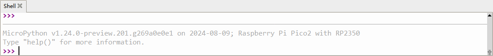

Jika pesan di sini menunjukkan bahwa port serial tidak dapat dikenali, Anda perlu merujuk ke tutorial flashing firmware dan mem-flash firmware ke motherboard agar port serial dapat dikenali.


 Setelah berhasil mengidentifikasi port serial dan mencetak informasi firmware, klik tombol hijau untuk mulai menjalankan skrip.


## 1.3 Code analysis

```c++
UPLOAD_DATA = 3  #0: Tidak menerima data 1: Menerima data encoder total 2: Menerima encoder real-time 3: Menerima kecepatan motor saat ini mm/s
MOTOR_TYPE = 1  #1: motor 520 2: motor 310 3: motor TT disk kode kecepatan 4: motor reduksi DC TT 5: motor 520 tipe L
```

- UPLOAD_DATA: digunakan untuk mengatur data enkoder motor. Atur 1 ke jumlah total pulsa enkoder dan 2 ke data pulsa waktu nyata 10 ms.
- MOTOR_TYPE: digunakan untuk mengatur jenis motor yang digunakan. Cukup ubah angka yang sesuai dengan komentar sesuai motor yang sedang Anda gunakan. Anda tidak perlu mengubah sisa kode.

Jika Anda perlu menggerakkan motor dan mengamati data, cukup ubah dua angka di awal program. Sisa kode tidak perlu diubah.

```c++
def set_motor_parameter():
    if MOTOR_TYPE == 1:
        set_motor_type(1)  # Konfigurasi tipe motor
        time.sleep(0.1)
        set_pluse_phase(30)  # Konfigurasi rasio reduksi, periksa manual motor
        time.sleep(0.1)
        set_pluse_line(11)  # Konfigurasi garis cincin magnetik, periksa manual motor
        time.sleep(0.1)
        set_wheel_dis(67.00)  # Konfigurasi diameter roda, hasil pengukuran
        time.sleep(0.1)
        set_motor_deadzone(1600)  # Konfigurasi zona mati motor, hasil eksperimen
        time.sleep(0.1)
    elif MOTOR_TYPE == 2:
        set_motor_type(2)
        time.sleep(0.1)
        set_pluse_phase(20)
        time.sleep(0.1)
        set_pluse_line(13)
        time.sleep(0.1)
        set_wheel_dis(48.00)
        time.sleep(0.1)
        set_motor_deadzone(1200)
        time.sleep(0.1)
    elif MOTOR_TYPE == 3:
        set_motor_type(3)
        time.sleep(0.1)
        set_pluse_phase(45)
        time.sleep(0.1)
        set_pluse_line(13)
        time.sleep(0.1)
        set_wheel_dis(68.00)
        time.sleep(0.1)
        set_motor_deadzone(1250)
        time.sleep(0.1)
    elif MOTOR_TYPE == 4:
        set_motor_type(4)
        time.sleep(0.1)
        set_pluse_phase(48)
        time.sleep(0.1)
        set_motor_deadzone(1000)
        time.sleep(0.1)
    elif MOTOR_TYPE == 5:
        set_motor_type(1)
        time.sleep(0.1)
        set_pluse_phase(40)
        time.sleep(0.1)
        set_pluse_line(11)
        time.sleep(0.1)
        set_wheel_dis(67.00)
        time.sleep(0.1)
        set_motor_deadzone(1600)
        time.sleep(0.1)
```

Ini digunakan untuk menyimpan parameter motor Yahboom. Dengan memodifikasi parameter MOTOR_TYPE di atas, konfigurasi sekali klik dapat dilakukan.

Biasanya, jangan mengubah kode di sini saat menggunakan motor Yahboom.

Jika Anda menggunakan motor Anda sendiri, atau jika data tertentu perlu dimodifikasi sesuai kebutuhan Anda, Anda dapat memeriksa kursus《1.2 Perintah kontrol》 untuk memahami arti spesifik dari setiap perintah.

```c++
if __name__ == "__main__":
    try:
        t = 0
        print("please wait...")
        send_upload_command(UPLOAD_DATA)  # Kirim data yang perlu dilaporkan ke modul motor
        time.sleep(0.1)
        set_motor_parameter()  # Atur parameter motor
        while True:
            received_message = receive_data()  # Menerima pesan
            if received_message:  # Jika ada data yang dikembalikan
                parsed = parse_data(received_message)  # Parsing data
                if parsed:
                    print(parsed)  # Cetak data yang telah di-parsing
            t += 10
            M1 = t
            M2 = t
            M3 = t
            M4 = t
            
            if MOTOR_TYPE == 4:
                control_pwm(M1*2, M2*2, M3*2, M4*2)
            else:
                control_speed(M1, M2, M3, M4)  # Kirim perintah langsung untuk mengontrol motor
            if t> 1000 or t < -1000:
                t = 0
            time.sleep(0.1)
```

Dalam program loop, kecepatan keempat motor akan ditingkatkan secara perlahan dari 0 hingga 1000. Jika tipe motornya 4, yaitu motor tanpa encoder, PWM motor dikontrol secara langsung.

Pada saat yang sama, data yang dikirim oleh papan pengemudi dibaca dan dicetak pada saat yang sama.

```
# Menerima data
def receive_data():
    global recv_buffer
    if uart.any() > 0:  # Periksa apakah ada data di buffer port serial
        recv_buffer += uart.read(uart.any()).decode()  # Baca dan decode data
        
        # Pisahkan pesan berdasarkan karakter akhir "#"
        messages = recv_buffer.split("#")
        recv_buffer = messages[-1]
        
        if len(messages) > 1:
            return messages[0] + "#"  # Kembalikan satu pesan lengkap
    return None

# Parsing data yang diterima
def parse_data(data):
    data = data.strip()  # Hapus spasi atau baris baru di kedua ujung
    if data.startswith("$MAll:"):
        values_str = data[6:-1]  # Hapus "$MAll:" dan "#"
        values = list(map(int, values_str.split(',')))  # Pisahkan dan konversi ke integer
        parsed = ', '.join([f"M{i+1}:{value}" for i, value in enumerate(values)])
        return parsed
    elif data.startswith("$MTEP:"):
        values_str = data[6:-1]
        values = list(map(int, values_str.split(',')))
        parsed = ', '.join([f"M{i+1}:{value}" for i, value in enumerate(values)])
        return parsed
    elif data.startswith("$MSPD:"):
        values_str = data[6:-1]
        values = [float(value) if '.' in value else int(value) for value in values_str.split(',')]
        parsed = ', '.join([f"M{i+1}:{value}" for i, value in enumerate(values)])
        return parsed
```

Setelah mendapatkan data dari papan pengemudi, maka dilakukan pemindahan gigi, dan pemindahan gigi tersebut diperlukan untuk mendapatkan data yang benar.

 

## 1.4 Fenomena Eksperimental

Setelah kabel terpasang dengan benar, colokkan motherboard ke port USB komputer, lalu klik tombol berhenti berwarna merah pada perangkat lunak. Biasanya, Anda akan melihat informasi firmware muncul di bilah pesan di bawah.

Kemudian, klik tombol jalankan berwarna hijau, dan Anda dapat melihat bahwa motor akan secara bertahap menambah kecepatan, lalu berhenti, dan mengulanginya lagi.

Pada saat yang sama, Anda dapat melihat nilai motor yang dicetak pada bilah pesan terus berubah.

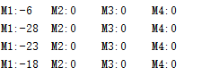

## For RDK X5

# Drive motor and read encoder-USART

# Motor penggerak dan encoder pembaca-USART

## 1.1 Penjelasan

Harap baca "0. Pengenalan dan Penggunaan Motor" terlebih dahulu untuk memahami parameter motor, metode pengkabelan, dan tegangan catu daya yang Anda gunakan. Hal ini untuk menghindari pengoperasian yang tidak tepat dan kerusakan pada papan driver atau motor.

Komunikasi I2C dan serial tidak dapat dibagi, hanya satu yang dapat dipilih.

##### Pengkabelan perangkat keras:

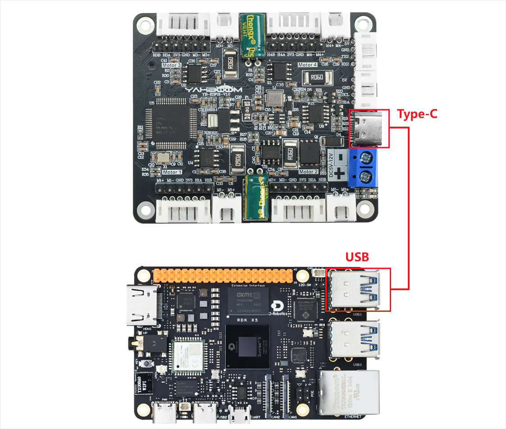

Bila papan RDK dan papan driver menggunakan komunikasi port serial, cukup sambungkan port USB pada papan utama ke port TYPE-C pada papan driver motor 4 saluran.

| Motor | 4-channel motor driver board(Motor) |
| :---: | :---------------------------------: |
|  M2   |                 M-                  |
|   V   |                 3V3                 |
|   A   |                 H1A                 |
|   B   |                 H1B                 |
|   G   |                 GND                 |
|  M1   |                 M+                  |

## 1.2 Instruksi

Setelah papan RDK tersambung ke USB papan driver, Anda dapat menggunakan perintah berikut untuk memeriksa apakah port serial dikenali.

```
ll /dev/ttyUSB*
```

Biasanya, `/dev/ttyUSB0`akan ditampilkan. Jika tidak ada ttyUSB0 tetapi ttyUSB1, Anda perlu mengubah `port='/dev/ttyUSB0'`di awal kode menjadi`port='/dev/ttyUSB1'`

Kemudian, gunakan perangkat lunak transfer file, seperti WinSCP, yang perlu Anda cari dan unduh sendiri.

Pindahkan file py ke direktori root papan RDK melalui perangkat lunak, lalu buka terminal dan jalankan perintah.

```
sudo python ~/USART.py
```

 

## 1.3 Analisis kode

```c++
UPLOAD_DATA = 3  # 0: Tidak menerima data 1: Menerima data encoder total 2: Menerima encoder real-time 3: Menerima kecepatan motor saat ini mm/s
MOTOR_TYPE = 1  # 1: motor 520 2: motor 310 3: motor TT disk kode kecepatan 4: motor reduksi DC TT 5: motor 520 tipe L
```

- UPLOAD_DATA: digunakan untuk mengatur data enkoder motor. Atur 1 ke jumlah total pulsa enkoder dan 2 ke data pulsa waktu nyata 10 ms.
- MOTOR_TYPE: digunakan untuk mengatur jenis motor yang digunakan. Cukup ubah angka yang sesuai dengan komentar sesuai motor yang sedang Anda gunakan. Anda tidak perlu mengubah sisa kode.

Jika Anda perlu menggerakkan motor dan mengamati data, cukup ubah dua angka di awal program. Sisa kode tidak perlu diubah.

```c++
def set_motor_parameter():
    if MOTOR_TYPE == 1:
        set_motor_type(1)  # Konfigurasi tipe motor
        time.sleep(0.1)
        set_pluse_phase(30)  # Konfigurasi rasio reduksi, periksa manual motor
        time.sleep(0.1)
        set_pluse_line(11)  # Konfigurasi garis cincin magnetik, periksa manual motor
        time.sleep(0.1)
        set_wheel_dis(67.00)  # Konfigurasi diameter roda, hasil pengukuran
        time.sleep(0.1)
        set_motor_deadzone(1900)  # Konfigurasi zona mati motor, hasil eksperimen
        time.sleep(0.1)
    elif MOTOR_TYPE == 2:
        set_motor_type(2)
        time.sleep(0.1)
        set_pluse_phase(20)
        time.sleep(0.1)
        set_pluse_line(13)
        time.sleep(0.1)
        set_wheel_dis(48.00)
        time.sleep(0.1)
        set_motor_deadzone(1600)
        time.sleep(0.1)
    elif MOTOR_TYPE == 3:
        set_motor_type(3)
        time.sleep(0.1)
        set_pluse_phase(45)
        time.sleep(0.1)
        set_pluse_line(13)
        time.sleep(0.1)
        set_wheel_dis(68.00)
        time.sleep(0.1)
        set_motor_deadzone(1250)
        time.sleep(0.1)
    elif MOTOR_TYPE == 4:
        set_motor_type(4)
        time.sleep(0.1)
        set_pluse_phase(48)
        time.sleep(0.1)
        set_motor_deadzone(1000)
        time.sleep(0.1)
    elif MOTOR_TYPE == 5:
        set_motor_type(1)
        time.sleep(0.1)
        set_pluse_phase(40)
        time.sleep(0.1)
        set_pluse_line(11)
        time.sleep(0.1)
        set_wheel_dis(67.00)
        time.sleep(0.1)
        set_motor_deadzone(1900)
        time.sleep(0.1)
```

Ini digunakan untuk menyimpan parameter motor Yahboom. Dengan memodifikasi parameter MOTOR_TYPE di atas, konfigurasi sekali klik dapat dilakukan.

Biasanya, jangan mengubah kode di sini saat menggunakan motor Yahboom.

Jika Anda menggunakan motor Anda sendiri, atau jika data tertentu perlu dimodifikasi sesuai kebutuhan Anda, Anda dapat memeriksa kursus《1.2 Perintah kontrol》 untuk memahami arti spesifik dari setiap perintah.

```
if __name__ == "__main__":
    try:
        t = 0
        print("please wait...")
        send_upload_command(UPLOAD_DATA)  # Kirim data yang perlu dilaporkan ke modul motor
        time.sleep(0.1)
        set_motor_parameter()  # Atur parameter motor
        while True:
            received_message = receive_data()  # Menerima pesan
            if received_message:  # Jika ada data yang dikembalikan
                parsed = parse_data(received_message)  # Parsing data
                if parsed:
                    print(parsed)  # Cetak data yang telah di-parsing
            t += 10
            M1 = t
            M2 = t
            M3 = t
            M4 = t
            if MOTOR_TYPE == 4:
                control_pwm(M1*2, M2*2, M3*2, M4*2)
            else:
                control_speed(M1, M2, M3, M4)  # Kirim perintah langsung untuk mengontrol motor
            if t> 1000 or t < -1000:
                t = 0
            time.sleep(0.1)
```

Dalam program loop, kecepatan keempat motor akan ditingkatkan secara perlahan dari 0 hingga 1000. Jika tipe motornya 4, yaitu motor tanpa encoder, PWM motor dikontrol secara langsung.

Pada saat yang sama, data yang dikirim oleh papan pengemudi dibaca dan dicetak pada saat yang sama.

```
def parse_data(data):
    data = data.strip()  # Hapus spasi atau baris baru di kedua ujung
    if data.startswith("$MAll:"):
        values_str = data[6:-1]  # Hapus "$MAll:" dan "#"
        values = list(map(int, values_str.split(',')))  # Pisahkan dan konversi ke integer
        parsed = ', '.join([f"M{i+1}:{value}" for i, value in enumerate(values)])
        return parsed
    elif data.startswith("$MTEP:"):
        values_str = data[6:-1]
        values = list(map(int, values_str.split(',')))
        parsed = ', '.join([f"M{i+1}:{value}" for i, value in enumerate(values)])
        return parsed
    elif data.startswith("$MSPD:"):
        values_str = data[6:-1]
        values = [float(value) if '.' in value else int(value) for value in values_str.split(',')]
        parsed = ', '.join([f"M{i+1}:{value}" for i, value in enumerate(values)])
        return parsed
```

Data asli yang disimpan diekstraksi dan direkonstruksi ke dalam format pencetakan baru.

## 1.4 Fenomena Eksperimental

Setelah menghubungkan port Tipe-C pada papan driver ke port USB pada motherboard, letakkan program di direktori root dan jalankan perintah `sudo python ~/USART.py`. Anda dapat melihat bahwa motor akan secara bertahap mempercepat, lalu berhenti, dan berulang.

Pada saat yang sama, Anda dapat melihat nilai motor tercetak di terminal yang terus berubah.

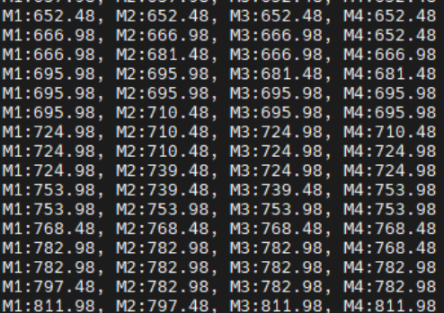

## For STM32

# Kontrol mobil dan baca encoder-USART

## 1.1 Penjelasan

Harap baca "0. Pengenalan dan Penggunaan Motor" terlebih dahulu untuk memahami parameter motor, metode pengkabelan, dan tegangan catu daya yang Anda gunakan. Hal ini untuk menghindari pengoperasian yang tidak tepat dan kerusakan pada papan driver atau motor.

Komunikasi I2C dan serial tidak dapat digunakan bersama, hanya satu yang dapat dipilih. STM32C8T6 dan RCT6 kompatibel dengan proyek ini.

**4 antarmuka motor pada modul sesuai dengan motor pada mobil robot, seperti yang ditunjukkan di bawah ini**

M1 -> Motor kiri atas (roda depan kiri mobil)

M2 -> Motor kiri bawah (roda belakang kiri mobil)

M3 -> Motor kanan atas (roda depan kanan mobil)

M4 -> Motor kanan bawah (roda belakang kanan mobil)

##### Pengkabelan perangkat keras:

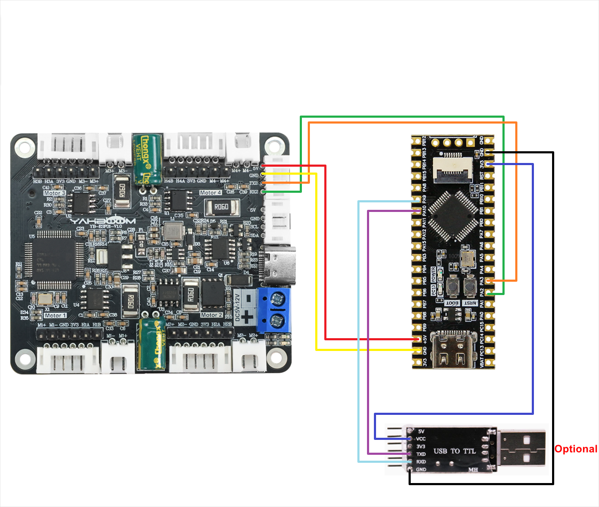

| **4-channel motor drive board** | STM32C8T6/STM32RCT6 |
| :-----------------------------: | :-----------------: |
|               RX2               |         PA2         |
|               TX2               |         PA3         |
|               GND               |         GND         |
|               5V                |         5V          |

| Motor | **4-channel motor drive board**(Motor) |
| :---: | :------------------------------------: |
|  M2   |                   M-                   |
|   V   |                  3V3                   |
|   A   |                  H1B                   |
|   B   |                  H1A                   |
|   G   |                  GND                   |
|  M1   |                   M+                   |

Modul port serial USB ke TTL perlu dihubungkan untuk mencetak data encoder yang diproses.

Jika Anda menggunakan Yahboom STM32, Anda dapat langsung menghubungkan antarmuka TYPE-C pada papan pengembangan STM32 ke port USB komputer, dan Anda juga dapat mencapai pencetakan port serial, jadi Anda tidak perlu menghubungkan modul port serial USB ke TTL.

| USB TO TTL | STM32C8T6/STM32RCT6 |
| :--------: | :-----------------: |
|    VCC     |         3V3         |
|    GND     |         GND         |
|    RXD     |         PA9         |
|    TXD     |        PA10         |

Konfigurasi port serial: Baud rate 115200, tidak ada pemeriksaan paritas, tidak ada kontrol aliran perangkat keras, 1 stop bit

##### Catatan: Port serial di sini digunakan untuk mencetak data pada asisten port serial, bukan untuk komunikasi dengan papan driver

## 1.2 Analisis kode

```
#define UPLOAD_DATA 2  // 1:接收总的编码器数据 2:接收实时的编码器 1: Receive total encoder data 2: Receive real-time encoder data


#define MOTOR_TYPE 1   //1:520电机 2:310电机 3:测速码盘TT电机 4:TT直流减速电机 5:L型520电机
                       //1:520 motor 2:310 motor 3:speed code disc TT motor 4:TT DC reduction motor 5:L type 520 motor
```

- UPLOAD_DATA: digunakan untuk mengatur data enkoder motor. Atur 1 ke jumlah total pulsa enkoder dan 2 ke data pulsa waktu nyata 10 ms.
- MOTOR_TYPE: digunakan untuk mengatur jenis motor yang digunakan. Cukup ubah angka yang sesuai dengan komentar sesuai motor yang sedang Anda gunakan. Anda tidak perlu mengubah sisa kode.

Jika Anda perlu menggerakkan motor dan mengamati data, cukup ubah dua angka di awal program. Sisa kode tidak perlu diubah.

```
#if MOTOR_TYPE == 1
    send_motor_type(1);  // Konfigurasi tipe motor
    delay_ms(100);
    send_pulse_phase(30);  // Konfigurasi rasio reduksi. Periksa manual motor untuk mengetahuinya
    delay_ms(100);
    send_pulse_line(11);  // Konfigurasi garis cincin magnetik. Periksa manual motor untuk mendapatkan hasilnya
    delay_ms(100);
    send_wheel_diameter(67.00);  // Konfigurasi diameter roda dan ukur
    delay_ms(100);
    send_motor_deadzone(1900);  // Konfigurasi zona mati motor, hasil eksperimen
    delay_ms(100);
    
    #elif MOTOR_TYPE == 2
    send_motor_type(2);
    delay_ms(100);
    send_pulse_phase(20);
    delay_ms(100);
    send_pulse_line(13);
    delay_ms(100);
    send_wheel_diameter(48.00);
    delay_ms(100);
    send_motor_deadzone(1600);
    delay_ms(100);
    
    #elif MOTOR_TYPE == 3
    send_motor_type(3);
    delay_ms(100);
    send_pulse_phase(45);
    delay_ms(100);
    send_pulse_line(13);
    delay_ms(100);
    send_wheel_diameter(68.00);
    delay_ms(100);
    send_motor_deadzone(1250);
    delay_ms(100);
    
    #elif MOTOR_TYPE == 4
    send_motor_type(4);
    delay_ms(100);
    send_pulse_phase(48);
    delay_ms(100);
    send_motor_deadzone(1000);
    delay_ms(100);
    
    #elif MOTOR_TYPE == 5
    send_motor_type(1);
    delay_ms(100);
    send_pulse_phase(40);
    delay_ms(100);
    send_pulse_line(11);
    delay_ms(100);
    send_wheel_diameter(67.00);
    delay_ms(100);
    send_motor_deadzone(1900);
    delay_ms(100);
    #endif
```

Ini digunakan untuk menyimpan parameter motor Yahboom. Dengan memodifikasi parameter MOTOR_TYPE di atas, konfigurasi sekali klik dapat dilakukan.

Biasanya, jangan mengubah kode di sini saat menggunakan motor Yahboom.

Jika Anda menggunakan motor Anda sendiri, atau jika data tertentu perlu dimodifikasi sesuai kebutuhan Anda, Anda dapat memeriksa kursus《1.2 Perintah kontrol》 untuk memahami arti spesifik dari setiap perintah.

```
    while(1)
    {
        if(times>=250)
        {
            #if MOTOR_TYPE == 4
            Car_Move_PWM();
            #else
            Car_Move();
            #endif
            times = 0;
        }
        if(g_recv_flag == 1)
        {
            g_recv_flag = 0;
            
            #if UPLOAD_DATA == 1
                Deal_data_real();
                printf("M1:%d,M2:%d,M3:%d,M4:%d\r\n",Encoder_Now[0],Encoder_Now[1],Encoder_Now[2],Encoder_Now[3]);
            #elif UPLOAD_DATA == 2
                Deal_data_real();
                printf("M1:%d,M2:%d,M3:%d,M4:%d\r\n",Encoder_Offset[0],Encoder_Offset[1],Encoder_Offset[2],Encoder_Offset[3]);
            #elif UPLOAD_DATA == 3
                Deal_data_real();
                printf("M1:%.2f,M2:%.2f,M3:%.2f,M4:%.2f\r\n",g_Speed[0],g_Speed[1],g_Speed[2],g_Speed[3]);
            #endif
        }
    }


```

Pengatur waktu 100 ms diatur dalam program. Setiap kali interupsi pengatur waktu dipicu, variabel waktu akan bertambah satu. Ketika mencapai 25 kali, yaitu 2,5 detik, status gerak mobil akan berubah.

Jika tipe motornya 4, yaitu motor tanpa enkoder, maka versi PWM dari fungsi pengalih status mobil digunakan. Pada saat yang sama, data yang dikirim oleh papan driver dibaca dan data tersebut dicetak.

```
// Memeriksa data yang dikirim dari board driver, dan menyimpan data yang memenuhi protokol komunikasi
void Deal_Control_Rxtemp(uint8_t rxtemp)
{
    static u16 step = 0;
    static u8 start_flag = 0;
    if(rxtemp == '$' &&     start_flag == 0)
    {
        start_flag = 1;
        memset(g_recv_buff,0,RXBUFF_LEN);  // Bersihkan data
    }
    
    else if(start_flag == 1)
    {
            if(rxtemp == '#')
            {
                start_flag = 0;
                step = 0;
                g_recv_flag = 1;
                memcpy(g_recv_buff_deal,g_recv_buff,RXBUFF_LEN);  // Hanya yang benar yang akan ditugaskan
            }
            else
            {
                if(step > RXBUFF_LEN)
                {
                    start_flag = 0;
                    step = 0;
                    memset(g_recv_buff,0,RXBUFF_LEN);  // Bersihkan data yang diterima
                }
                else
                {
                    g_recv_buff[step] = rxtemp;
                    step++;
                }
            }
    }
    
}
// Memformat data yang disimpan dari board driver dan mempersiapkannya untuk dicetak
void Deal_data_real(void)
{
    static uint8_t data[RXBUFF_LEN];
    uint8_t  length = 0;
    
    // Encoder keseluruhan
     if ((strncmp("MAll",(char*)g_recv_buff_deal,4)==0))
    {
        length = strlen((char*)g_recv_buff_deal)-5;
        for (uint8_t i = 0; i < length; i++)
        {
            data[i] = g_recv_buff_deal[i+5];  // Hapus titik dua
        }  
                data[length] = '\0';    
                    
                char* strArray[10];  // Array pointer Panjangnya didefinisikan oleh nomor pemisahan char 1 byte char* 4 byte
                char mystr_temp[4][10] = {'\0'}; 
                splitString(strArray,(char*)data, ", ");  // Pisahkan dengan koma
                for (int i = 0; i < 4; i++)
                {
                        strcpy(mystr_temp[i],strArray[i]);
                        Encoder_Now[i] = atoi(mystr_temp[i]);
                }
                
        }
        // Data encoder real-time 10ms
        else if ((strncmp("MTEP",(char*)g_recv_buff_deal,4)==0))
    {
        length = strlen((char*)g_recv_buff_deal)-5;
        for (uint8_t i = 0; i < length; i++)
        {
            data[i] = g_recv_buff_deal[i+5];  // Hapus titik dua
        }  
                data[length] = '\0';        
                char* strArray[10];  // Array pointer Panjangnya didefinisikan oleh nomor pemisahan char 1 byte char* 4 byte
                char mystr_temp[4][10] = {'\0'}; 
                splitString(strArray,(char*)data, ", ");  // Pisahkan dengan koma
                for (int i = 0; i < 4; i++)
                {
                        strcpy(mystr_temp[i],strArray[i]);
                        Encoder_Offset[i] = atoi(mystr_temp[i]);
                }
        }
        // Kecepatan
        else if ((strncmp("MSPD",(char*)g_recv_buff_deal,4)==0))
    {
        length = strlen((char*)g_recv_buff_deal)-5;
        for (uint8_t i = 0; i < length; i++)
        {
            data[i] = g_recv_buff_deal[i+5];  // Hapus titik dua
        }  
                data[length] = '\0';    
                
                char* strArray[10];  // Array pointer Panjangnya didefinisikan oleh nomor pemisahan char 1 byte char* 4 byte
                char mystr_temp[4][10] = {'\0'}; 
                splitString(strArray,(char*)data, ", ");  // Pisahkan dengan koma
                for (int i = 0; i < 4; i++)
                {
                        strcpy(mystr_temp[i],strArray[i]);
                        g_Speed[i] = atof(mystr_temp[i]);
                }
        }
}
```

- Deal_Control_Rxtemp: Saring data yang diterima dan simpan data yang memenuhi protokol komunikasi.
- Deal_data_real: Ekstrak data asli yang disimpan dan rekonstruksi format cetak baru.

## 1.3 Fenomena Eksperimental

Setelah kabel terpasang dengan benar, tulis program ke motherboard. Setelah pengaturan ulang, Anda dapat melihat bahwa mobil akan bergerak maju selama 2,5 detik, mundur selama 2,5 detik, belok kanan selama 2,5 detik, belok kiri selama 2,5 detik, lalu berhenti selama 2,5 detik, dan melanjutkan tindakan pengalihan status di atas.

Pada saat yang sama, Anda dapat melihat bahwa nilai motor yang dicetak terus berubah dalam asisten port serial.

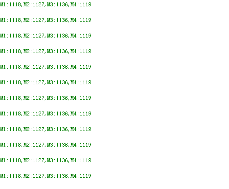

## Referensi:

- https://www.yahboom.net/study/Quad-MD-Module
- https://github.com/YahboomTechnology/4-Channel-Motor-Drive-Module
