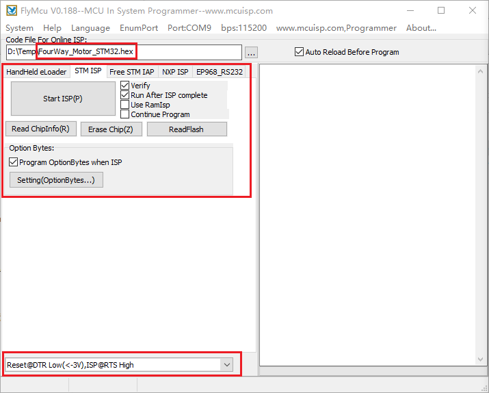
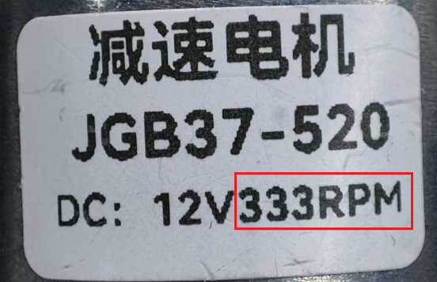
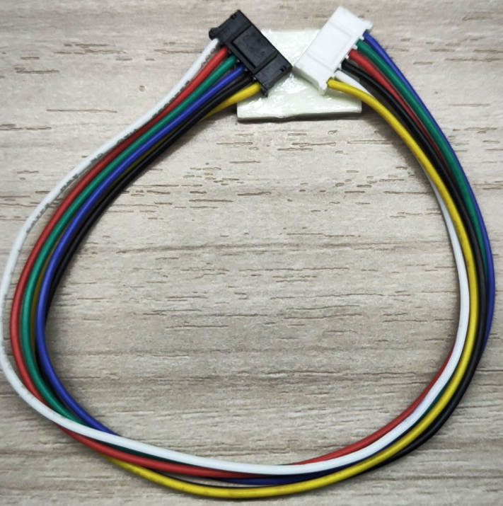
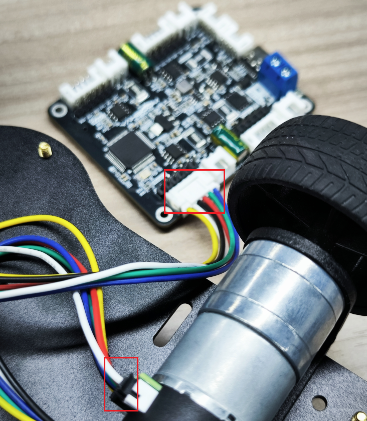
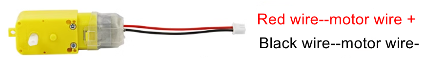
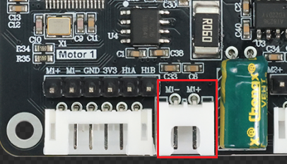
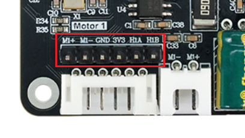
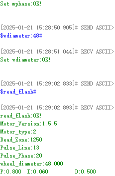
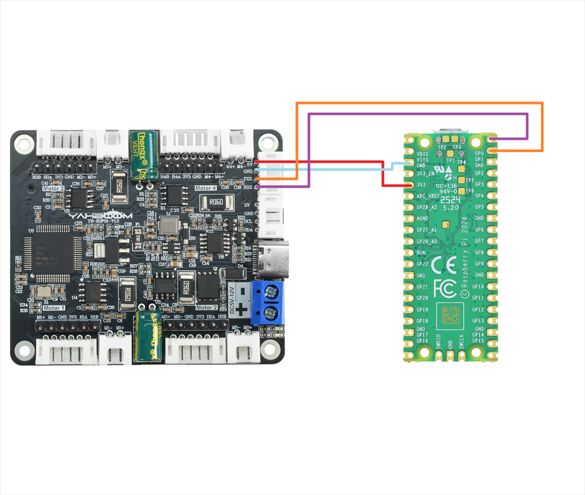

# Welcome to 4-Channel Motor Drive Module repository

## 1.1 Pengenalan Board Driver Motor 4-Channel


### Pengenalan Produk:

Modul driver motor encoder 4-channel mengintegrasikan koprosesor chip tunggal berkinerja tinggi, yang dapat terhubung dengan mulus dengan berbagai kontroler seperti MSPM0, STM32, Raspberry Pi dan Jetson melalui komunikasi port serial atau IIC, menyederhanakan proses penggerak.

Hanya membutuhkan empat kabel penghubung untuk mencapai komunikasi efisien dengan unit kontrol utama untuk dengan mudah mengontrol motor dan mendapatkan data encoder, mengurangi jumlah kabel dan mengurangi kesulitan operasi.

Pada saat yang sama, mendukung penggerak sebagian besar motor TT encoder Hall, motor reduksi DC 520/310 dan lainnya di pasaran.

### Tabel Parameter:

| Spesifikasi Teknis                         |             Parameter             |
| :----------------------------------------- | :-------------------------------: |
| Tegangan Input yang Direkomendasikan       |               5-12v               |
| Arus DC untuk Pin 5v                       |               0.7A                |
| Arus DC untuk Pin 3.3v                     |               500ma               |
| Arus penggerak berkelanjutan motor tunggal | Default 4A (output maksimum 5.5A) |
| Panjang * Lebar * Tinggi                   |         56 * 65 * 13.4mm          |
| Interface motor encoder                    |  PH2.0-6PIN、soket kabel Dupont   |
| Interface motor DC                         |            XH2.54-2PIN            |

## 4 interface motor pada modul sesuai dengan motor pada mobil robot, seperti ditunjukkan di bawah ini

M1 -> Motor kiri atas (roda depan kiri mobil) M2 -> Motor kiri bawah (roda belakang kiri mobil) M3 -> Motor kanan atas (roda depan kanan mobil) M4 -> Motor kanan bawah (roda belakang kanan mobil)

## Konfigurasi Port Serial

**Baud rate 115200, tanpa paritas, tanpa kontrol aliran perangkat keras, 1 stop bit**

 

### 1.Konfigurasi Tipe Motor

| Perintah  | Penjelasan  |  Contoh   |          Keterangan          | Default Firmware | Simpan saat mati |
| :-------: | :---------: | :-------: | :--------------------------: | :--------------: | :--------------: |
| $mtype:x# | Model motor | $mtype:1# | Model motor adalah motor 520 |    Motor 520     |        Y         |
|  Catatan  |             |           |                              |                  |                  |

1. Pemilihan tipe motor. Jika encoder motor A terhubung ke port A board, maka B terhubung ke B. Anda perlu memilih model motor 310. Jika tidak, Anda perlu memilih motor 520 atau motor TT.
2. Perintah dapat dikirim dalam huruf besar atau kecil semua.
3. Jika perintah di atas berhasil, akan mengembalikan pesan **perintah+OK**. Jika tidak ada pesan yang dikembalikan, periksa koneksi port serial.
4. x: adalah tipe motor. Tipe motor yang diwakili oleh nilai yang berbeda adalah sebagai berikut: 1: motor 520 2: motor 310 3: motor TT (dengan encoder) 4: motor TT (tanpa encoder)

Catatan: Jika Anda menggunakan motor tanpa encoder, Anda dapat memilih tipe 4, yaitu perintahnya adalah: $mtype:4# Jika Anda menggunakan motor dengan encoder, Anda dapat memilih salah satu dari 1, 2, dan 3.

### 2.Konfigurasi Deadband Motor

|    Perintah     |              Penjelasan               |     Contoh      |                          Keterangan                          | Default Firmware | Simpan saat mati |
| :-------------: | :-----------------------------------: | :-------------: | :----------------------------------------------------------: | :--------------: | :--------------: |
| $deadzone:xxxx# | Konfigurasi zona mati pulsa pwm motor | $deadzone:1650# | Saat mengontrol PWM, nilai zona mati akan ditambahkan secara default sehingga motor tidak akan memiliki area osilasi. |       1600       |        Y         |
|     Catatan     |                                       |                 |                                                              |                  |                  |

1. Perintah dapat dikirim dalam huruf besar atau kecil semua
2. Jika perintah di atas berhasil, akan mengembalikan pesan **perintah+OK**. Jika tidak ada pesan yang dikembalikan, periksa koneksi port serial
3. xxxx: adalah nilai zona mati, yang perlu diukur. Dengan mengubah nilai ini, getaran minimum motor dapat dihilangkan
4. Rentang nilai zona mati (0-3600)

### 3.Konfigurasi Garis Fase Motor

|  Perintah  |          Penjelasan          |   Contoh   |                      Keterangan                      | Default Firmware | Simpan saat mati |
| :--------: | :--------------------------: | :--------: | :--------------------------------------------------: | :--------------: | :--------------: |
| $mline:xx# | Konfigurasi garis fase motor | $mline:13# | Konfigurasi fase encoder Hall motor menjadi 13 garis |        11        |        Y         |
|  Catatan   |                              |            |                                                      |                  |                  |

1. Perintah dapat dikirim dalam huruf besar atau kecil semua
2. Perintah di atas akan mengembalikan informasi **perintah+OK** jika berhasil. Jika tidak ada informasi yang dikembalikan, periksa koneksi port serial
3. xx: Ini adalah fase encoder Hall untuk satu putaran. Nilai ini perlu diperoleh dengan memeriksa tabel parameter motor dari pedagang
4. Untuk motor dengan encoder: Nilai ini memainkan **peran utama** dalam mengontrol kecepatan. Nilai ini harus benar
5. Motor tanpa encoder: Konfigurasi nilai ini dapat diabaikan

### 4.Konfigurasi Rasio Reduksi Motor

|  Perintah   |           Penjelasan            |   Contoh    |                 Keterangan                 | Default Firmware | Simpan saat mati |
| :---------: | :-----------------------------: | :---------: | :----------------------------------------: | :--------------: | :--------------: |
| $mphase:xx# | Konfigurasi rasio reduksi motor | $mphase:40# | Konfigurasi rasio reduksi motor menjadi 40 |        30        |        Y         |
| **Catatan** |                                 |             |                                            |                  |                  |

1. Perintah dapat dikirim dalam huruf besar atau kecil semua
2. Perintah di atas akan mengembalikan informasi **perintah+OK** jika berhasil. Jika tidak ada informasi yang dikembalikan, periksa koneksi port serial
3. xx: Ini adalah parameter rasio reduksi motor. Nilai ini perlu diperoleh dengan memeriksa tabel parameter motor dari pedagang
4. Untuk motor dengan encoder: Nilai ini memainkan **peran utama** dalam mengontrol kecepatan. Nilai ini harus benar
5. Motor tanpa encoder: Konfigurasi nilai ini dapat diabaikan

### 5.Konfigurasi Diameter Roda (Opsional)

|    Perintah    |        Penjelasan         |     Contoh     |        Keterangan         | Default Firmware | Simpan saat mati |
| :------------: | :-----------------------: | :------------: | :-----------------------: | :--------------: | :--------------: |
| $wdiameter:xx# | Konfigurasi diameter roda | $wdiameter:50# | Diameter roda adalah 50mm |      67 mm       |        Y         |
|  **Catatan**   |                           |                |                           |                  |                  |

1. Perintah dapat dikirim dalam huruf besar atau kecil semua
2. Perintah di atas akan mengembalikan informasi **perintah+OK** jika berhasil. Jika tidak ada informasi yang dikembalikan, periksa koneksi port serial
3. xx: Ini adalah diameter roda. Nilai ini dapat diukur atau diperoleh menggunakan informasi pedagang
4. Untuk motor dengan encoder: Nilai ini memainkan **peran utama** dalam mengontrol kecepatan. Nilai ini harus benar dalam milimeter (mm); jika nilai ini salah, hanya akan mempengaruhi data kecepatan yang tidak akurat, dan tidak akan mempengaruhi data encoder
5. Motor tanpa encoder: Konfigurasi nilai ini dapat diabaikan

### 6.Konfigurasi Parameter PID untuk Kontrol Motor

|       Perintah        |        Penjelasan         |       Contoh        |                          Keterangan                          |  Default Firmware  | Simpan saat mati |
| :-------------------: | :-----------------------: | :-----------------: | :----------------------------------------------------------: | :----------------: | :--------------: |
| $MPID:x.xx,x.xx,x.xx# | Konfigurasi parameter PID | $MPID:1.5,0.03,0.1# | Konfigurasi kontrol kecepatan adalah P: 1.5, I: 0.03, D: 0.1 | P:0.8 I:0.06 D:0.5 |        Y         |
|      **Catatan**      |                           |                     |                                                              |                    |                  |

1. Perintah dapat dikirim dalam huruf besar atau kecil semua
2. Perintah di atas akan mengembalikan **perintah+OK** jika berhasil. Jika tidak ada informasi yang dikembalikan, periksa koneksi port serial
3. x.xx, x.xx, x.xx: Ini adalah parameter untuk mengontrol motor p, i, d masing-masing. **Setiap kali nilai diubah, chip akan restart dan menghentikan motor yang bergerak. Ini adalah situasi normal**
4. Untuk motor dengan encoder: parameter pid valid, dan nilai ini harus benar. **Umumnya, tidak perlu memodifikasi pid, dan nilai default dapat digunakan**
5. Motor tanpa encoder: parameter pid tidak valid, dan konfigurasi nilai ini dapat diabaikan

### 7.Reset Semua Variabel ke Nilai Default

|   Perintah    |           Penjelasan            | Contoh | Keterangan | Default Firmware | Simpan saat mati |
| :-----------: | :-----------------------------: | :----: | :--------: | :--------------: | :--------------: |
| $flash_reset# | Kembalikan nilai default pabrik |   -    |     -      |        -         |        -         |
|  **Catatan**  |                                 |        |            |                  |                  |

1. Perintah dapat dikirim dalam huruf besar atau kecil semua
2. Jika perintah di atas berhasil, akan mengembalikan pesan **perintah+OK**. Jika tidak ada pesan yang dikembalikan, periksa koneksi port serial
3. Eksekusi perintah ini dan modul akan restart sekali

### 8.Perintah Kontrol Kecepatan

|   Perintah    |        Penjelasan         |       Contoh        |                     Keterangan                      | Default Firmware | Simpan saat mati |
| :-----------: | :-----------------------: | :-----------------: | :-------------------------------------------------: | :--------------: | :--------------: |
| $spd:0,0,0,0# | Kontrol kecepatan 4 motor | $spd:100,-100,0,50# | Kontrol kecepatan 4 motor M1:100 M2:-100 M3:0 M4:50 |        -         |        N         |
|  **Catatan**  |                           |                     |                                                     |                  |                  |

1. Perintah dapat dikirim dalam huruf besar atau kecil semua
2. Jika perintah di atas berhasil, akan mengembalikan pesan **perintah+OK**. Jika tidak ada pesan yang dikembalikan, periksa koneksi port serial
3. Untuk motor dengan encoder: perintah ini berfungsi untuk mengontrol kecepatan motor
4. Motor tanpa encoder: perintah ini tidak valid
5. Perintah kontrol motor tidak perlu dikirim berulang kali; cukup kirim sekali, dan modul akan mengontrol motor menurut kecepatan yang ditetapkan, hingga perintah kontrol kecepatan baru diterima atau perintah berhenti dikirim.

Catatan: Setelah perintah ini dikirim, encoder atau data kecepatan akan secara otomatis dikirim balik menurut perintah yang telah dikonfigurasi sebelumnya.

### 9.Instruksi Kontrol PWM Langsung

|   Perintah    |            Penjelasan             |        Contoh        |                         Keterangan                         | Default Firmware | Simpan saat mati |
| :-----------: | :-------------------------------: | :------------------: | :--------------------------------------------------------: | :--------------: | :--------------: |
| $pwm:0,0,0,0# | Kontrol 4 motor dengan output PWM | $spd:0,-520,300,800# | Kontrol output PWM dari 4 motor M1:0 M2:-520 M3:300 M4:800 |        -         |        N         |
|  **Catatan**  |                                   |                      |                                                            |                  |                  |

1. Perintah dapat dikirim dalam huruf besar atau kecil semua
2. Jika perintah di atas berhasil, motor akan bergerak, dan tidak ada yang akan dikembalikan dari port serial
3. Rentang kecepatan adalah (-3600~3600) dan tidak valid jika melebihi rentang
4. Untuk kontrol motor tanpa encoder, **Anda dapat mengontrolnya melalui perintah ini**
5. 0,0,0,0: mewakili M1,M2,M3,M4 pada layar board

### 10.Laporan Data Encoder (Perintah ini hanya valid untuk motor dengan encoder)

|    Perintah    |     Penjelasan      |     Contoh     |                          Keterangan                          | Default Firmware | Simpan saat mati |
| :------------: | :-----------------: | :------------: | :----------------------------------------------------------: | :--------------: | :--------------: |
| $upload:0,0,0# | Terima data encoder | $upload:1,0,0# | Terima data encoder total dari putaran roda 1: buka, 0: tidak menerima |        -         |        N         |
|  **Catatan**   |                     |                |                                                              |                  |                  |

1. Perintah dapat dikirim dalam huruf besar atau kecil semua
2. $upload:0,0,0#: 0 pertama mewakili: data encoder total dari putaran roda. 0 kedua mewakili: data encoder real-time dari putaran roda (10ms). 0 ketiga mewakili: kecepatan roda
3. Informasi yang sesuai dapat diterima pada saat yang sama

- Data encoder total dari putaran roda mengembalikan informasi: "$MAll:M1,M2,M3,M4#"
- Data encoder real-time dari putaran roda mengembalikan informasi: "$MTEP:M1,M2,M3,M4#"
- Kecepatan roda mengembalikan informasi: "$MSPD:M1,M2,M3,M4#"

### 11.Query Variabel Flash

|   Perintah   |      Penjelasan      | Contoh | Keterangan | Default Firmware | Simpan saat mati |
| :----------: | :------------------: | :----: | :--------: | :--------------: | :--------------: |
| $read_flash# | Query variabel flash |   -    |     -      |        -         |        N         |
|   Catatan    |                      |        |            |                  |                  |

1. Perintah dapat dikirim dalam huruf besar atau kecil semua
2. Jika perintah di atas berhasil, akan mengembalikan pesan **perintah+OK**. Jika tidak ada pesan yang dikembalikan, periksa koneksi port serial

### 12.Cek Level Baterai

|  Perintah  |    Penjelasan     | Contoh | Keterangan | Default Firmware | Simpan saat mati |
| :--------: | :---------------: | :----: | :--------: | :--------------: | :--------------: |
| $read_vol# | Cek level baterai |   -    |     -      |        -         |        N         |
|  Catatan   |                   |        |            |                  |                  |

1. Perintah dapat dikirim dalam huruf besar atau kecil semua
2. Jika perintah di atas berhasil, akan mengembalikan informasi **daya baterai ($Battery:7.40V#)**. Jika tidak ada informasi yang dikembalikan, silakan periksa koneksi port serial

## Kontrol Protokol IIC

**Alamat perangkat IIC board driver motor 4-channel:** 0x26

| Alamat Register | R/W  |   Tipe   |                           Rentang                            |                          Penjelasan                          | Contoh                                                       |
| :-------------: | :--: | :------: | :----------------------------------------------------------: | :----------------------------------------------------------: | :----------------------------------------------------------- |
|      0x01       |  w   | uint8_t  | 1: motor 520 2: motor 310 3: motor TT (dengan encoder) 4: motor TT (tanpa encoder) |                       Tulis tipe motor                       | Alamat perangkat + alamat register + tipe motor              |
|      0x02       |  w   | uint16_t |                            0-3600                            |                  Konfigurasi deadband motor                  | Alamat perangkat + alamat register + nilai zona mati motor   |
|      0x03       |  w   | uint16_t |                           0-65535                            |        Konfigurasi jumlah garis cincin magnetik motor        | Alamat perangkat + alamat register + jumlah garis cincin magnetik motor |
|      0x04       |  w   | uint16_t |                           0-65535                            |               Konfigurasi rasio reduksi motor                | Alamat perangkat + alamat register + rasio reduksi motor     |
|      0x05       |  w   |  float   |                              -                               |              Masukkan diameter roda, satuan: mm              | Alamat perangkat + alamat register + diameter roda (perlu mengkonversi float ke bytes - little endian terlebih dahulu) |
|      0x06       |  w   | int16_t  |                          -1000~1000                          | Kontrol kecepatan, register ini hanya efektif untuk motor dengan encoder, satuan: mm | Alamat perangkat + alamat register + kecepatan (mentransmisikan data 4 motor setiap kali) **Mode big-endian** Setiap kecepatan menempati 2 bit Untuk uint8_t misalnya: kecepatan motor m1 200, kecepatan motor m2 -200, kecepatan motor m3 0, kecepatan motor m4 500 Yaitu: [0x00 0xC8 0xFF 0x38 0x00 0x00 0x01 0xf4] |
|      0x07       |  w   | int16_t  |                          -3600~3600                          | Kontrol PWM, kontrol ini tidak memerlukan data encoder dan dapat langsung mengontrol rotasi motor | Alamat perangkat + alamat register + kecepatan (mentransmisikan data 4 motor setiap kali) **Mode big-endian** Setiap kecepatan menempati 2 bit Untuk uint8_t misalnya: pwm motor m1 200, pwm motor m2 adalah -200, pwm motor m3 adalah 0, pwm motor m4 adalah 500 Yaitu: [0x00 0xC8 0xFF 0x38 0x00 0x00 0x01 0xf4] |
|      0x08       |  R   | uint16_t |                              -                               |                    Membaca level baterai                     | Data yang benar: data = (buf[0]<<8\|buf[1])/10.0             |
|      0x10       |  R   | int16_t  |                              -                               |      Baca data pulsa real-time encoder motor M1 - 10ms       | Data yang benar: data = buf[0]<<8\|buf[1]                    |
|      0x11       |  R   | int16_t  |                              -                               |      Baca data pulsa real-time encoder motor M2 - 10ms       | Data yang benar: data = buf[0]<<8\|buf[1]                    |
|      0x12       |  R   | int16_t  |                              -                               |      Baca data pulsa real-time encoder motor M3 - 10ms       | Data yang benar: data = buf[0]<<8\|buf[1]                    |
|      0x13       |  R   | int16_t  |                              -                               |      Baca data pulsa real-time encoder motor M4 - 10ms       | Data yang benar: data = buf[0]<<8\|buf[1]                    |
|      0x20       |  R   | int16_t  |                              -                               |     Baca data pulsa total encoder motor M1 (Bit tinggi)      | -                                                            |
|      0x21       |  R   | int16_t  |                              -                               |     Baca data pulsa total encoder motor M1 (Bit rendah)      | Data yang diperoleh perlu digeser untuk mendapatkan data yang benar. Bit tinggi mewakili: buf[0] buf[1] Bit rendah mewakili: bf[0] bf[1] (data = buf[0]<<24\|buf[1]<<16\|bf[0]<<8\|bf[1]) |
|      0x22       |  R   | int16_t  |                              -                               |     Baca data pulsa total encoder motor M2 (Bit tinggi)      | -                                                            |
|      0x23       |  R   | int16_t  |                              -                               |     Baca data pulsa total encoder motor M2 (Bit rendah)      | Metode perhitungan sama dengan M1                            |
|      0x24       |  R   | int16_t  |                              -                               |     Baca data pulsa total encoder motor M3 (Bit tinggi)      | -                                                            |
|      0x25       |  R   | int16_t  |                              -                               |     Baca data pulsa total encoder motor M3 (Bit rendah)      | Metode perhitungan sama dengan M1                            |
|      0x26       |  R   | int16_t  |                              -                               |     Baca data pulsa total encoder motor M4 (Bit tinggi)      | -                                                            |
|      0x27       |  R   | int16_t  |                              -                               |     Baca data pulsa total encoder motor M4 (Bit rendah)      | Metode perhitungan sama dengan M1                            |

# Cara Memperbarui Firmware

Buka software pembakaran FlyMcu yang disediakan dalam lampiran, hubungkan port typec dari board driver motor empat jalur ke komputer, kemudian klik Enumport di software tersebut. Dan pilih port serial yang digunakan oleh board driver Anda.


Pada file program, pilih file firmware yang telah diunduh, kemudian perhatikan bahwa pengaturan lain dalam kotak merah harus sama dengan yang ada di gambar.



Terakhir, cukup klik Start Programming. Tidak diperlukan operasi lain dan firmware akan mulai dibakar. Gambar berikut menunjukkan informasi yang ditampilkan setelah pembakaran berhasil:


Terakhir, cabut dan colokkan kabel type-c lagi untuk me-restart board driver. Jika lampu merah selalu menyala dan lampu hijau berkedip dua kali setiap 3 detik, maka pembakaran berhasil.

# Pengenalan dan Penggunaan Motor

**Kursus ini digunakan untuk menjelaskan parameter motor, tegangan supply yang direkomendasikan, dan metode perkabelan yang direkomendasikan untuk menghubungkan motor ke board driver motor 4-channel.** 

## 1. Motor 520


|         Parameter         |                         MD520Z19_12V                         |                         MD520Z30_12V                         |                         MD520Z56_12V                         |
| :-----------------------: | :----------------------------------------------------------: | :----------------------------------------------------------: | :----------------------------------------------------------: |
|      Tegangan rated       |                             12V                              |                             12V                              |                             12V                              |
|        Tipe motor         |                    Sikat magnet permanen                     |                    Sikat magnet permanen                     |                    Sikat magnet permanen                     |
|       Poros output        |             Poros eksentrik tipe-D diameter 6mm              |             Poros eksentrik tipe-D diameter 6mm              |             Poros eksentrik tipe-D diameter 6mm              |
|        Torsi stall        |                           3.1kg·cm                           |                           4.8kg·cm                           |                           8.3kg·cm                           |
|        Torsi rated        |                           2.2kg·cm                           |                           3.3kg·cm                           |                           6.5kg·cm                           |
| Kecepatan sebelum reduksi |                           11000rpm                           |                           11000rpm                           |                           12000rpm                           |
| Kecepatan setelah reduksi |                          550±10rpm                           |                          333±10rpm                           |                          205±10rpm                           |
|        Daya rated         |                             ≤4W                              |                             ≤4W                              |                             ≤4W                              |
|        Arus stall         |                              3A                              |                              3A                              |                              4A                              |
|        Arus rated         |                             0.3A                             |                             0.3A                             |                             0.3A                             |
|  Rasio reduksi gear set   |                             1:19                             |                             1:30                             |                             1:56                             |
|       Tipe encoder        |               Encoder Hall incremental fase AB               |               Encoder Hall incremental fase AB               |               Encoder Hall incremental fase AB               |
|  Tegangan supply encoder  |                            3.3-5V                            |                            3.3-5V                            |                            3.3-5V                            |
|   Jumlah loop magnetik    |                           11 garis                           |                           11 garis                           |                           11 garis                           |
|      Tipe interface       |                          PH2.0 6Pin                          |                          PH2.0 6Pin                          |                          PH2.0 6Pin                          |
|          Fungsi           | Dengan pembentukan pull-up built-in, MCU dapat langsung membaca pulsa sinyal | Dengan pembentukan pull-up built-in, MCU dapat langsung membaca pulsa sinyal | Dengan pembentukan pull-up built-in, MCU dapat langsung membaca pulsa sinyal |
|    Berat motor tunggal    |                           150g±1g                            |                           150g±1g                            |                           150g±1g                            |

Catu daya yang direkomendasikan: **12V**.

Ada tiga jenis motor 520, dan tegangan rated mereka adalah **12V**. Ketika kita menggerakkan motor 520, kita dapat menghubungkan tegangan antara 11 dan 16V, dan disarankan untuk menggunakan supply tegangan 12V**.

Jika Anda ingin membedakan model motor 520 yang Anda beli, Anda dapat langsung melihat label yang tercetak pada motor 520. Ada teks yang tercetak di atasnya bernama RPM, dan angka di depan RPM sesuai dengan angka **kecepatan setelah reduksi** dalam tabel parameter.

Misalnya, label motor 520 di tangan saya mengatakan 333RPM, jadi Anda harus memperhatikan parameter dalam kolom **MD520Z30_12V**. Khususnya, dua parameter **rasio reduksi dan jumlah garis cincin magnetik** mungkin perlu dimodifikasi saat menggunakan board driver motor 4-channel.



Perkabelan yang direkomendasikan:

Motor 520 yang Anda beli akan dilengkapi dengan dua jenis kabel. Di sini kami merekomendasikan agar Anda memilih kabel double-ended PH2.0-6PIN hitam, satu ujung terhubung ke motor, dan ujung lainnya langsung terhubung ke interface motor encoder PH2.0-6PIN pada board driver motor empat jalur. Kita dapat menemukan bahwa A pada motor sesuai dengan fase B dari board driver motor empat jalur.

Jadi saat mengkonfigurasi tipe motor pada board driver motor empat jalur, Anda harus memilih `$mtype:1#`, model motor 520.


Instruksi perkabelan motor 520:

Jika Anda menggunakan koneksi PH2.0-6PIN ke kabel Dupont, Anda dapat menghubungkan sesuai dengan gambar di bawah ini. Dengan koneksi ini, fase A motor akan terhubung ke fase A board driver motor empat jalur, dan fase B akan terhubung ke fase B.

Namun, saat mengkonfigurasi tipe motor, Anda harus memilih `$mtype:2#`, model motor 310.

 


 

## 2. Motor 310


​	

| Parameter                 | Nilai/deskripsi                                              |
| ------------------------- | ------------------------------------------------------------ |
| Nama motor                | MD310Z20_7.4V                                                |
| Arus stall                | ≤1.4A                                                        |
| Tegangan rated motor      | 7.4V                                                         |
| Arus rated                | ≤0.65A                                                       |
| Tipe motor                | Sikat magnet permanen                                        |
| Rasio reduksi gear set    | 1:20                                                         |
| Poros output              | Poros eksentrik tipe-D diameter 3mm                          |
| Tipe encoder              | Encoder Hall incremental fase AB                             |
| Torsi stall               | ≥1.0kg·cm                                                    |
| Tegangan supply encoder   | 3.3-5V                                                       |
| Torsi rated               | 0.4kg·cm                                                     |
| Jumlah loop magnetik      | 13 garis                                                     |
| Kecepatan sebelum reduksi | 9000rpm                                                      |
| Tipe interface            | PH2.0 6Pin                                                   |
| Fungsi                    | Dengan pembentukan pull-up built-in, MCU dapat langsung membaca pulsa sinyal |
| Kecepatan setelah reduksi | 450±10rpm                                                    |
| Daya rated                | 4.8W                                                         |
| Berat motor tunggal       | 70g                                                          |

Catu daya yang direkomendasikan: **7.4V**. Dapat dihubungkan ke tegangan antara 4.2~8.4V, **direkomendasikan menggunakan tegangan 7.4V**.

Dua parameter **rasio reduksi dan jumlah garis cincin magnetik** dalam tabel parameter utama diperlukan. Dua parameter ini mungkin perlu dimodifikasi saat menggunakan board driver motor empat jalur.

Jika Anda membeli motor 310 sendiri, Anda akan menerima kabel PH2.0-6PIN ke DuPont. Saat menghubungkan board driver 4-channel, hubungkan ke soket IO-nya.


Instruksi perkabelan motor 310:

Ketika fase A motor 310 terhubung ke fase A board driver motor 4-channel, dan fase B terhubung ke fase B, maka saat mengkonfigurasi tipe motor, Anda harus memilih `$mtype:2#`, model motor 310.


 

Jika Anda membeli motor 310 dalam kit chassis, motor ini memiliki kabel double-ended PH2.0-6PIN. Anda dapat menghubungkan ujung hitam ke motor 310 dan ujung putih ke interface motor encoder PH2.0-6PIN pada board driver motor 4-channel.

Pada saat ini, pilih `$mtype:2#` untuk mengkonfigurasi tipe motor, yaitu model motor 310.

 






## 3. Motor TT DC


| Parameter                 | Nilai/Deskripsi |
| ------------------------- | --------------- |
| Model                     | Motor gear TT   |
| Material sikat            | Sikat karbon    |
| Rasio reduksi             | 1:48            |
| Tegangan rated            | 6V              |
| Arus idle                 | 200MA           |
| Arus stall                | 1.5A            |
| Torsi                     | 0.8N.m          |
| Kecepatan sebelum reduksi | 12000±10%rpm    |
| Kecepatan setelah reduksi | 245±10%rpm      |

Catu daya yang direkomendasikan: **7.4V**

Motor ini tidak memiliki encoder, jadi Anda hanya perlu memodifikasi **tipe motor** dan **rasio reduksi** di board driver motor empat jalur. Saat mengkonfigurasi tipe motor, pilih `$mtype:4#`, model motor TT tanpa encoder.

Perkabelan yang direkomendasikan: Hubungkan interface XH2.54-2PIN pada motor TT langsung ke soket XH2.54-2PIN pada board driver motor 4-channel.



 



 

 

## 4. Motor TT dengan pengukuran kecepatan encoder


| Parameter                          | Nilai/Deskripsi                                              |
| ---------------------------------- | ------------------------------------------------------------ |
| Model                              | Motor TT poros tunggal logam 13-kawat                        |
| Tipe motor                         | Motor 130                                                    |
| Tipe motor/material sikat          | Sikat tembaga                                                |
| Rasio reduksi                      | 1:45                                                         |
| Tegangan rated                     | 6V                                                           |
| Arus tanpa beban                   | 0.08A                                                        |
| Arus rated                         | 0.3A                                                         |
| Arus stall                         | 1.1A                                                         |
| Torsi                              | 1.2N.m                                                       |
| Kecepatan sebelum reduksi          | 16000±5%rpm                                                  |
| Kecepatan setelah reduksi          | 355±5%rpm                                                    |
| Tipe encoder                       | Encoder fase AB Hall                                         |
| Catu daya encoder                  | 3.3-5V                                                       |
| Jumlah garis encoder               | 13 garis                                                     |
| Hitungan maksimum per putaran roda | 2340                                                         |
| Fitur                              | Dengan pembentukan pull-up built-in, MCU dapat membaca langsung |

Catu daya yang direkomendasikan: **7.4V**. Dapat dihubungkan ke 5~13V, **direkomendasikan menggunakan supply tegangan 7.4V**.

Dua parameter **rasio reduksi dan jumlah garis encoder** dalam tabel parameter utama diperlukan. Dua parameter ini mungkin perlu dimodifikasi saat menggunakan board driver motor 4-channel.

Perkabelan yang direkomendasikan: Gunakan kabel PH2.0-6PIN ke kabel Dupont dan hubungkan ke soket IO board driver motor 4-channel.




Instruksi perkabelan untuk motor TT pengukuran kecepatan encoder:

Ketika fase A motor TT encoder terhubung ke fase A board driver motor empat jalur, dan fase B terhubung ke fase B, maka saat mengkonfigurasi tipe motor, Anda harus memilih `$mtype:3#`, model motor TT dengan encoder.


## 5. Motor 520 tipe-L


| Parameter             | Nilai/Deskripsi  |
| --------------------- | ---------------- |
| Model                 | Motor 520 tipe-L |
| Tegangan starting     | 6V               |
| Tegangan rated        | 12V              |
| Rasio reduksi         | 1:40             |
| Jumlah loop magnetik  | 11线             |
| Arus tanpa beban      | ≥450mA           |
| Kecepatan tanpa beban | 300r/min±5%      |
| Torsi rated           | 4.4KG.CM         |
| Kecepatan rated       | 150r/min         |
| Torsi stall           | 10KG.CM          |
| Arus stall            | 4A               |

Catu daya yang direkomendasikan: **12V**.

Dua parameter **rasio reduksi dan jumlah garis encoder** dalam tabel parameter utama diperlukan. Dua parameter ini mungkin perlu dimodifikasi saat menggunakan board driver motor 4-channel.

Perkabelan yang direkomendasikan: Motor 520 tipe-L yang dibeli akan dilengkapi dengan dua jenis kabel. Di sini kami merekomendasikan agar Anda memilih kabel double-headed PH2.0-6PIN hitam, satu ujung terhubung ke motor, dan ujung lainnya langsung terhubung ke interface motor encoder PH2.0-6PIN pada board driver motor 4-channel. 

Perkabelan ini adalah yang paling nyaman, tetapi dapat ditemukan bahwa A pada motor sesuai dengan fase B board driver motor 4-channel. Oleh karena itu, saat mengkonfigurasi tipe motor pada board driver motor 4-channel, Anda harus memilih `$mtype:1#`, model motor 520.


Instruksi perkabelan motor 520 tipe-L:

Jika Anda menggunakan koneksi PH2.0-6PIN ke kabel Dupont, Anda dapat menghubungkan sesuai dengan gambar di bawah ini. Dengan koneksi ini, fase A motor akan terhubung ke fase A board driver motor 4-channel, dan fase B akan terhubung ke fase B. 

Namun, saat mengkonfigurasi tipe motor, Anda harus memilih `$mtype:2#`, model motor 310.


## 1.PC host

# Komunikasi Serial

## 1.1 Penjelasan

**Harap baca 《0. Pengenalan dan penggunaan motor》 terlebih dahulu untuk memahami parameter motor, metode perkabelan, dan tegangan catu daya yang saat ini Anda gunakan. Untuk menghindari operasi yang tidak tepat dan kerusakan pada board driver atau motor.**

Hubungkan board driver ke komputer melalui port TYPE-C pada board driver, dan gunakan asisten port serial untuk mengirim perintah ke board driver untuk kontrol dan pembacaan data.

##### Perkabelan perangkat keras:

| **Motor** | **Board driver motor 4-channel**(Motor) |
| :-------: | :-------------------------------------: |
|    M2     |                   M-                    |
|     V     |                   3V3                   |
|     A     |                   H1A                   |
|     B     |                   H1B                   |
|     G     |                   GND                   |
|    M1     |                   M+                    |

 

## 1.2 Instruksi

Buka software asisten port serial di komputer. Di sini kita mengambil Uart Assistant sebagai contoh.


 

Konfigurasi port serial: **Baud rate 115200, tanpa pemeriksaan paritas, tanpa kontrol aliran perangkat keras, 1 stop bit**

Setelah konfigurasi, Anda dapat mengirim perintah di jendela kirim di bawah untuk mengontrol board driver. Semua perintah port serial dan penjelasan tercantum dalam kursus《1.2 Perintah kontrol》.

Selanjutnya, kami akan mendemonstrasikan cara memodifikasi parameter default untuk menggunakan **motor 310, ban diameter 48mm**.


Pertama, keluarkan perintah `$read_flash#`, yang digunakan untuk query parameter penyimpanan power-off di flash. Ini dapat menyimpan tipe ban, zona mati motor, garis fase motor, rasio reduksi motor, diameter roda, dan parameter PID motor.

Kemudian, sesuai dengan parameter motor dan ban, masukkan perintah konfigurasi parameter kirim di kolom kirim di bawah.




Kita dapat melihat bahwa setelah setiap perintah konfigurasi dikeluarkan, board driver akan mengirim kembali pesan 'OK!', menunjukkan bahwa pengaturan berhasil. Terakhir, gunakan perintah untuk melihat flash untuk melihat bahwa parameter yang baru saja dimodifikasi telah berlaku. Metode modifikasi parameter PID sama dengan ini, tetapi umumnya tidak perlu dimodifikasi, jadi tidak akan didemonstrasikan di sini.

Jika Anda ingin mengontrol gerakan motor, kirim perintah `$spd:0,0,0,0#` atau `$pwm:0,0,0,0#`. Perintah spd mengontrol motor dengan encoder, dan perintah pwm dapat mengontrol motor dengan atau tanpa encoder. Misalkan saya ingin mengontrol motor 310 yang dicolokkan ke Motor1 pada board driver, yang memiliki encoder, maka kirim `$spd:100,0,0,0#` untuk mengontrolnya. Untuk mengontrol motor yang terhubung ke Motor2, modifikasi nilai kedua: `$spd:0,100,0,0#`.

## Untuk Arduino

# Menggerakkan motor dan membaca encoder-USART

## 1.1 Penjelasan

**Harap baca 《0. Pengenalan dan penggunaan motor》 terlebih dahulu untuk memahami parameter motor, metode perkabelan, dan tegangan catu daya yang saat ini Anda gunakan. Untuk menghindari operasi yang tidak tepat dan kerusakan pada board driver atau motor.**

I2C dan komunikasi serial tidak dapat dibagikan, hanya satu yang dapat dipilih.

Kursus ini menggunakan board Arduino UNO. Dan menggunakan Arduino 1.8.5 IDE 

**Sebelum menulis program, jangan hubungkan board driver ke pin RX pada Arduino, jika tidak program tidak dapat ditulis ke board.**

**Setelah program ditulis, hubungkan pin RX pada Arduino.**

##### Perkabelan perangkat keras:


| Motor | **Board driver motor 4-channel**(Motor) |
| :---: | :-------------------------------------: |
|  M2   |                   M-                    |
|   V   |                   3V3                   |
|   A   |                   H1A                   |
|   B   |                   H1B                   |
|   G   |                   GND                   |
|  M1   |                   M+                    |

| **Board driver motor 4-channel** | Arduino UNO |
| :------------------------------: | :---------: |
|               RX2                |     TX      |
|               TX2                |     RX      |
|               GND                |     GND     |
|                5V                |     5V      |

Karena port serial perangkat keras pada board Arduino digunakan untuk berkomunikasi dengan board driver, kasus ini memerlukan port serial USB ke TTL tambahan untuk mencetak data.

| USB TO TTL | Arduino UNO |
| :--------: | :---------: |
|    VCC     |     3V3     |
|    GND     |     GND     |
|    RXD     |      3      |
|    TXD     |      2      |

Konfigurasi port serial: **Baud rate 115200, tanpa pemeriksaan paritas, tanpa kontrol aliran perangkat keras, 1 stop bit**

## 1.2 Analisis kode

```
#define UPLOAD_DATA 3  //0:不接受数据 1:接收总的编码器数据 2:接收实时的编码器 3:接收电机当前速度 mm/s
                       //0: Do not receive data 1: Receive total encoder data 2: Receive real-time encoder 3: Receive current motor speed mm/s


#define MOTOR_TYPE 1   //1:520电机 2:310电机 3:测速码盘TT电机 4:TT直流减速电机 5:L型520电机
                       //1:520 motor 2:310 motor 3:speed code disc TT motor 4:TT DC reduction motor 5:L type 520 motor
```

- UPLOAD_DATA: used to set the data of the motor encoder. Set 1 to the total number of encoder pulses and 2 to the real-time pulse data of 10ms.
- MOTOR_TYPE: used to set the type of motor used. Just modify the corresponding numbers according to the comments according to the motor you are currently using. You don’t need to modify the rest of the code.

If you need to drive the motor and observe the data, just modify the two numbers at the beginning of the program. No changes are required to the rest of the code.

```
  #if MOTOR_TYPE == 1
    send_motor_type(1);//配置电机类型 Configure motor type
    delay(100);
    send_pulse_phase(30);//配置减速比 查电机手册得出    Configure the reduction ratio. Check the motor manual to find out
    delay(100);
    send_pulse_line(11);//配置磁环线 查电机手册得出 Configure the magnetic ring wire. Check the motor manual to get the result.
    delay(100);
    send_wheel_diameter(67.00);//配置轮子直径,测量得出        Configure the wheel diameter and measure it
    delay(100);
    send_motor_deadzone(1900);//配置电机死区,实验得出 Configure the motor dead zone, and the experiment shows
    delay(100);
    
  #elif MOTOR_TYPE == 2
  send_motor_type(2);
    delay(100);
    send_pulse_phase(20);
    delay(100);
    send_pulse_line(13);
    delay(100);
    send_wheel_diameter(48.00);
    delay(100);
    send_motor_deadzone(1600);
    delay(100);
    
  #elif MOTOR_TYPE == 3
  send_motor_type(3);
    delay(100);
    send_pulse_phase(45);
    delay(100);
    send_pulse_line(13);
    delay(100);
    send_wheel_diameter(68.00);
    delay(100);
    send_motor_deadzone(1250);
    delay(100);
    
  #elif MOTOR_TYPE == 4
  send_motor_type(4);
    delay(100);
    send_pulse_phase(48);
    delay(100);
    send_motor_deadzone(1000);
    delay(100);
    
  #elif MOTOR_TYPE == 5
  send_motor_type(1);
    delay(100);
    send_pulse_phase(40);
    delay(100);
    send_pulse_line(11);
    delay(100);
    send_wheel_diameter(67.00);
    delay(100);
    send_motor_deadzone(1900);
    delay(100);
  #endif
```

This is used to store the parameters of the Yahboom motor. By modifying the MOTOR_TYPE parameter above, one-click configuration can be achieved.

In normally, do not modify the code here when using the Yahboom motor.

If you are using your own motor, or if a certain data needs to be modified according to your needs, you can check the course《1.2 Control command》 to understand the specific meaning of each command.

```
void loop(){
  
      Motor_USART_Recieve();
      if(g_recv_flag == 1)
    {
      g_recv_flag = 0;
      #if MOTOR_TYPE == 4
        Contrl_Pwm(i*2,i*2,i*2,i*2);
      #else
        Contrl_Speed(i,i,i,i);   //值为-1000~1000 The value is -1000~1000
      #endif


        Deal_data_real();
        //delay(100);
      #if UPLOAD_DATA == 1
        sprintf(buffer,"M1:%d,M2:%d,M3:%d,M4:%d\r\n",Encoder_Now[0],Encoder_Now[1],Encoder_Now[2],Encoder_Now[3]);
        printSerial.println(buffer);
      #elif UPLOAD_DATA == 2
        sprintf(buffer,"M1:%d,M2:%d,M3:%d,M4:%d\r\n",Encoder_Offset[0],Encoder_Offset[1],Encoder_Offset[2],Encoder_Offset[3]);
        printSerial.println(buffer);
      #elif UPLOAD_DATA == 3
        dtostrf(g_Speed[0], 4, 2, string1);
        dtostrf(g_Speed[1], 4, 2, string2);
        dtostrf(g_Speed[2], 4, 2, string3);
        dtostrf(g_Speed[3], 4, 2, string4);
        sprintf(buffer,"M1:%s,M2:%s,M3:%s,M4:%s\r\n",string1,string2,string3,string4);
        printSerial.println(buffer);
      #endif


      i++;
      if (i == 1000) i = 0;
      
    }


}
```

In the loop program, the speed of the four motors will be slowly increased from 0 to 1000. If the motor type is 4, that is, the motor without encoder, the motor's PWM is directly controlled. 

At the same time, the data sent by the driver board is read and printed out at the same time.

```
//检验从驱动板发送过来的数据，符合通讯协议的数据则保存下来
//Check the data sent from the driver board, and save the data that meets the communication protocol
void Deal_Control_Rxtemp(uint8_t rxtemp)
{
    static u8 step = 0;
    static u8 start_flag = 0;


    if(rxtemp == '$' &&     start_flag == 0)
    {
        start_flag = 1;
        memset(g_recv_buff,0,RXBUFF_LEN);//清空数据 Clear data
    }
    
    else if(start_flag == 1)
    {
            if(rxtemp == '#')
            {
                start_flag = 0;
                step = 0;
                g_recv_flag = 1;
        // 检查前四个字符  Check the first four characters
    if (strncmp("MAll:",(char*)g_recv_buff,5)==0 ||
        strncmp("MTEP:",(char*)g_recv_buff,5)==0 ||
        strncmp("MSPD:",(char*)g_recv_buff,5)==0) {
        if (isValidNumbers((char*)g_recv_buff + 5)) {
                // 如果符合条件，打印数据  If the conditions are met, print the data
                memcpy(g_recv_buff_deal,g_recv_buff,RXBUFF_LEN);
            }
    } else {
        // 不匹配时清除缓冲区，避免残留无效数据 Clear the buffer when there is no match to avoid residual invalid data
        memset(g_recv_buff, 0, RXBUFF_LEN);
    }
            }
            else
            {
                if(step > RXBUFF_LEN)
                {
                    start_flag = 0;
                    step = 0;
                    memset(g_recv_buff,0,RXBUFF_LEN);//清空接收数据   Clear received data
                }
                else
                {
                    g_recv_buff[step] = rxtemp;
                    step++;
                }
            }
    }
    
}


//将从驱动板保存到的数据进行格式处理，然后准备打印
//Format the data saved from the driver board and prepare it for printing
void Deal_data_real(void)
{
     static uint8_t data[RXBUFF_LEN];
   uint8_t  length = 0;
    //总体的编码器    Overall encoder
     if ((strncmp("MAll",(char*)g_recv_buff_deal,4)==0))
    {
        length = strlen((char*)g_recv_buff_deal)-5;
        for (uint8_t i = 0; i < length; i++)
        {
            data[i] = g_recv_buff_deal[i+5]; //去掉冒号 Remove the colon
        }  
                data[length] = '\0';    
                char* strArray[10];//指针数组 长度根据分割号定义  char 1字节   char* 4字节    Pointer array The length is defined by the split number char 1 byte char* 4 bytes
                char mystr_temp[4][10] = {'\0'}; 
                splitString(strArray,(char*)data, ", ");//以逗号切割 Split by comma
                for (int i = 0; i < 4; i++)
                {
                        strcpy(mystr_temp[i],strArray[i]);
                        Encoder_Now[i] = atoi(mystr_temp[i]);
                }
                
        }
        //10ms的实时编码器数据  10ms real-time encoder data
        else if ((strncmp("MTEP",(char*)g_recv_buff_deal,4)==0))
    {
        length = strlen((char*)g_recv_buff_deal)-5;
        for (uint8_t i = 0; i < length; i++)
        {
            data[i] = g_recv_buff_deal[i+5]; //去掉冒号 Remove the colon
        }  
                data[length] = '\0';        


                char* strArray[10];//指针数组 长度根据分割号定义  char 1字节   char* 4字节       Pointer array The length is defined by the split number char 1 byte char* 4 bytes
                char mystr_temp[4][10] = {'\0'}; 
                splitString(strArray,(char*)data, ", ");//以逗号切割 Split by comma
                for (int i = 0; i < 4; i++)
                {
                        strcpy(mystr_temp[i],strArray[i]);
                        Encoder_Offset[i] = atoi(mystr_temp[i]);
                }
        }
        //速度    Speed
        else if ((strncmp("MSPD",(char*)g_recv_buff_deal,4)==0))
    {
        length = strlen((char*)g_recv_buff_deal)-5;
        for (uint8_t i = 0; i < length; i++)
        {
            data[i] = g_recv_buff_deal[i+5]; //去掉冒号 Remove the colon
        }  
                data[length] = '\0';    
                
                char* strArray[10];//指针数组 长度根据分割号定义  char 1字节   char* 4字节       Pointer array The length is defined by the split number char 1 byte char* 4 bytes
                char mystr_temp[4][10] = {'\0'}; 
                splitString(strArray,(char*)data, ", ");//以逗号切割 Split by comma
                for (int i = 0; i < 4; i++)
                {
                        strcpy(mystr_temp[i],strArray[i]);
                        g_Speed[i] = atof(mystr_temp[i]);
                }
        }
}
```

- Deal_Control_Rxtemp: Filter the received data and save those that meet the communication protocol.
- Deal_data_real: Extract the saved original data and reconstruct a new print format.

## 1.3 Experimental phenomenon

**Before writing the program, do not connect the driver board to the RX pin on the Arduino, otherwise the program cannot be written into the board.**

**After the program is written, connect the RX pin on the Arduino.**

Connect the USB to TTL module to the computer, use the computer's serial port debugging assistant "UartAssist", open the USB to TTL serial port, and you can receive the processed data.

If you open the serial port of the Arduino motherboard, you may see that the serial port prints the original data. After powering on again, you can see that the motor will gradually speed up, then stop, and repeat.

At the same time, you can see that the printed motor value is constantly changing in the serial port assistant.


# For ESP32

## Drive motor and read encoder-USART

## 1.1 Explanation

**Please read 《0. Motor introduction and usage》first to understand the motor parameters, wiring method, and power supply voltage you are currently using. To avoid improper operation and damage to the driver board or motor.**

I2C and serial communication cannot be shared, only one can be selected.

This course uses the YahboomESP32 image transmission module lite version.

If you use other ESP32-S3 boards, you need to modify the pin settings in the program according to your board pin situation.

Use ESP-IDF 5.4.0 version  to compile the project.

##### Hardware wiring:


| Motor | **4-channel motor drive board**(Motor) |
| :---: | :------------------------------------: |
|  M2   |                   M-                   |
|   V   |                  3V3                   |
|   A   |                  H1A                   |
|   B   |                  H1B                   |
|   G   |                  GND                   |
|  M1   |                   M+                   |

| **4-channel motor drive board** | ESP32S3 |
| :-----------------------------: | :-----: |
|               RX2               |   TX1   |
|               TX2               |   RX1   |
|               GND               |   GND   |
|               5V                |   5V    |

USB to TTL serial port module needs to be connected, mainly for printing data.

When using the Yahboom ESP32 image transmission module lite version, the 3V3 of the USB to TTL serial port module must be replaced with 5V and connected to the 5V on the ESP32 board to write the program normally.

After the program is written, it can be switched back to 3V3.

| USB TO TTL | ESP32S3 |
| :--------: | :-----: |
|    3V3     |   3V3   |
|    TXD     |   RX0   |
|    RXD     |   TX0   |
|    GND     |   GND   |

Serial port configuration: **Baud rate 115200, no parity check, no hardware flow control, 1 stop bit**

## 1.2 Code analysis

```
#define UART1_TX_PIN    36
#define UART1_RX_PIN    35
```

This code is defined in the `uart_module.h` file.

If you need to change the pin for the serial port to communicate with the four-way motor driver board, you can modify the number here.

```
#define UPLOAD_DATA 3  //0:不接受数据 1:接收总的编码器数据 2:接收实时的编码器 3:接收电机当前速度 mm/s
                       //0: Do not receive data 1: Receive total encoder data 2: Receive real-time encoder 3: Receive current motor speed mm/s


#define MOTOR_TYPE 1   //1:520电机 2:310电机 3:测速码盘TT电机 4:TT直流减速电机 5:L型520电机
                       //1:520 motor 2:310 motor 3:speed code disc TT motor 4:TT DC reduction motor 5:L type 520 motor
```

- UPLOAD_DATA: used to set the data of the motor encoder. Set 1 to the total number of encoder pulses and 2 to the real-time pulse data of 10ms.
- MOTOR_TYPE: used to set the type of motor used. Just modify the corresponding numbers according to the comments according to the motor you are currently using. You don’t need to modify the rest of the code.

If you need to drive the motor and observe the data, just modify the two numbers at the beginning of the program. No changes are required to the rest of the code.

```
  #if MOTOR_TYPE == 1
    send_motor_type(1);//配置电机类型 Configure motor type
    delay(100);
    send_pulse_phase(30);//配置减速比 查电机手册得出    Configure the reduction ratio. Check the motor manual to find out
    delay(100);
    send_pulse_line(11);//配置磁环线 查电机手册得出 Configure the magnetic ring wire. Check the motor manual to get the result.
    delay(100);
    send_wheel_diameter(67.00);//配置轮子直径,测量得出        Configure the wheel diameter and measure it
    delay(100);
    send_motor_deadzone(1900);//配置电机死区,实验得出 Configure the motor dead zone, and the experiment shows
    delay(100);
    
  #elif MOTOR_TYPE == 2
  send_motor_type(2);
    delay(100);
    send_pulse_phase(20);
    delay(100);
    send_pulse_line(13);
    delay(100);
    send_wheel_diameter(48.00);
    delay(100);
    send_motor_deadzone(1600);
    delay(100);
    
  #elif MOTOR_TYPE == 3
  send_motor_type(3);
    delay(100);
    send_pulse_phase(45);
    delay(100);
    send_pulse_line(13);
    delay(100);
    send_wheel_diameter(68.00);
    delay(100);
    send_motor_deadzone(1250);
    delay(100);
    
  #elif MOTOR_TYPE == 4
  send_motor_type(4);
    delay(100);
    send_pulse_phase(48);
    delay(100);
    send_motor_deadzone(1000);
    delay(100);
    
  #elif MOTOR_TYPE == 5
  send_motor_type(1);
    delay(100);
    send_pulse_phase(40);
    delay(100);
    send_pulse_line(11);
    delay(100);
    send_wheel_diameter(67.00);
    delay(100);
    send_motor_deadzone(1900);
    delay(100);
  #endif
```

This is used to store the parameters of the Yahboom motor. By modifying the MOTOR_TYPE parameter above, one-click configuration can be achieved.

In normally, do not modify the code here when using the Yahboom motor.

If you are using your own motor, or if a certain data needs to be modified according to your needs, you can check the course《1.2 Control command》 to understand the specific meaning of each command.

```
void MotorControl_Task(void *arg) {
    static int i = 0;
    while(1) {
        if(g_recv_flag == 1)// 接收标志检查 | Check reception flag
        {
            g_recv_flag = 0;// 重置标志 | Reset flag


            // 根据电机类型选择控制方式 | Select control mode by motor type
            #if MOTOR_TYPE == 4
            Contrl_Pwm(i*20,i*20,i*20,i*20);// PWM控制模式 | PWM control
            #else
            Contrl_Speed(i*10,i*10,i*10,i*10);// 速度控制模式 | Speed control
            #endif
            
            Deal_data_real();
            
            #if UPLOAD_DATA == 1
                printf("M1:%d,M2:%d,M3:%d,M4:%d\r\n",Encoder_Now[0],Encoder_Now[1],Encoder_Now[2],Encoder_Now[3]);
            #elif UPLOAD_DATA == 2
                printf("M1:%d,M2:%d,M3:%d,M4:%d\r\n",Encoder_Offset[0],Encoder_Offset[1],Encoder_Offset[2],Encoder_Offset[3]);
            #elif UPLOAD_DATA == 3
                printf("M1:%.2f,M2:%.2f,M3:%.2f,M4:%.2f\r\n",g_Speed[0],g_Speed[1],g_Speed[2],g_Speed[3]);
            #endif
            
            i = (i < 100) ? i+1 : 0;
            delay_ms(100);
        }
        delay_ms(1);// 防止任务卡死 | Preventing tasks from getting stuck
    }
}
```

In the main program loop, the speed of the four motors will be slowly increased from 0 to 1000. If the motor type is 4, that is, the motor without encoder, the PWM of the motor is directly controlled. 

At the same time, the data sent by the driver board is read and printed out.

```c++
//Memeriksa data yang dikirim dari board driver, dan menyimpan data yang memenuhi protokol komunikasi
//Check the data sent from the driver board, and save the data that meets the communication protocol
void Deal_Control_Rxtemp(uint8_t rxtemp)
{
    static u8 step = 0;
    static u8 start_flag = 0;


    if(rxtemp == '$' &&     start_flag == 0)
    {
        start_flag = 1;
        memset(g_recv_buff,0,RXBUFF_LEN);//Bersihkan data Clear data
    }
    
    else if(start_flag == 1)
    {
            if(rxtemp == '#')
            {
                start_flag = 0;
                step = 0;
                g_recv_flag = 1;
        // Periksa empat karakter pertama  Check the first four characters
    if (strncmp("MAll:",(char*)g_recv_buff,5)==0 ||
        strncmp("MTEP:",(char*)g_recv_buff,5)==0 ||
        strncmp("MSPD:",(char*)g_recv_buff,5)==0) {
        if (isValidNumbers((char*)g_recv_buff + 5)) {
                // Jika kondisi terpenuhi, cetak data  If the conditions are met, print the data
                memcpy(g_recv_buff_deal,g_recv_buff,RXBUFF_LEN);
            }
    } else {
        // Bersihkan buffer saat tidak cocok untuk menghindari data tidak valid yang tersisa Clear the buffer when there is no match to avoid residual invalid data
        memset(g_recv_buff, 0, RXBUFF_LEN);
    }
            }
            else
            {
                if(step > RXBUFF_LEN)
                {
                    start_flag = 0;
                    step = 0;
                    memset(g_recv_buff,0,RXBUFF_LEN);//Bersihkan data yang diterima   Clear received data
                }
                else
                {
                    g_recv_buff[step] = rxtemp;
                    step++;
                }
            }
    }
    
}


//Memformat data yang disimpan dari board driver dan mempersiapkannya untuk dicetak
//Format the data saved from the driver board and prepare it for printing
void Deal_data_real(void)
{
     static uint8_t data[RXBUFF_LEN];
   uint8_t  length = 0;
    //Encoder keseluruhan    Overall encoder
     if ((strncmp("MAll",(char*)g_recv_buff_deal,4)==0))
    {
        length = strlen((char*)g_recv_buff_deal)-5;
        for (uint8_t i = 0; i < length; i++)
        {
            data[i] = g_recv_buff_deal[i+5]; //Hapus titik dua Remove the colon
        }  
                data[length] = '\0';    
                char* strArray[10];//Array pointer Panjangnya didefinisikan oleh nomor pemisahan char 1 byte char* 4 byte    Pointer array The length is defined by the split number char 1 byte char* 4 bytes
                char mystr_temp[4][10] = {'\0'}; 
                splitString(strArray,(char*)data, ", ");//Pisahkan dengan koma Split by comma
                for (int i = 0; i < 4; i++)
                {
                        strcpy(mystr_temp[i],strArray[i]);
                        Encoder_Now[i] = atoi(mystr_temp[i]);
                }
                
        }
        //Data encoder real-time 10ms  10ms real-time encoder data
        else if ((strncmp("MTEP",(char*)g_recv_buff_deal,4)==0))
    {
        length = strlen((char*)g_recv_buff_deal)-5;
        for (uint8_t i = 0; i < length; i++)
        {
            data[i] = g_recv_buff_deal[i+5]; //Hapus titik dua Remove the colon
        }  
                data[length] = '\0';        


                char* strArray[10];//Array pointer Panjangnya didefinisikan oleh nomor pemisahan char 1 byte char* 4 byte       Pointer array The length is defined by the split number char 1 byte char* 4 bytes
                char mystr_temp[4][10] = {'\0'}; 
                splitString(strArray,(char*)data, ", ");//Pisahkan dengan koma Split by comma
                for (int i = 0; i < 4; i++)
                {
                        strcpy(mystr_temp[i],strArray[i]);
                        Encoder_Offset[i] = atoi(mystr_temp[i]);
                }
        }
        //Kecepatan    Speed
        else if ((strncmp("MSPD",(char*)g_recv_buff_deal,4)==0))
    {
        length = strlen((char*)g_recv_buff_deal)-5;
        for (uint8_t i = 0; i < length; i++)
        {
            data[i] = g_recv_buff_deal[i+5]; //Hapus titik dua Remove the colon
        }  
                data[length] = '\0';    
                
                char* strArray[10];//Array pointer Panjangnya didefinisikan oleh nomor pemisahan char 1 byte char* 4 byte       Pointer array The length is defined by the split number char 1 byte char* 4 bytes
                char mystr_temp[4][10] = {'\0'}; 
                splitString(strArray,(char*)data, ", ");//Pisahkan dengan koma Split by comma
                for (int i = 0; i < 4; i++)
                {
                        strcpy(mystr_temp[i],strArray[i]);
                        g_Speed[i] = atof(mystr_temp[i]);
                }
        }
}
```

- Deal_Control_Rxtemp: Filter the received data and save those that meet the communication protocol.
- Deal_data_real: Extract the saved original data and reconstruct a new print format.

## 1.3 Experimental phenomenon

After the wiring is correct, write the program into the mainboard. After powering on again, you can see that the motor will gradually speed up, then stop, and repeat.

At the same time, you can see the motor value constantly changing in the serial monitor.


# For Jetson Nano

## Drive motor and read encoder-USART

## 1.1 Explanation

**Please read 《0. Motor introduction and usage》first to understand the motor parameters, wiring method, and power supply voltage you are currently using. To avoid improper operation and damage to the driver board or motor.**

I2C and serial communication cannot be shared, only one can be selected.

##### Hardware wiring:


When the mainboard and driver board use serial port communication, just connect the USB port on the mainboard to the TYPE-C port on the 4-channel motor driver board.

| Motor | **4-channel motor drive board**(Motor) |
| :---: | :------------------------------------: |
|  M2   |                   M-                   |
|   V   |                  3V3                   |
|   A   |                  H1A                   |
|   B   |                  H1B                   |
|   G   |                  GND                   |
|  M1   |                   M+                   |

 

## 1.2 Instructions

After Jetson board is connected to the USB interface of the driver board, you can use the following command to check whether the serial port is recognized.

```
ll /dev/ttyUSB*
```

Normally, `/dev/ttyUSB0` will be displayed. If there is no ttyUSB0 but ttyUSB1, you need to change `port='/dev/ttyUSB0'` at the beginning of the code to `port='/dev/ttyUSB1'`

Then, use file transfer software, such as WinSCP, which needs to be searched and downloaded by yourself. 

Transfer the py file to the root directory of the Jetson board through the software, then open the terminal and run the command.

```
sudo python3 ~/USART.py
```

If the system reports a missing serial module error.


After running the following two commands to install the module, try running again.

```
sudo apt update
sudo apt install python3-serial
```

 

## 1.3 Code analysis

```
UPLOAD_DATA = 3  #0: Tidak menerima data 1: Menerima data encoder total 2: Menerima encoder real-time 3: Menerima kecepatan motor saat ini mm/s
MOTOR_TYPE = 1  #1:motor 520 2:motor 310 3:motor TT disk kode kecepatan 4:motor reduksi DC TT 5:motor 520 tipe L
```

- UPLOAD_DATA: used to set the data of the motor encoder. Set 1 to the total number of encoder pulses and 2 to the real-time pulse data of 10ms.
- MOTOR_TYPE: used to set the type of motor used. Just modify the corresponding numbers according to the comments according to the motor you are currently using. You don’t need to modify the rest of the code.

If you need to drive the motor and observe the data, just modify the two numbers at the beginning of the program. No changes are required to the rest of the code.

```c++
def set_motor_parameter():
    if MOTOR_TYPE == 1:
        set_motor_type(1)  # Konfigurasi tipe motor
        time.sleep(0.1)
        set_pluse_phase(30)  # Konfigurasi rasio reduksi, periksa manual motor
        time.sleep(0.1)
        set_pluse_line(11)  # Konfigurasi garis cincin magnetik, periksa manual motor
        time.sleep(0.1)
        set_wheel_dis(67.00)  # Konfigurasi diameter roda, hasil pengukuran
        time.sleep(0.1)
        set_motor_deadzone(1900)  # Konfigurasi zona mati motor, hasil eksperimen
        time.sleep(0.1)
    elif MOTOR_TYPE == 2:
        set_motor_type(2)
        time.sleep(0.1)
        set_pluse_phase(20)
        time.sleep(0.1)
        set_pluse_line(13)
        time.sleep(0.1)
        set_wheel_dis(48.00)
        time.sleep(0.1)
        set_motor_deadzone(1600)
        time.sleep(0.1)
    elif MOTOR_TYPE == 3:
        set_motor_type(3)
        time.sleep(0.1)
        set_pluse_phase(45)
        time.sleep(0.1)
        set_pluse_line(13)
        time.sleep(0.1)
        set_wheel_dis(68.00)
        time.sleep(0.1)
        set_motor_deadzone(1250)
        time.sleep(0.1)
    elif MOTOR_TYPE == 4:
        set_motor_type(4)
        time.sleep(0.1)
        set_pluse_phase(48)
        time.sleep(0.1)
        set_motor_deadzone(1000)
        time.sleep(0.1)
    elif MOTOR_TYPE == 5:
        set_motor_type(1)
        time.sleep(0.1)
        set_pluse_phase(40)
        time.sleep(0.1)
        set_pluse_line(11)
        time.sleep(0.1)
        set_wheel_dis(67.00)
        time.sleep(0.1)
        set_motor_deadzone(1900)
        time.sleep(0.1)
```

This is used to store the parameters of the Yahboom motor. By modifying the MOTOR_TYPE parameter above, one-click configuration can be achieved.

In normally, do not modify the code here when using the Yahboom motor.

If you are using your own motor, or if a certain data needs to be modified according to your needs, you can check the course《1.2 Control command》 to understand the specific meaning of each command.

```c++
if __name__ == "__main__":
    try:
        t = 0
        print("please wait...")
        send_upload_command(UPLOAD_DATA)  # Kirim data yang perlu dilaporkan ke modul motor
        time.sleep(0.1)
        set_motor_parameter()  # Atur parameter motor
        while True:
            received_message = receive_data()  # Menerima pesan
            if received_message:  # Jika ada data yang dikembalikan
                parsed = parse_data(received_message)  # Parsing data
                if parsed:
                    print(parsed)  # Cetak data yang telah di-parsing
            t += 10
            M1 = t
            M2 = t
            M3 = t
            M4 = t
            if MOTOR_TYPE == 4:
                control_pwm(M1*2, M2*2, M3*2, M4*2)
            else:
                control_speed(M1, M2, M3, M4)  # Kirim perintah langsung untuk mengontrol motor
            if t> 1000 or t < -1000:
                t = 0
            time.sleep(0.1)
```

In the main program loop, the speed of the four motors will be slowly increased from 0 to 1000. If the motor type is 4, that is, the motor without encoder, the PWM of the motor is directly controlled. 

At the same time, the data sent by the driver board is read and printed out.

```
def parse_data(data):
    data = data.strip()  # Hapus spasi atau baris baru di kedua ujung
    if data.startswith("$MAll:"):
        values_str = data[6:-1]  # Hapus "$MAll:" dan "#"
        values = list(map(int, values_str.split(',')))  # Pisahkan dan konversi ke integer
        parsed = ', '.join([f"M{i+1}:{value}" for i, value in enumerate(values)])
        return parsed
    elif data.startswith("$MTEP:"):
        values_str = data[6:-1]
        values = list(map(int, values_str.split(',')))
        parsed = ', '.join([f"M{i+1}:{value}" for i, value in enumerate(values)])
        return parsed
    elif data.startswith("$MSPD:"):
        values_str = data[6:-1]
        values = [float(value) if '.' in value else int(value) for value in values_str.split(',')]
        parsed = ', '.join([f"M{i+1}:{value}" for i, value in enumerate(values)])
        return parsed
```

Extract the saved original data and reconstruct it into a new printing format.

## 1.4 Experimental phenomenon

After connecting the type-c port on the driver board to the USB port on the motherboard, place the program in the root directory and run the command `sudo python3 ~/USART.py`. You can see that the motor will gradually speed up, then stop, and repeat.

At the same time, you can see the printed motor value in the terminal constantly changing.

## For PICO2

# Drive motor and read encoder-USART

## 1.1 Explanation

**Please read 《0. Motor introduction and usage》first to understand the motor parameters, wiring method, and power supply voltage you are currently using. To avoid improper operation and damage to the driver board or motor.**

I2C and serial communication cannot be shared, only one can be selected.

##### Hardware wiring:




| Motor | **4-channel motor drive board**(Motor) |
| :---: | :------------------------------------: |
|  M2   |                   M-                   |
|   V   |                  3V3                   |
|   A   |                  H1A                   |
|   B   |                  H1B                   |
|   G   |                  GND                   |
|  M1   |                   M+                   |

| **4-channel motor drive board** | Pico2 |
| :-----------------------------: | :---: |
|               RX2               |  GP0  |
|               TX2               |  GP1  |
|               GND               |  GND  |
|               5V                |  3V3  |

 

## 1.2 Instructions

Open the code using Thonny software, connect to the Raspberry Pi pico2, and click the stop button on the far right of the upper toolbar.


Then, you can see the information of the current firmware in pico2 pop up in the message bar at the bottom, which means that the software has recognized the serial port.


If the message bar here shows that the serial port cannot be recognized, you need to refer to the firmware flashing tutorial and flash the firmware to the motherboard so that the serial port can be recognized.


 

After successfully identifying the serial port and printing the firmware information, click the green button to start running the script.


## 1.3 Code analysis

```c++
UPLOAD_DATA = 3  #0: Tidak menerima data 1: Menerima data encoder total 2: Menerima encoder real-time 3: Menerima kecepatan motor saat ini mm/s
MOTOR_TYPE = 1  #1: motor 520 2: motor 310 3: motor TT disk kode kecepatan 4: motor reduksi DC TT 5: motor 520 tipe L
```

- UPLOAD_DATA: used to set the data of the motor encoder. Set 1 to the total number of encoder pulses and 2 to the real-time pulse data of 10ms.
- MOTOR_TYPE: used to set the type of motor used. Just modify the corresponding numbers according to the comments according to the motor you are currently using. You don’t need to modify the rest of the code.

If you need to drive the motor and observe the data, just modify the two numbers at the beginning of the program. No changes are required to the rest of the code.

```c++
def set_motor_parameter():
    if MOTOR_TYPE == 1:
        set_motor_type(1)  # Konfigurasi tipe motor
        time.sleep(0.1)
        set_pluse_phase(30)  # Konfigurasi rasio reduksi, periksa manual motor
        time.sleep(0.1)
        set_pluse_line(11)  # Konfigurasi garis cincin magnetik, periksa manual motor
        time.sleep(0.1)
        set_wheel_dis(67.00)  # Konfigurasi diameter roda, hasil pengukuran
        time.sleep(0.1)
        set_motor_deadzone(1600)  # Konfigurasi zona mati motor, hasil eksperimen
        time.sleep(0.1)
    elif MOTOR_TYPE == 2:
        set_motor_type(2)
        time.sleep(0.1)
        set_pluse_phase(20)
        time.sleep(0.1)
        set_pluse_line(13)
        time.sleep(0.1)
        set_wheel_dis(48.00)
        time.sleep(0.1)
        set_motor_deadzone(1200)
        time.sleep(0.1)
    elif MOTOR_TYPE == 3:
        set_motor_type(3)
        time.sleep(0.1)
        set_pluse_phase(45)
        time.sleep(0.1)
        set_pluse_line(13)
        time.sleep(0.1)
        set_wheel_dis(68.00)
        time.sleep(0.1)
        set_motor_deadzone(1250)
        time.sleep(0.1)
    elif MOTOR_TYPE == 4:
        set_motor_type(4)
        time.sleep(0.1)
        set_pluse_phase(48)
        time.sleep(0.1)
        set_motor_deadzone(1000)
        time.sleep(0.1)
    elif MOTOR_TYPE == 5:
        set_motor_type(1)
        time.sleep(0.1)
        set_pluse_phase(40)
        time.sleep(0.1)
        set_pluse_line(11)
        time.sleep(0.1)
        set_wheel_dis(67.00)
        time.sleep(0.1)
        set_motor_deadzone(1600)
        time.sleep(0.1)
```

This is used to store the parameters of the Yahboom motor. By modifying the MOTOR_TYPE parameter above, one-click configuration can be achieved.

In normally, do not modify the code here when using the Yahboom motor.

If you are using your own motor, or if a certain data needs to be modified according to your needs, you can check the course《1.2 Control command》 to understand the specific meaning of each command.

```c++
if __name__ == "__main__":
    try:
        t = 0
        print("please wait...")
        send_upload_command(UPLOAD_DATA)  # Kirim data yang perlu dilaporkan ke modul motor
        time.sleep(0.1)
        set_motor_parameter()  # Atur parameter motor
        while True:
            received_message = receive_data()  # Menerima pesan
            if received_message:  # Jika ada data yang dikembalikan
                parsed = parse_data(received_message)  # Parsing data
                if parsed:
                    print(parsed)  # Cetak data yang telah di-parsing
            t += 10
            M1 = t
            M2 = t
            M3 = t
            M4 = t
            
            if MOTOR_TYPE == 4:
                control_pwm(M1*2, M2*2, M3*2, M4*2)
            else:
                control_speed(M1, M2, M3, M4)  # Kirim perintah langsung untuk mengontrol motor
            if t> 1000 or t < -1000:
                t = 0
            time.sleep(0.1)
```

In the loop program, the speed of the four motors will be slowly increased from 0 to 1000. If the motor type is 4, that is, the motor without encoder, the motor's PWM is directly controlled. 

At the same time, the data sent by the driver board is read and printed out at the same time.

```
# Menerima data
def receive_data():
    global recv_buffer
    if uart.any() > 0:  # Periksa apakah ada data di buffer port serial
        recv_buffer += uart.read(uart.any()).decode()  # Baca dan decode data
        
        # Pisahkan pesan berdasarkan karakter akhir "#"
        messages = recv_buffer.split("#")
        recv_buffer = messages[-1]
        
        if len(messages) > 1:
            return messages[0] + "#"  # Kembalikan satu pesan lengkap
    return None

# Parsing data yang diterima
def parse_data(data):
    data = data.strip()  # Hapus spasi atau baris baru di kedua ujung
    if data.startswith("$MAll:"):
        values_str = data[6:-1]  # Hapus "$MAll:" dan "#"
        values = list(map(int, values_str.split(',')))  # Pisahkan dan konversi ke integer
        parsed = ', '.join([f"M{i+1}:{value}" for i, value in enumerate(values)])
        return parsed
    elif data.startswith("$MTEP:"):
        values_str = data[6:-1]
        values = list(map(int, values_str.split(',')))
        parsed = ', '.join([f"M{i+1}:{value}" for i, value in enumerate(values)])
        return parsed
    elif data.startswith("$MSPD:"):
        values_str = data[6:-1]
        values = [float(value) if '.' in value else int(value) for value in values_str.split(',')]
        parsed = ', '.join([f"M{i+1}:{value}" for i, value in enumerate(values)])
        return parsed
```

After getting the data from the driver board, it is shifted, and the shift is required to get the correct data.

 

## 1.4 Experimental phenomenon

After the wiring is correct, plug the motherboard into the USB port of the computer, and then click the red stop button on the software. Under normal circumstances, you can see the firmware information pop up in the message bar below.

Then, click the green run button, and you can see that the motor will gradually speed up, then stop, and repeat.

At the same time, you can see the printed motor value in the message bar constantly changing.


## For RDK X5

# Drive motor and read encoder-USART

## 1.1 Explanation

**Please read 《0. Motor introduction and usage》first to understand the motor parameters, wiring method, and power supply voltage you are currently using. To avoid improper operation and damage to the driver board or motor.**

I2C and serial communication cannot be shared, only one can be selected.

##### Hardware wiring:


When RDK board and driver board use serial port communication, just connect the USB port on the mainboard to the TYPE-C port on the 4-channel motor driver board.

| Motor | 4-channel motor driver board(Motor) |
| :---: | :---------------------------------: |
|  M2   |                 M-                  |
|   V   |                 3V3                 |
|   A   |                 H1A                 |
|   B   |                 H1B                 |
|   G   |                 GND                 |
|  M1   |                 M+                  |

## 1.2 Instructions

After the RDK board is connected to the USB of the driver board, you can use the following command to check whether the serial port is recognized.

```
ll /dev/ttyUSB*
```

In normally, `/dev/ttyUSB0` will be displayed. If there is no ttyUSB0 but ttyUSB1, you need to change `port='/dev/ttyUSB0'` at the beginning of the code to `port='/dev/ttyUSB1'`

Then, use file transfer software, such as WinSCP, which needs to be searched and downloaded by yourself. 

Transfer the py file to the root directory of the RDK board through the software, then open the terminal and run the command.

```
sudo python ~/USART.py
```

 

## 1.3 Code analysis

```
UPLOAD_DATA = 3  #0:不接受数据 1:接收总的编码器数据 2:接收实时的编码器 3:接收电机当前速度 mm/s
                 #0: Do not receive data 1: Receive total encoder data 2: Receive real-time encoder 3: Receive current motor speed mm/s


MOTOR_TYPE = 1  #1:520电机 2:310电机 3:测速码盘TT电机 4:TT直流减速电机 5:L型520电机
                #1:520 motor 2:310 motor 3:speed code disc TT motor 4:TT DC reduction motor 5:L type 520 motor
```

- UPLOAD_DATA: used to set the data of the motor encoder. Set 1 to the total number of encoder pulses and 2 to the real-time pulse data of 10ms.
- MOTOR_TYPE: used to set the type of motor used. Just modify the corresponding numbers according to the comments according to the motor you are currently using. You don’t need to modify the rest of the code.

If you need to drive the motor and observe the data, just modify the two numbers at the beginning of the program. No changes are required to the rest of the code.

```
def set_motor_parameter():


    if MOTOR_TYPE == 1:
        set_motor_type(1)  # 配置电机类型
        time.sleep(0.1)
        set_pluse_phase(30)  # 配置减速比，查电机手册得出
        time.sleep(0.1)
        set_pluse_line(11)  # 配置磁环线，查电机手册得出
        time.sleep(0.1)
        set_wheel_dis(67.00)  # 配置轮子直径，测量得出
        time.sleep(0.1)
        set_motor_deadzone(1900)  # 配置电机死区，实验得出
        time.sleep(0.1)


    elif MOTOR_TYPE == 2:
        set_motor_type(2)
        time.sleep(0.1)
        set_pluse_phase(20)
        time.sleep(0.1)
        set_pluse_line(13)
        time.sleep(0.1)
        set_wheel_dis(48.00)
        time.sleep(0.1)
        set_motor_deadzone(1600)
        time.sleep(0.1)


    elif MOTOR_TYPE == 3:
        set_motor_type(3)
        time.sleep(0.1)
        set_pluse_phase(45)
        time.sleep(0.1)
        set_pluse_line(13)
        time.sleep(0.1)
        set_wheel_dis(68.00)
        time.sleep(0.1)
        set_motor_deadzone(1250)
        time.sleep(0.1)


    elif MOTOR_TYPE == 4:
        set_motor_type(4)
        time.sleep(0.1)
        set_pluse_phase(48)
        time.sleep(0.1)
        set_motor_deadzone(1000)
        time.sleep(0.1)


    elif MOTOR_TYPE == 5:
        set_motor_type(1)
        time.sleep(0.1)
        set_pluse_phase(40)
        time.sleep(0.1)
        set_pluse_line(11)
        time.sleep(0.1)
        set_wheel_dis(67.00)
        time.sleep(0.1)
        set_motor_deadzone(1900)
        time.sleep(0.1)


```

This is used to store the parameters of the Yahboom motor. By modifying the MOTOR_TYPE parameter above, one-click configuration can be achieved.

In normally, do not modify the code here when using the Yahboom motor.

If you are using your own motor, or if a certain data needs to be modified according to your needs, you can check the course《1.2 Control command》 to understand the specific meaning of each command.

```
if __name__ == "__main__":
    try:
        t = 0
        print("please wait...")
        send_upload_command(UPLOAD_DATA)#给电机模块发送需要上报的数据 Send the data that needs to be reported to the motor module
        time.sleep(0.1)
        set_motor_parameter()#设计电机参数  Design motor parameters


        while True:
            received_message = receive_data()  # 接收消息    Receiving Messages
            if received_message:    # 如果有数据返回 If there is data returned
                parsed = parse_data(received_message) # 解析数据 Parsing the data
                if parsed:
                    print(parsed)  # 打印解析后的数据   Print the parsed data


            t += 10
            M1 = t
            M2 = t
            M3 = t
            M4 = t


            if MOTOR_TYPE == 4:
                control_pwm(M1*2, M2*2, M3*2, M4*2)
            else:
                control_speed(M1, M2, M3, M4)#直接发送命令控制电机  Send commands directly to control the motor


            if t> 1000 or t < -1000:
                t = 0


            time.sleep(0.1)


```

In the loop program, the speed of the four motors will be slowly increased from 0 to 1000. If the motor type is 4, that is, the motor without encoder, the motor's PWM is directly controlled. 

At the same time, the data sent by the driver board is read and printed out at the same time.

```
def parse_data(data):
    data = data.strip()  # 去掉两端的空格或换行符   Remove spaces or line breaks at both ends


    if data.startswith("$MAll:"):
        values_str = data[6:-1]  # 去除 "$MAll:" 和 "#" Remove "$MAll:" and "#"
        values = list(map(int, values_str.split(',')))  # 分割并转换为整数  Split and convert to integer
        parsed = ', '.join([f"M{i+1}:{value}" for i, value in enumerate(values)])
        return parsed
    elif data.startswith("$MTEP:"):
        values_str = data[6:-1]
        values = list(map(int, values_str.split(',')))
        parsed = ', '.join([f"M{i+1}:{value}" for i, value in enumerate(values)])
        return parsed
    elif data.startswith("$MSPD:"):
        values_str = data[6:-1]
        values = [float(value) if '.' in value else int(value) for value in values_str.split(',')]
        parsed = ', '.join([f"M{i+1}:{value}" for i, value in enumerate(values)])
        return parsed


```

The saved original data is extracted and reconstructed into a new printing format.

## 1.4 Experimental phenomenon

After connecting the type-c port on the driver board to the USB port on the motherboard, place the program in the root directory and run the command `sudo python ~/USART.py`. You can see that the motor will gradually speed up, then stop, and repeat.

At the same time, you can see the printed motor value in the terminal constantly changing.


## For STM32

# Control car and read encoder-USART

## 1.1 Explanation

**Please read 《0. Motor introduction and usage》first to understand the motor parameters, wiring method, and power supply voltage you are currently using. To avoid improper operation and damage to the driver board or motor.**

I2C and serial communication cannot be shared, only one can be selected. Both STM32C8T6 and RCT6 are compatible with this project.

**The 4 motor interfaces on the module correspond to motors on robot car, as shown below**

M1 -> Upper left motor (left front wheel of the car) 

M2 -> Lower left motor (left rear wheel of the car) 

M3 -> Upper right motor (right front wheel of the car) 

M4 -> Lower right motor (right rear wheel of the car)

##### Hardware wiring:


| **4-channel motor drive board** | STM32C8T6/STM32RCT6 |
| :-----------------------------: | :-----------------: |
|               RX2               |         PA2         |
|               TX2               |         PA3         |
|               GND               |         GND         |
|               5V                |         5V          |

| Motor | **4-channel motor drive board**(Motor) |
| :---: | :------------------------------------: |
|  M2   |                   M-                   |
|   V   |                  3V3                   |
|   A   |                  H1B                   |
|   B   |                  H1A                   |
|   G   |                  GND                   |
|  M1   |                   M+                   |

USB to TTL serial port module needs to be connected to print the processed encoder data.

If you are using Yahboom STM32, you can directly connect the TYPE-C interface on the STM32 development board to the computer USB port, and you can also achieve serial port printing, so you don't need to connect a USB to TTL serial port module.

| USB TO TTL | STM32C8T6/STM32RCT6 |
| :--------: | :-----------------: |
|    VCC     |         3V3         |
|    GND     |         GND         |
|    RXD     |         PA9         |
|    TXD     |        PA10         |

Serial port configuration: **Baud rate 115200, no parity check, no hardware flow control, 1 stop bit**

##### *Note: The serial port here is used to print data on the serial port assistant, not for communication with the driver board*

## 1.2 Code analysis

```
#define UPLOAD_DATA 2  // 1:接收总的编码器数据 2:接收实时的编码器 1: Receive total encoder data 2: Receive real-time encoder data


#define MOTOR_TYPE 1   //1:520电机 2:310电机 3:测速码盘TT电机 4:TT直流减速电机 5:L型520电机
                       //1:520 motor 2:310 motor 3:speed code disc TT motor 4:TT DC reduction motor 5:L type 520 motor
```

- UPLOAD_DATA: used to set the data of the motor encoder. Set 1 to the total number of encoder pulses and 2 to the real-time pulse data of 10ms.
- MOTOR_TYPE: used to set the type of motor used. Just modify the corresponding numbers according to the comments according to the motor you are currently using. You don’t need to modify the rest of the code.

If you need to drive the motor and observe the data, just modify the two numbers at the beginning of the program. No changes are required to the rest of the code.

```
    #if MOTOR_TYPE == 1
    send_motor_type(1);//配置电机类型 Configure motor type
    delay_ms(100);
    send_pulse_phase(30);//配置减速比 查电机手册得出    Configure the reduction ratio. Check the motor manual to find out
    delay_ms(100);
    send_pulse_line(11);//配置磁环线 查电机手册得出 Configure the magnetic ring wire. Check the motor manual to get the result.
    delay_ms(100);
    send_wheel_diameter(67.00);//配置轮子直径,测量得出        Configure the wheel diameter and measure it
    delay_ms(100);
    send_motor_deadzone(1900);//配置电机死区,实验得出 Configure the motor dead zone, and the experiment shows
    delay_ms(100);
    
    #elif MOTOR_TYPE == 2
    send_motor_type(2);
    delay_ms(100);
    send_pulse_phase(20);
    delay_ms(100);
    send_pulse_line(13);
    delay_ms(100);
    send_wheel_diameter(48.00);
    delay_ms(100);
    send_motor_deadzone(1600);
    delay_ms(100);
    
    #elif MOTOR_TYPE == 3
    send_motor_type(3);
    delay_ms(100);
    send_pulse_phase(45);
    delay_ms(100);
    send_pulse_line(13);
    delay_ms(100);
    send_wheel_diameter(68.00);
    delay_ms(100);
    send_motor_deadzone(1250);
    delay_ms(100);
    
    #elif MOTOR_TYPE == 4
    send_motor_type(4);
    delay_ms(100);
    send_pulse_phase(48);
    delay_ms(100);
    send_motor_deadzone(1000);
    delay_ms(100);
    
    #elif MOTOR_TYPE == 5
    send_motor_type(1);
    delay_ms(100);
    send_pulse_phase(40);
    delay_ms(100);
    send_pulse_line(11);
    delay_ms(100);
    send_wheel_diameter(67.00);
    delay_ms(100);
    send_motor_deadzone(1900);
    delay_ms(100);
    #endif
```

This is used to store the parameters of the Yahboom motor. By modifying the MOTOR_TYPE parameter above, one-click configuration can be achieved.

In normally, do not modify the code here when using the Yahboom motor.

If you are using your own motor, or if a certain data needs to be modified according to your needs, you can check the course《1.2 Control command》 to understand the specific meaning of each command.

```
    while(1)
    {
        if(times>=250)
        {
            #if MOTOR_TYPE == 4
            Car_Move_PWM();
            #else
            Car_Move();
            #endif
            times = 0;
        }
        if(g_recv_flag == 1)
        {
            g_recv_flag = 0;
            
            #if UPLOAD_DATA == 1
                Deal_data_real();
                printf("M1:%d,M2:%d,M3:%d,M4:%d\r\n",Encoder_Now[0],Encoder_Now[1],Encoder_Now[2],Encoder_Now[3]);
            #elif UPLOAD_DATA == 2
                Deal_data_real();
                printf("M1:%d,M2:%d,M3:%d,M4:%d\r\n",Encoder_Offset[0],Encoder_Offset[1],Encoder_Offset[2],Encoder_Offset[3]);
            #elif UPLOAD_DATA == 3
                Deal_data_real();
                printf("M1:%.2f,M2:%.2f,M3:%.2f,M4:%.2f\r\n",g_Speed[0],g_Speed[1],g_Speed[2],g_Speed[3]);
            #endif
        }
    }


```

A 100ms timer is set in the program. Each time the timer interrupt is triggered, the times variable will be incremented by one. When it reaches 25 times, that is, 2.5 seconds, the motion state of the car will be changed.

If the motor type is 4, that is, the motor without encoder, then the pwm version of the car state switching function is used. At the same time, read the data sent by the driver board and print the data out at the same time.

```
//检验从驱动板发送过来的数据，符合通讯协议的数据则保存下来
//Check the data sent from the driver board, and save the data that meets the communication protocol
void Deal_Control_Rxtemp(uint8_t rxtemp)
{
    static u16 step = 0;
    static u8 start_flag = 0;


    if(rxtemp == '$' &&     start_flag == 0)
    {
        start_flag = 1;
        memset(g_recv_buff,0,RXBUFF_LEN);//清空数据 Clear data
    }
    
    else if(start_flag == 1)
    {
            if(rxtemp == '#')
            {
                start_flag = 0;
                step = 0;
                g_recv_flag = 1;
                memcpy(g_recv_buff_deal,g_recv_buff,RXBUFF_LEN); //只有正确才会赋值 Only correct ones will be assigned
            }
            else
            {
                if(step > RXBUFF_LEN)
                {
                    start_flag = 0;
                    step = 0;
                    memset(g_recv_buff,0,RXBUFF_LEN);//清空接收数据   Clear received data
                }
                else
                {
                    g_recv_buff[step] = rxtemp;
                    step++;
                }
            }
    }
    
}


//将从驱动板保存到的数据进行格式处理，然后准备打印
//Format the data saved from the driver board and prepare it for printing
void Deal_data_real(void)
{
    static uint8_t data[RXBUFF_LEN];
    uint8_t  length = 0;
    
    //总体的编码器    Overall encoder
     if ((strncmp("MAll",(char*)g_recv_buff_deal,4)==0))
    {
        length = strlen((char*)g_recv_buff_deal)-5;
        for (uint8_t i = 0; i < length; i++)
        {
            data[i] = g_recv_buff_deal[i+5]; //去掉冒号 Remove the colon
        }  
                data[length] = '\0';    


                    
                char* strArray[10];//指针数组 长度根据分割号定义  char 1字节   char* 4字节    Pointer array The length is defined by the split number char 1 byte char* 4 bytes
                char mystr_temp[4][10] = {'\0'}; 
                splitString(strArray,(char*)data, ", ");//以逗号切割 Split by comma
                for (int i = 0; i < 4; i++)
                {
                        strcpy(mystr_temp[i],strArray[i]);
                        Encoder_Now[i] = atoi(mystr_temp[i]);
                }
                
        }
        //10ms的实时编码器数据  10ms real-time encoder data
        else if ((strncmp("MTEP",(char*)g_recv_buff_deal,4)==0))
    {
        length = strlen((char*)g_recv_buff_deal)-5;
        for (uint8_t i = 0; i < length; i++)
        {
            data[i] = g_recv_buff_deal[i+5]; //去掉冒号 Remove the colon
        }  
                data[length] = '\0';        


                char* strArray[10];//指针数组 长度根据分割号定义  char 1字节   char* 4字节       Pointer array The length is defined by the split number char 1 byte char* 4 bytes
                char mystr_temp[4][10] = {'\0'}; 
                splitString(strArray,(char*)data, ", ");//以逗号切割 Split by comma
                for (int i = 0; i < 4; i++)
                {
                        strcpy(mystr_temp[i],strArray[i]);
                        Encoder_Offset[i] = atoi(mystr_temp[i]);
                }
        }
        //速度    Speed
        else if ((strncmp("MSPD",(char*)g_recv_buff_deal,4)==0))
    {
        length = strlen((char*)g_recv_buff_deal)-5;
        for (uint8_t i = 0; i < length; i++)
        {
            data[i] = g_recv_buff_deal[i+5]; //去掉冒号 Remove the colon
        }  
                data[length] = '\0';    
                
                char* strArray[10];//指针数组 长度根据分割号定义  char 1字节   char* 4字节       Pointer array The length is defined by the split number char 1 byte char* 4 bytes
                char mystr_temp[4][10] = {'\0'}; 
                splitString(strArray,(char*)data, ", ");//以逗号切割 Split by comma
                for (int i = 0; i < 4; i++)
                {
                        strcpy(mystr_temp[i],strArray[i]);
                        g_Speed[i] = atof(mystr_temp[i]);
                }
        }
}


```

- Deal_Control_Rxtemp: Filter the received data and save those that meet the communication protocol.
- Deal_data_real: Extract the saved original data and reconstruct a new print format.

## 1.3 Experimental phenomenon

After the wiring is correct, write the program into the mainboard. After resetting, you can see that the car will move forward for 2.5S, move backward for 2.5S, rotate right for 2.5S, rotate left for 2.5S, then stop for 2.5S, and continue the above state switching actions.

At the same time, you can see that the printed motor values are constantly changing in the serial port assistant.


