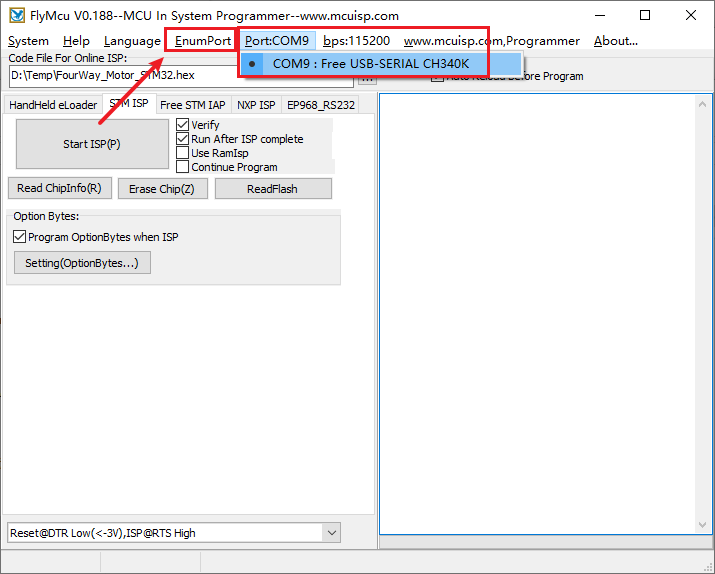
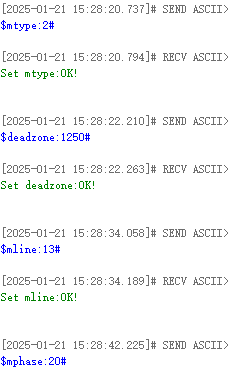
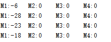
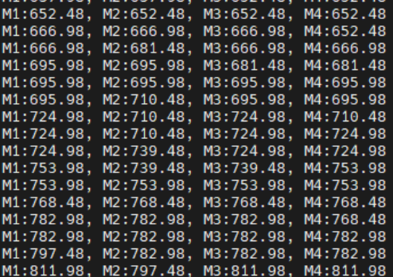

# Welcome to 4-Channel Motor Drive Module repository

## 1.1 Introduction to 4-channel motor drive board

# Introduction to 4-channel motor drive board


### Product Introduction:

The 4-channel encoder motor driver module integrates a high-performance single-chip coprocessor, which can be seamlessly connected with multiple controllers such as MSPM0, STM32, Raspberry Pi and Jetson through serial port or IIC communication, simplifying the driving process. 

Only four connecting wires are needed to achieve efficient communication with the main control unit to easily control the motor and obtain encoder data, reducing the number of wiring and reducing the difficulty of operation. 

At the same time, it supports driving most Hall encoder TT motors, 520/310 and other DC reduction motors on the market.

### Parameter table:

| Tech specs                            |            Parameters            |
| :------------------------------------ | :------------------------------: |
| Input Voltage recommended             |              5-12v               |
| DC Current for 5v Pin                 |               0.7A               |
| DC Current for 3.3v Pin               |              500ma               |
| Single motor continuous drive current | Default 4A (maximum output 5.5A) |
| Length * Width * High                 |         56 * 65 * 13.4mm         |
| Encoder motor interface               |  PH2.0-6PIN、Dupont line socket  |
| DC motor interface                    |           XH2.54-2PIN            |

## The 4 motor interfaces on the module correspond to motors on robot car, as shown below

M1 -> Upper left motor (left front wheel of the car) M2 -> Lower left motor (left rear wheel of the car) M3 -> Upper right motor (right front wheel of the car) M4 -> Lower right motor (right rear wheel of the car)

## Serial port configuration

**Baud rate 115200, no parity, no hardware flow control, 1 stop bit**

 

### 1.Configure motor type

|  Command  | Explanation |  Example  |            Remark            | Firmware Defaults | Power off save |
| :-------: | :---------: | :-------: | :--------------------------: | :---------------: | :------------: |
| $mtype:x# | Motor model | $mtype:1# | The motor model is 520 motor |     520 motor     |       Y        |
|   Note    |             |           |                              |                   |                |

1. Motor type selection. If the motor encoder A is connected to the A port of the board, then B is connected to B. You need to select the 310 motor model. Otherwise, you need to select the 520 motor or TT motor.
2. The command can be sent in all uppercase or lowercase letters.
3. If the above command is successful, it will return the message **command+OK**. If no message is returned, check the serial port connection.
4. x: is the type of motor. The motor types represented by different values are as follows: 1: 520 motor 2: 310 motor 3: TT motor (with encoder) 4: TT motor (without encoder)

Note: If you are using a motor without an encoder, you can select type 4, that is, the command is: $mtype:4# If you are using a motor with an encoder, you can select one of 1, 2, and 3.

### 2.Configuring motor deadband

|     Command     |               Explanation               |     Example     |                            Remark                            | Firmware Defaults | Power off save |
| :-------------: | :-------------------------------------: | :-------------: | :----------------------------------------------------------: | :---------------: | :------------: |
| $deadzone:xxxx# | Configure the motor pwm pulse dead zone | $deadzone:1650# | When controlling PWM, the dead zone value will be added by default so that the motor will not have an oscillation area. |       1600        |       Y        |
|      Note       |                                         |                 |                                                              |                   |                |

1. The command can be sent in all uppercase or all lowercase
2. If the above command is successful, it will return the message of **command+OK**. If no message is returned, check the serial port connection
3. xxxx: is the value of the dead zone, which needs to be measured. By changing this value, the minimum vibration of the motor can be eliminated
4. The range of the dead zone value (0-3600)

### 3.Configuring motor phase lines

|  Command   |           Explanation           |  Example   |                          Remark                           | Firmware Defaults | Power off save |
| :--------: | :-----------------------------: | :--------: | :-------------------------------------------------------: | :---------------: | :------------: |
| $mline:xx# | Configure the motor phase lines | $mline:13# | Configure the phase of the motor Hall encoder to 13 lines |        11         |       Y        |
|    Note    |                                 |            |                                                           |                   |                |

1. The command can be sent in all uppercase or all lowercase
2. The above command will return **command+OK** information if it is successful. If no information is returned, check the serial port connection
3. xx: This is the phase of the Hall encoder for one turn. This value needs to be obtained by checking the merchant's motor parameter table
4. For motors with encoders: This value plays a **main role** in controlling speed. This value needs to be correct
5. Motors without encoders: This value configuration can be ignored

### 4.Configure motor reduction ratio

|   Command   |             Explanation             |   Example   |                  Remark                   | Firmware Defaults | Power off save |
| :---------: | :---------------------------------: | :---------: | :---------------------------------------: | :---------------: | :------------: |
| $mphase:xx# | Configure the motor reduction ratio | $mphase:40# | Configure the motor reduction ratio to 40 |        30         |       Y        |
|  **Note**   |                                     |             |                                           |                   |                |

1. The command can be sent in all uppercase or all lowercase
2. The above command will return **command+OK** information if it is successful. If no information is returned, check the serial port connection
3. xx: This is the motor reduction ratio parameter. This value needs to be obtained by checking the merchant's motor parameter table
4. For motors with encoders: This value plays a **main role** in controlling speed. This value needs to be correct
5. Motors without encoders: This value configuration can be ignored

### 5.Configure the wheel diameter (Optional)

|    Command     |         Explanation          |    Example     |              Remark               | Firmware Defaults | Power off save |
| :------------: | :--------------------------: | :------------: | :-------------------------------: | :---------------: | :------------: |
| $wdiameter:xx# | Configure the wheel diameter | $wdiameter:50# | The diameter of the wheel is 50mm |       67 mm       |       Y        |
|    **Note**    |                              |                |                                   |                   |                |

1. The command can be sent in all uppercase or all lowercase
2. The above command will return **command+OK** information if it is successful. If no information is returned, check the serial port connection
3. xx: This is the diameter of the wheel. This value can be measured or obtained using the merchant's information
4. For motors with encoders: This value plays a **main role** in controlling speed. This value needs to be correct in millimeters (mm); if this value is incorrect, it will only affect the speed data inaccurately, and will not affect the encoder data
5. Motors without encoders: This value configuration can be ignored

### 6.Configure PID parameters for motor control

|        Command        |       Explanation        |       Example       |                           Remark                           | Firmware Defaults  | Power off save |
| :-------------------: | :----------------------: | :-----------------: | :--------------------------------------------------------: | :----------------: | :------------: |
| $MPID:x.xx,x.xx,x.xx# | Configure PID parameters | $MPID:1.5,0.03,0.1# | The configuration control speed is P: 1.5, I: 0.03, D: 0.1 | P:0.8 I:0.06 D:0.5 |       Y        |
|       **Note**        |                          |                     |                                                            |                    |                |

1. The command can be sent in all uppercase or all lowercase
2. The above command will return **command+OK** if it is successful. If no information is returned, check the serial port connection
3. x.xx, x.xx, x.xx: These are the parameters for controlling motor p, i, d respectively. **Every time the value is changed, the chip will restart and stop the moving motor. This is a normal situation**
4. For motors with encoders: the pid parameter is valid, and this value needs to be correct. **Generally, there is no need to modify the pid, and the default value can be used**
5. Motors without encoders: the pid parameter is invalid, and this value configuration can be ignored

### 7.Reset all variables to defaults value

|    Command    |          Explanation           | Example | Remark | Firmware Defaults | Power off save |
| :-----------: | :----------------------------: | :-----: | :----: | :---------------: | :------------: |
| $flash_reset# | Restore factory defaults value |    -    |   -    |         -         |       -        |
|   **Note**    |                                |         |        |                   |                |

1. The command can be sent in all uppercase or all lowercase
2. If the above command is successful, it will return the message **command+OK**. If no message is returned, check the serial port connection
3. Execute this command and the module will restart once

### 8.Control speed command

|    Command    |          Explanation          |       Example       |                         Remark                          | Firmware Defaults | Power off save |
| :-----------: | :---------------------------: | :-----------------: | :-----------------------------------------------------: | :---------------: | :------------: |
| $spd:0,0,0,0# | Control the speed of 4 motors | $spd:100,-100,0,50# | Control the speed of 4 motors M1:100 M2:-100 M3:0 M4:50 |         -         |       N        |
|   **Note**    |                               |                     |                                                         |                   |                |

1. The command can be sent in all uppercase or all lowercase letters
2. If the above command is successful, the motor will move, and the serial port will not return anything
3. This command is only valid for encoder type motors.
4. The speed range is (-1000~1000) and it is invalid if it exceeds the range
5. 0,0,0,0: represents M1, M2, M3, M4 on the board screen
6. When the spd command parameter is 0, PID still works. At this time, the hand cannot turn the wheel. To turn the wheel, use the pwm command to set it to 0.

### 9.Direct control PWM instruction

|    Command    |           Explanation            |       Example        |                            Remark                            | Firmware Defaults | Power off save |
| :-----------: | :------------------------------: | :------------------: | :----------------------------------------------------------: | :---------------: | :------------: |
| $pwm:0,0,0,0# | Control 4 motors with PWM output | $spd:0,-520,300,800# | Control the PWM output of 4 motors M1:0 M2:-520 M3:300 M4:800 |         -         |       N        |
|   **Note**    |                                  |                      |                                                              |                   |                |

1. The command can be sent in all uppercase or all lowercase
2. If the above command is successful, the motor will move, and nothing will be returned from the serial port
3. The speed range is (-3600~3600) and it is invalid if it exceeds the range
4. For motor control without encoder, **you can control it through this command**
5. 0,0,0,0: represents M1,M2,M3,M4 on the board screen

### 10.Report encoder data (This command is only valid for motors with encoder)

|    Command     |     Explanation      |    Example     |                            Remark                            | Firmware Defaults | Power off save |
| :------------: | :------------------: | :------------: | :----------------------------------------------------------: | :---------------: | :------------: |
| $upload:0,0,0# | Receive encoder data | $upload:1,0,0# | Receive the total encoder data of wheel rotation 1: open, 0: do not receive |         -         |       N        |
|    **Note**    |                      |                |                                                              |                   |                |

1. The command can be sent in all uppercase or all lowercase
2. $upload:0,0,0#: The first 0 represents: the total encoder data of the wheel rotation The second 0 represents: the real-time encoder data of the wheel rotation (10ms) The third 0 represents: the speed of the wheel
3. The corresponding information can be received at the same time

- The total encoder data of the wheel rotation returns the information: "$MAll:M1,M2,M3,M4#"
- The real-time encoder data of the wheel rotation returns the information: "$MTEP:M1,M2,M3,M4#"
- The speed of the wheel returns the information: "$MSPD:M1,M2,M3,M4#"

### 11.Query flash variables

|   Command    |      Explanation      | Example | Remark | Firmware Defaults | Power off save |
| :----------: | :-------------------: | :-----: | :----: | :---------------: | :------------: |
| $read_flash# | Query flash variables |    -    |   -    |         -         |       N        |
|     Note     |                       |         |        |                   |                |

1. The command can be sent in all uppercase or all lowercase
2. If the above command is successful, it will return the message **command+OK**. If no message is returned, check the serial port connection

### 12.Check battery level

|  Command   |     Explanation     | Example | Remark | Firmware Defaults | Power off save |
| :--------: | :-----------------: | :-----: | :----: | :---------------: | :------------: |
| $read_vol# | Check battery level |    -    |   -    |         -         |       N        |
|    Note    |                     |         |        |                   |                |

1. The command can be sent in all uppercase or all lowercase
2. If the above command is successful, it will return the information of **battery power ($Battery:7.40V#)**. If no information is returned, please check the serial port connection

## IIC protocol control

**4-channel motor driver board IIC device address:** 0x26

| Register address | R/W  |   Type   |                            Range                             |                         Explanation                          | Example                                                      |
| :--------------: | :--: | :------: | :----------------------------------------------------------: | :----------------------------------------------------------: | :----------------------------------------------------------- |
|       0x01       |  w   | uint8_t  | 1: 520 motor 2: 310 motor 3: TT motor (with encoder) 4: TT motor (without encoder) |                       Write motor type                       | Device address + register address + motor type               |
|       0x02       |  w   | uint16_t |                            0-3600                            |                  Configuring motor deadband                  | Device address + register address + motor dead zone value    |
|       0x03       |  w   | uint16_t |                           0-65535                            |      Configure the number of motor magnetic ring lines       | Device address + register address + number of motor magnetic ring lines |
|       0x04       |  w   | uint16_t |                           0-65535                            |               Configure motor reduction ratio                | Device address + register address + motor reduction ratio    |
|       0x05       |  w   |  float   |                              -                               |              Enter the wheel diameter, unit: mm              | Device address + register address + wheel diameter (need to convert float to bytes - little endian first) |
|       0x06       |  w   | int16_t  |                          -1000~1000                          | Speed control, this register is only effective for motors with encoders, unit: mm | Device address + register address + speed (transmitting data of 4 motors each time) **Big-endian mode**Each speed occupies 2 bits For uint8_t eg: m1 motor speed 200, m2 motor speed -200, m3 motor speed 0, m4 motor speed 500 That is: [0x00 0xC8 0xFF 0x38 0x00 0x00 0x01 0xf4] |
|       0x07       |  w   | int16_t  |                          -3600~3600                          | PWM control, this control does not require encoder data and can directly control the motor rotation | Device address + register address + speed (transmitting data of 4 motors each time) **Big-endian mode**Each speed occupies 2 bits For uint8_t eg: m1 motor pwm200, m2 motor pwm is -200, m3 motor pwm is 0, m4 motor pwm is 500 That is: [0x00 0xC8 0xFF 0x38 0x00 0x00 0x01 0xf4] |
|       0x08       |  R   | uint16_t |                              -                               |                    Reading battery level                     | A correct data: data = (buf[0]<<8\|buf[1])/10.0              |
|       0x10       |  R   | int16_t  |                              -                               |         Read M1 encoder real-time pulse data - 10ms          | A correct data: data = buf[0]<<8\|buf[1]                     |
|       0x11       |  R   | int16_t  |                              -                               |         Read M2 encoder real-time pulse data - 10ms          | A correct data: data = buf[0]<<8\|buf[1]                     |
|       0x12       |  R   | int16_t  |                              -                               |         Read M3 encoder real-time pulse data - 10ms          | A correct data: data = buf[0]<<8\|buf[1]                     |
|       0x13       |  R   | int16_t  |                              -                               |         Read M4 encoder real-time pulse data - 10ms          | A correct data: data = buf[0]<<8\|buf[1]                     |
|       0x20       |  R   | int16_t  |                              -                               | Read the total pulse data of the M1 motor encoder (High bit) | -                                                            |
|       0x21       |  R   | int16_t  |                              -                               | Read the total pulse data of the M1 motor encoder (Low bit)  | The acquired data needs to be shifted to get the correct data. High bit represents: buf[0] buf[1] Low bit represents: bf[0] bf[1] (data = buf[0]<<24\|buf[1]<<16\|bf[0]<<8\|bf[1]) |
|       0x22       |  R   | int16_t  |                              -                               | Read the total pulse data of the M2 motor encoder (High bit) | -                                                            |
|       0x23       |  R   | int16_t  |                              -                               | Read the total pulse data of the M2 motor encoder (Low bit)  | Same calculation method as M1                                |
|       0x24       |  R   | int16_t  |                              -                               | Read the total pulse data of the M3 motor encoder (High bit) | -                                                            |
|       0x25       |  R   | int16_t  |                              -                               | Read the total pulse data of the M3 motor encoder (Low bit)  | Same calculation method as M1                                |
|       0x26       |  R   | int16_t  |                              -                               | Read the total pulse data of the M4 motor encoder (High bit) | -                                                            |
|       0x27       |  R   | int16_t  |                              -                               | Read the total pulse data of the M4 motor encoder (Low bit)  | Same calculation method as M1                                |


# How to Update the Firmware

Open the burning software FlyMcu provided in the attachment, connect the typec port of the four-way motor driver board to the computer, and then click the Enumport in the software. And select the serial port used by your driver board.



In the program file, select the downloaded firmware file, and then pay attention that the other settings in the red box should be the same as those in the picture.


Finally, just click Start Programming. No other operations are required and the firmware will start burning. The following figure shows the information displayed after the burning is successful:


Finally, unplug and plug the type-c cable again to restart the driver board. If the red light is always on and the green light flashes twice every 3 seconds, then the burning is successful.

 

# Motor introduction and usage

**This course is used to explain the parameters of the motor, the recommended supply voltage, and the recommended wiring method for connecting the motor to the 4-channel motor driver board.** 

[Motor introduction and usage](https://www.yahboom.net/public/upload/upload-html/1740571311/0. Motor introduction and usage.html#motor-introduction-and-usage)[1. 520 motor](https://www.yahboom.net/public/upload/upload-html/1740571311/0. Motor introduction and usage.html#1-520-motor)[2. 310 motor](https://www.yahboom.net/public/upload/upload-html/1740571311/0. Motor introduction and usage.html#2-310-motor)[3. DC TT Motor](https://www.yahboom.net/public/upload/upload-html/1740571311/0. Motor introduction and usage.html#3-dc-tt-motor)[4. TT motor with encoder speed measurement](https://www.yahboom.net/public/upload/upload-html/1740571311/0. Motor introduction and usage.html#4-tt-motor-with-encoder-speed-measurement)[5. L-type 520 motor](https://www.yahboom.net/public/upload/upload-html/1740571311/0. Motor introduction and usage.html#5-l-type-520-motor)

## 1. 520 motor


|         Parameter         |                         MD520Z19_12V                         |                         MD520Z30_12V                         |                         MD520Z56_12V                         |
| :-----------------------: | :----------------------------------------------------------: | :----------------------------------------------------------: | :----------------------------------------------------------: |
|       Rated voltage       |                             12V                              |                             12V                              |                             12V                              |
|        Motor type         |                    Permanent magnet brush                    |                    Permanent magnet brush                    |                    Permanent magnet brush                    |
|       Output shaft        |             6mm diameter D-type eccentric shaft              |             6mm diameter D-type eccentric shaft              |             6mm diameter D-type eccentric shaft              |
|       Stall torque        |                           3.1kg·cm                           |                           4.8kg·cm                           |                           8.3kg·cm                           |
|       Rated torque        |                           2.2kg·cm                           |                           3.3kg·cm                           |                           6.5kg·cm                           |
| Speed before deceleration |                           11000rpm                           |                           11000rpm                           |                           12000rpm                           |
| Speed after deceleration  |                          550±10rpm                           |                          333±10rpm                           |                          205±10rpm                           |
|        Rated power        |                             ≤4W                              |                             ≤4W                              |                             ≤4W                              |
|       Stall current       |                              3A                              |                              3A                              |                              4A                              |
|       Rated current       |                             0.3A                             |                             0.3A                             |                             0.3A                             |
| Gear set reduction ratio  |                             1:19                             |                             1:30                             |                             1:56                             |
|       Encoder type        |              AB phase incremental Hall encoder               |              AB phase incremental Hall encoder               |              AB phase incremental Hall encoder               |
|  Encoder supply voltage   |                            3.3-5V                            |                            3.3-5V                            |                            3.3-5V                            |
|   Magnetic loop number    |                           11 line                            |                           11 line                            |                           11 line                            |
|      Interface type       |                          PH2.0 6Pin                          |                          PH2.0 6Pin                          |                          PH2.0 6Pin                          |
|         Function          | With built-in pull-up shaping, the MCU can directly read the signal pulse | With built-in pull-up shaping, the MCU can directly read the signal pulse | With built-in pull-up shaping, the MCU can directly read the signal pulse |
|    Single motor weight    |                           150g±1g                            |                           150g±1g                            |                           150g±1g                            |

Recommended power supply: **12V**.

There are three types of 520 motors, and their rated voltage is **12V**. When we drive the 520 motor, we can connect a voltage between 11 and 16V, and it is recommended to use a 12V voltage supply**.

If you want to distinguish the model of the 520 motor you bought, you can directly look at the label printed on the 520 motor. There is a text printed on it called RPM, and the number in front of RPM corresponds to the **speed after deceleration** number in the parameter table.

For example, the label of the 520 motor in my hand says 333RPM, so you should pay attention to the parameters in the **MD520Z30_12V** column. In particular, the two parameters of **reduction ratio and number of magnetic ring lines** may be modified when using a 4-channel motor driver board.


Recommended wiring:

The 520 motor you purchased will come with two types of cables. Here we recommend that you choose the black PH2.0-6PIN double-ended cable, one end connected to the motor, and the other end directly connected to the PH2.0-6PIN encoder motor interface on the four-way motor driver board. We can find that the A on the motor corresponds to the B phase of the four-way motor driver board.

So when configuring the motor type on the four-way motor driver board, you should choose `$mtype:1#`, the model of the 520 motor.


520 motor wiring instructions:

If you use PH2.0-6PIN to Dupont line connection, you can connect according to the picture below. With this connection, the motor phase A will be connected to the four-way motor driver board phase A, and phase B will be connected to phase B.

However, when configuring the motor type, you should select `$mtype:2#`, the model of the 310 motor.

 


 

## 2. 310 motor


​	

| Parameter                 | Value/description                                            |
| ------------------------- | ------------------------------------------------------------ |
| Motor name                | MD310Z20_7.4V                                                |
| Stall current             | ≤1.4A                                                        |
| Motor rated voltage       | 7.4V                                                         |
| Rated current             | ≤0.65A                                                       |
| Motor type                | Permanent magnet brush                                       |
| Gear set reduction ratio  | 1:20                                                         |
| Output shaft              | 3mm diameter D-type eccentric shaft                          |
| Encoder type              | AB phase incremental Hall encoder                            |
| Stall torque              | ≥1.0kg·cm                                                    |
| Encoder supply voltage    | 3.3-5V                                                       |
| Rated torque              | 0.4kg·cm                                                     |
| Magnetic loop number      | 13 line                                                      |
| Speed before deceleration | 9000rpm                                                      |
| Interface type            | PH2.0 6Pin                                                   |
| Functions                 | With built-in pull-up shaping, the MCU can directly read the signal pulse |
| Speed after deceleration  | 450±10rpm                                                    |
| Rated power               | 4.8W                                                         |
| Single motor weight       | 70g                                                          |

Recommended power supply: **7.4V**. It can be connected to a voltage between 4.2~8.4V, **recommended to use a voltage of 7.4V**.

The two parameters **reduction ratio and number of magnetic ring lines** in the main parameter table are required. These two parameters may be modified when using a four-way motor driver board.

If you buy a 310 motor alone, you will receive a PH2.0-6PIN to DuPont cable. When connecting a 4-channel driver board, connect it to its IO socket.


310 motor wiring instructions:

When the A phase of the 310 motor is connected to the A phase of the 4-channel motor driver board, and the B phase is connected to the B phase, then when configuring the motor type, you should select `$mtype:2#`, the model of the 310 motor.


 

If you purchased the 310 motor in the chassis kit, it has a PH2.0-6PIN double-ended cable. You can connect the black end to the 310 motor and the white end to the PH2.0-6PIN encoder motor interface on the 4-channel motor driver board.

At this time, select `$mtype:2#` to configure the motor type, which is the model of the 310 motor.

 


## 3. DC TT Motor


| Parameter                 | Value/Description |
| ------------------------- | ----------------- |
| Model                     | TT gear motor     |
| Brush material            | Carbon brush      |
| Reduction ratio           | 1:48              |
| Rated voltage             | 6V                |
| Idle current              | 200MA             |
| Stall current             | 1.5A              |
| Torque                    | 0.8N.m            |
| Speed before deceleration | 12000±10%rpm      |
| Speed after deceleration  | 245±10%rpm        |

Recommended power supply: **7.4V**

This motor has no encoder, so you only need to modify **motor type** and **reduction ratio** in the four-way motor driver board. When configuring the motor type, select `$mtype:4#`, the TT motor model without encoder.

Recommended wiring: Connect the XH2.54-2PIN interface on the TT motor directly to the XH2.54-2PIN socket on the 4-channel motor driver board.


 


 

 

## 4. TT motor with encoder speed measurement


| Parameter                          | Value/Description                                        |
| ---------------------------------- | -------------------------------------------------------- |
| Model                              | 13-wire metal single-axis TT motor                       |
| Motor type                         | 130 Motor                                                |
| Motor type/brush material          | Copper brush                                             |
| Reduction ratio                    | 1:45                                                     |
| Rated voltage                      | 6V                                                       |
| No-load current                    | 0.08A                                                    |
| Rated current                      | 0.3A                                                     |
| Stall current                      | 1.1A                                                     |
| Torque                             | 1.2N.m                                                   |
| Speed before deceleration          | 16000±5%rpm                                              |
| Speed after deceleration           | 355±5%rpm                                                |
| Encoder type                       | Hall AB phase encoder                                    |
| Encoder power supply               | 3.3-5V                                                   |
| Encoder line number                | 13 line                                                  |
| Maximum count per wheel revolution | 2340                                                     |
| Features                           | With built-in pull-up shaping, the MCU can read directly |

Recommended power supply: **7.4V**. It can be connected to 5~13V, **recommended to use 7.4V voltage power supply**.

The two parameters **reduction ratio and encoder line number** in the main parameter table are required. These two parameters may be modified when using the 4-channel motor driver board.

Recommended wiring: Use the PH2.0-6PIN to DuPont line cable and connect it to the IO socket of the 4-channel motor driver board.


Wiring instructions for encoder speed measurement TT motor:

When the A phase of the encoder TT motor is connected to the A phase of the four-way motor driver board, and the B phase is connected to the B phase, then when configuring the motor type, you should select `$mtype:3#`, the model of the TT motor with encoder.


## 5. L-type 520 motor


| Parameter            | Value/Description |
| -------------------- | ----------------- |
| Model                | L-type 520 motor  |
| Starting voltage     | 6V                |
| Rated voltage        | 12V               |
| Reduction ratio      | 1:40              |
| Magnetic loop number | 11线              |
| No-load current      | ≥450mA            |
| No-load speed        | 300r/min±5%       |
| Rated torque         | 4.4KG.CM          |
| Rated speed          | 150r/min          |
| Stall torque         | 10KG.CM           |
| Stall current        | 4A                |

Recommended power supply: **12V**.

The two parameters **reduction ratio and encoder line number** in the main parameter table are required. These two parameters may be modified when using the 4-channel motor driver board.

Recommended wiring: The purchased L-type 520 motor will come with two types of wires. Here we recommend that you choose the black PH2.0-6PIN double-headed cable, one end is connected to the motor, and the other end is directly connected to the PH2.0-6PIN encoder motor interface on the 4-channel motor driver board. 

This wiring is the most convenient, but it can be found that the A on the motor corresponds to the B phase of the 4-channel motor driver board. Therefore, when configuring the motor type on the 4-channel motor driver board, you should choose `$mtype:1#`, the model of the 520 motor.


L-type 520 motor wiring instructions:

If you use PH2.0-6PIN to Dupont line connection, you can connect according to the picture below. With this connection, the motor's A phase will be connected to the 4-channel motor driver board A phase, and B phase will be connected to B phase. 

However, when configuring the motor type, you should select `$mtype:2#`, the model of the 310 motor.


## 1.PC host

# Serial communication

## 1.1 Explanation

**Please read 《0. Motor introduction and usage》first to understand the motor parameters, wiring method, and power supply voltage you are currently using. To avoid improper operation and damage to the driver board or motor.**

Connect the driver board to the computer through the TYPE-C port on the driver board, and use the serial port assistant to send commands to the driver board for control and data reading.

##### Hardware wiring:

| **Motor** | **4-channel motor drive board**(Motor) |
| :-------: | :------------------------------------: |
|    M2     |                   M-                   |
|     V     |                  3V3                   |
|     A     |                  H1A                   |
|     B     |                  H1B                   |
|     G     |                  GND                   |
|    M1     |                   M+                   |

 

## 1.2 Instructions

Open the serial port assistant software on the computer. Here we take Uart Assistant as an example.


 

Serial port configuration: **Baud rate 115200, no parity check, no hardware flow control, 1 stop bit**

After configuration, you can send commands in the send window below to control the driver board. All serial port commands and explanations are listed in the course《1.2 Control command》.

Next, we will demonstrate how to modify the default parameters to use **310 motor, 48mm diameter tire**.


First, issue the command `$read_flash#`, which is to query the power-off saving parameters in the flash. It can save tire type, motor dead zone, motor phase line, motor reduction ratio, wheel diameter, and motor PID parameters.

Then, according to the parameters of the motor and tire, enter the send parameter configuration command in the send column below.




We can see that after each configuration command is issued, the driver board will send back an 'OK!' message, indicating that the setting is successful. Finally, use the command to view the flash to see that the parameters just modified have taken effect. The modification method of PID parameters is the same as these, but it generally does not need to be modified, so it will not be demonstrated here.

If you want to control the movement of the motor, send the command `$spd:0,0,0,0#` or `$pwm:0,0,0,0#`. The spd command controls the motor with an encoder, and the pwm command can control the motor with or without an encoder. Suppose I want to control the 310 motor plugged into Motor1 on the driver board, which has an encoder, then send `$spd:100,0,0,0#` to control it. To control the motor connected to Motor2, modify the second value: `$spd:0,100,0,0#`.

## For Arduino

# Drive motor and read encoder-USART

## 1.1 Explanation

**Please read 《0. Motor introduction and usage》first to understand the motor parameters, wiring method, and power supply voltage you are currently using. To avoid improper operation and damage to the driver board or motor.**

I2C and serial communication cannot be shared, only one can be selected.

The course uses the Arduino UNO board. And use is Arduino 1.8.5 IDE 

**Before writing the program, do not connect the driver board to the RX pin on the Arduino, otherwise the program cannot be written into the board.**

**After the program is written, connect the RX pin on the Arduino.**

##### Hardware wiring:


| Motor | **4-channel motor drive board**(Motor) |
| :---: | :------------------------------------: |
|  M2   |                   M-                   |
|   V   |                  3V3                   |
|   A   |                  H1A                   |
|   B   |                  H1B                   |
|   G   |                  GND                   |
|  M1   |                   M+                   |

| **4-channel motor drive board** | Arduino UNO |
| :-----------------------------: | :---------: |
|               RX2               |     TX      |
|               TX2               |     RX      |
|               GND               |     GND     |
|               5V                |     5V      |

Since the hardware serial port on the Arduino board is used to communicate with the driver board, this case requires an additional USB to TTL serial port to print data.

| USB TO TTL | Arduino UNO |
| :--------: | :---------: |
|    VCC     |     3V3     |
|    GND     |     GND     |
|    RXD     |      3      |
|    TXD     |      2      |

Serial port configuration: **Baud rate 115200, no parity check, no hardware flow control, 1 stop bit**

## 1.2 Code analysis

```
#define UPLOAD_DATA 3  //0:不接受数据 1:接收总的编码器数据 2:接收实时的编码器 3:接收电机当前速度 mm/s
                       //0: Do not receive data 1: Receive total encoder data 2: Receive real-time encoder 3: Receive current motor speed mm/s


#define MOTOR_TYPE 1   //1:520电机 2:310电机 3:测速码盘TT电机 4:TT直流减速电机 5:L型520电机
                       //1:520 motor 2:310 motor 3:speed code disc TT motor 4:TT DC reduction motor 5:L type 520 motor
```

- UPLOAD_DATA: used to set the data of the motor encoder. Set 1 to the total number of encoder pulses and 2 to the real-time pulse data of 10ms.
- MOTOR_TYPE: used to set the type of motor used. Just modify the corresponding numbers according to the comments according to the motor you are currently using. You don’t need to modify the rest of the code.

If you need to drive the motor and observe the data, just modify the two numbers at the beginning of the program. No changes are required to the rest of the code.

```
  #if MOTOR_TYPE == 1
    send_motor_type(1);//配置电机类型 Configure motor type
    delay(100);
    send_pulse_phase(30);//配置减速比 查电机手册得出    Configure the reduction ratio. Check the motor manual to find out
    delay(100);
    send_pulse_line(11);//配置磁环线 查电机手册得出 Configure the magnetic ring wire. Check the motor manual to get the result.
    delay(100);
    send_wheel_diameter(67.00);//配置轮子直径,测量得出        Configure the wheel diameter and measure it
    delay(100);
    send_motor_deadzone(1900);//配置电机死区,实验得出 Configure the motor dead zone, and the experiment shows
    delay(100);
    
  #elif MOTOR_TYPE == 2
  send_motor_type(2);
    delay(100);
    send_pulse_phase(20);
    delay(100);
    send_pulse_line(13);
    delay(100);
    send_wheel_diameter(48.00);
    delay(100);
    send_motor_deadzone(1600);
    delay(100);
    
  #elif MOTOR_TYPE == 3
  send_motor_type(3);
    delay(100);
    send_pulse_phase(45);
    delay(100);
    send_pulse_line(13);
    delay(100);
    send_wheel_diameter(68.00);
    delay(100);
    send_motor_deadzone(1250);
    delay(100);
    
  #elif MOTOR_TYPE == 4
  send_motor_type(4);
    delay(100);
    send_pulse_phase(48);
    delay(100);
    send_motor_deadzone(1000);
    delay(100);
    
  #elif MOTOR_TYPE == 5
  send_motor_type(1);
    delay(100);
    send_pulse_phase(40);
    delay(100);
    send_pulse_line(11);
    delay(100);
    send_wheel_diameter(67.00);
    delay(100);
    send_motor_deadzone(1900);
    delay(100);
  #endif
```

This is used to store the parameters of the Yahboom motor. By modifying the MOTOR_TYPE parameter above, one-click configuration can be achieved.

In normally, do not modify the code here when using the Yahboom motor.

If you are using your own motor, or if a certain data needs to be modified according to your needs, you can check the course《1.2 Control command》 to understand the specific meaning of each command.

```
void loop(){
  
      Motor_USART_Recieve();
      if(g_recv_flag == 1)
    {
      g_recv_flag = 0;
      #if MOTOR_TYPE == 4
        Contrl_Pwm(i*2,i*2,i*2,i*2);
      #else
        Contrl_Speed(i,i,i,i);   //值为-1000~1000 The value is -1000~1000
      #endif


        Deal_data_real();
        //delay(100);
      #if UPLOAD_DATA == 1
        sprintf(buffer,"M1:%d,M2:%d,M3:%d,M4:%d\r\n",Encoder_Now[0],Encoder_Now[1],Encoder_Now[2],Encoder_Now[3]);
        printSerial.println(buffer);
      #elif UPLOAD_DATA == 2
        sprintf(buffer,"M1:%d,M2:%d,M3:%d,M4:%d\r\n",Encoder_Offset[0],Encoder_Offset[1],Encoder_Offset[2],Encoder_Offset[3]);
        printSerial.println(buffer);
      #elif UPLOAD_DATA == 3
        dtostrf(g_Speed[0], 4, 2, string1);
        dtostrf(g_Speed[1], 4, 2, string2);
        dtostrf(g_Speed[2], 4, 2, string3);
        dtostrf(g_Speed[3], 4, 2, string4);
        sprintf(buffer,"M1:%s,M2:%s,M3:%s,M4:%s\r\n",string1,string2,string3,string4);
        printSerial.println(buffer);
      #endif


      i++;
      if (i == 1000) i = 0;
      
    }


}
```

In the loop program, the speed of the four motors will be slowly increased from 0 to 1000. If the motor type is 4, that is, the motor without encoder, the motor's PWM is directly controlled. 

At the same time, the data sent by the driver board is read and printed out at the same time.

```
//检验从驱动板发送过来的数据，符合通讯协议的数据则保存下来
//Check the data sent from the driver board, and save the data that meets the communication protocol
void Deal_Control_Rxtemp(uint8_t rxtemp)
{
    static u8 step = 0;
    static u8 start_flag = 0;


    if(rxtemp == '$' &&     start_flag == 0)
    {
        start_flag = 1;
        memset(g_recv_buff,0,RXBUFF_LEN);//清空数据 Clear data
    }
    
    else if(start_flag == 1)
    {
            if(rxtemp == '#')
            {
                start_flag = 0;
                step = 0;
                g_recv_flag = 1;
        // 检查前四个字符  Check the first four characters
    if (strncmp("MAll:",(char*)g_recv_buff,5)==0 ||
        strncmp("MTEP:",(char*)g_recv_buff,5)==0 ||
        strncmp("MSPD:",(char*)g_recv_buff,5)==0) {
        if (isValidNumbers((char*)g_recv_buff + 5)) {
                // 如果符合条件，打印数据  If the conditions are met, print the data
                memcpy(g_recv_buff_deal,g_recv_buff,RXBUFF_LEN);
            }
    } else {
        // 不匹配时清除缓冲区，避免残留无效数据 Clear the buffer when there is no match to avoid residual invalid data
        memset(g_recv_buff, 0, RXBUFF_LEN);
    }
            }
            else
            {
                if(step > RXBUFF_LEN)
                {
                    start_flag = 0;
                    step = 0;
                    memset(g_recv_buff,0,RXBUFF_LEN);//清空接收数据   Clear received data
                }
                else
                {
                    g_recv_buff[step] = rxtemp;
                    step++;
                }
            }
    }
    
}


//将从驱动板保存到的数据进行格式处理，然后准备打印
//Format the data saved from the driver board and prepare it for printing
void Deal_data_real(void)
{
     static uint8_t data[RXBUFF_LEN];
   uint8_t  length = 0;
    //总体的编码器    Overall encoder
     if ((strncmp("MAll",(char*)g_recv_buff_deal,4)==0))
    {
        length = strlen((char*)g_recv_buff_deal)-5;
        for (uint8_t i = 0; i < length; i++)
        {
            data[i] = g_recv_buff_deal[i+5]; //去掉冒号 Remove the colon
        }  
                data[length] = '\0';    
                char* strArray[10];//指针数组 长度根据分割号定义  char 1字节   char* 4字节    Pointer array The length is defined by the split number char 1 byte char* 4 bytes
                char mystr_temp[4][10] = {'\0'}; 
                splitString(strArray,(char*)data, ", ");//以逗号切割 Split by comma
                for (int i = 0; i < 4; i++)
                {
                        strcpy(mystr_temp[i],strArray[i]);
                        Encoder_Now[i] = atoi(mystr_temp[i]);
                }
                
        }
        //10ms的实时编码器数据  10ms real-time encoder data
        else if ((strncmp("MTEP",(char*)g_recv_buff_deal,4)==0))
    {
        length = strlen((char*)g_recv_buff_deal)-5;
        for (uint8_t i = 0; i < length; i++)
        {
            data[i] = g_recv_buff_deal[i+5]; //去掉冒号 Remove the colon
        }  
                data[length] = '\0';        


                char* strArray[10];//指针数组 长度根据分割号定义  char 1字节   char* 4字节       Pointer array The length is defined by the split number char 1 byte char* 4 bytes
                char mystr_temp[4][10] = {'\0'}; 
                splitString(strArray,(char*)data, ", ");//以逗号切割 Split by comma
                for (int i = 0; i < 4; i++)
                {
                        strcpy(mystr_temp[i],strArray[i]);
                        Encoder_Offset[i] = atoi(mystr_temp[i]);
                }
        }
        //速度    Speed
        else if ((strncmp("MSPD",(char*)g_recv_buff_deal,4)==0))
    {
        length = strlen((char*)g_recv_buff_deal)-5;
        for (uint8_t i = 0; i < length; i++)
        {
            data[i] = g_recv_buff_deal[i+5]; //去掉冒号 Remove the colon
        }  
                data[length] = '\0';    
                
                char* strArray[10];//指针数组 长度根据分割号定义  char 1字节   char* 4字节       Pointer array The length is defined by the split number char 1 byte char* 4 bytes
                char mystr_temp[4][10] = {'\0'}; 
                splitString(strArray,(char*)data, ", ");//以逗号切割 Split by comma
                for (int i = 0; i < 4; i++)
                {
                        strcpy(mystr_temp[i],strArray[i]);
                        g_Speed[i] = atof(mystr_temp[i]);
                }
        }
}
```

- Deal_Control_Rxtemp: Filter the received data and save those that meet the communication protocol.
- Deal_data_real: Extract the saved original data and reconstruct a new print format.

## 1.3 Experimental phenomenon

**Before writing the program, do not connect the driver board to the RX pin on the Arduino, otherwise the program cannot be written into the board.**

**After the program is written, connect the RX pin on the Arduino.**

Connect the USB to TTL module to the computer, use the computer's serial port debugging assistant "UartAssist", open the USB to TTL serial port, and you can receive the processed data.

If you open the serial port of the Arduino motherboard, you may see that the serial port prints the original data. After powering on again, you can see that the motor will gradually speed up, then stop, and repeat.

At the same time, you can see that the printed motor value is constantly changing in the serial port assistant.


# For ESP32

## Drive motor and read encoder-USART

## 1.1 Explanation

**Please read 《0. Motor introduction and usage》first to understand the motor parameters, wiring method, and power supply voltage you are currently using. To avoid improper operation and damage to the driver board or motor.**

I2C and serial communication cannot be shared, only one can be selected.

This course uses the YahboomESP32 image transmission module lite version.

If you use other ESP32-S3 boards, you need to modify the pin settings in the program according to your board pin situation.

Use ESP-IDF 5.4.0 version  to compile the project.

##### Hardware wiring:


| Motor | **4-channel motor drive board**(Motor) |
| :---: | :------------------------------------: |
|  M2   |                   M-                   |
|   V   |                  3V3                   |
|   A   |                  H1A                   |
|   B   |                  H1B                   |
|   G   |                  GND                   |
|  M1   |                   M+                   |

| **4-channel motor drive board** | ESP32S3 |
| :-----------------------------: | :-----: |
|               RX2               |   TX1   |
|               TX2               |   RX1   |
|               GND               |   GND   |
|               5V                |   5V    |

USB to TTL serial port module needs to be connected, mainly for printing data.

When using the Yahboom ESP32 image transmission module lite version, the 3V3 of the USB to TTL serial port module must be replaced with 5V and connected to the 5V on the ESP32 board to write the program normally.

After the program is written, it can be switched back to 3V3.

| USB TO TTL | ESP32S3 |
| :--------: | :-----: |
|    3V3     |   3V3   |
|    TXD     |   RX0   |
|    RXD     |   TX0   |
|    GND     |   GND   |

Serial port configuration: **Baud rate 115200, no parity check, no hardware flow control, 1 stop bit**

## 1.2 Code analysis

```
#define UART1_TX_PIN    36
#define UART1_RX_PIN    35
```

This code is defined in the `uart_module.h` file.

If you need to change the pin for the serial port to communicate with the four-way motor driver board, you can modify the number here.

```
#define UPLOAD_DATA 3  //0:不接受数据 1:接收总的编码器数据 2:接收实时的编码器 3:接收电机当前速度 mm/s
                       //0: Do not receive data 1: Receive total encoder data 2: Receive real-time encoder 3: Receive current motor speed mm/s


#define MOTOR_TYPE 1   //1:520电机 2:310电机 3:测速码盘TT电机 4:TT直流减速电机 5:L型520电机
                       //1:520 motor 2:310 motor 3:speed code disc TT motor 4:TT DC reduction motor 5:L type 520 motor
```

- UPLOAD_DATA: used to set the data of the motor encoder. Set 1 to the total number of encoder pulses and 2 to the real-time pulse data of 10ms.
- MOTOR_TYPE: used to set the type of motor used. Just modify the corresponding numbers according to the comments according to the motor you are currently using. You don’t need to modify the rest of the code.

If you need to drive the motor and observe the data, just modify the two numbers at the beginning of the program. No changes are required to the rest of the code.

```
  #if MOTOR_TYPE == 1
    send_motor_type(1);//配置电机类型 Configure motor type
    delay(100);
    send_pulse_phase(30);//配置减速比 查电机手册得出    Configure the reduction ratio. Check the motor manual to find out
    delay(100);
    send_pulse_line(11);//配置磁环线 查电机手册得出 Configure the magnetic ring wire. Check the motor manual to get the result.
    delay(100);
    send_wheel_diameter(67.00);//配置轮子直径,测量得出        Configure the wheel diameter and measure it
    delay(100);
    send_motor_deadzone(1900);//配置电机死区,实验得出 Configure the motor dead zone, and the experiment shows
    delay(100);
    
  #elif MOTOR_TYPE == 2
  send_motor_type(2);
    delay(100);
    send_pulse_phase(20);
    delay(100);
    send_pulse_line(13);
    delay(100);
    send_wheel_diameter(48.00);
    delay(100);
    send_motor_deadzone(1600);
    delay(100);
    
  #elif MOTOR_TYPE == 3
  send_motor_type(3);
    delay(100);
    send_pulse_phase(45);
    delay(100);
    send_pulse_line(13);
    delay(100);
    send_wheel_diameter(68.00);
    delay(100);
    send_motor_deadzone(1250);
    delay(100);
    
  #elif MOTOR_TYPE == 4
  send_motor_type(4);
    delay(100);
    send_pulse_phase(48);
    delay(100);
    send_motor_deadzone(1000);
    delay(100);
    
  #elif MOTOR_TYPE == 5
  send_motor_type(1);
    delay(100);
    send_pulse_phase(40);
    delay(100);
    send_pulse_line(11);
    delay(100);
    send_wheel_diameter(67.00);
    delay(100);
    send_motor_deadzone(1900);
    delay(100);
  #endif
```

This is used to store the parameters of the Yahboom motor. By modifying the MOTOR_TYPE parameter above, one-click configuration can be achieved.

In normally, do not modify the code here when using the Yahboom motor.

If you are using your own motor, or if a certain data needs to be modified according to your needs, you can check the course《1.2 Control command》 to understand the specific meaning of each command.

```
void MotorControl_Task(void *arg) {
    static int i = 0;
    while(1) {
        if(g_recv_flag == 1)// 接收标志检查 | Check reception flag
        {
            g_recv_flag = 0;// 重置标志 | Reset flag


            // 根据电机类型选择控制方式 | Select control mode by motor type
            #if MOTOR_TYPE == 4
            Contrl_Pwm(i*20,i*20,i*20,i*20);// PWM控制模式 | PWM control
            #else
            Contrl_Speed(i*10,i*10,i*10,i*10);// 速度控制模式 | Speed control
            #endif
            
            Deal_data_real();
            
            #if UPLOAD_DATA == 1
                printf("M1:%d,M2:%d,M3:%d,M4:%d\r\n",Encoder_Now[0],Encoder_Now[1],Encoder_Now[2],Encoder_Now[3]);
            #elif UPLOAD_DATA == 2
                printf("M1:%d,M2:%d,M3:%d,M4:%d\r\n",Encoder_Offset[0],Encoder_Offset[1],Encoder_Offset[2],Encoder_Offset[3]);
            #elif UPLOAD_DATA == 3
                printf("M1:%.2f,M2:%.2f,M3:%.2f,M4:%.2f\r\n",g_Speed[0],g_Speed[1],g_Speed[2],g_Speed[3]);
            #endif
            
            i = (i < 100) ? i+1 : 0;
            delay_ms(100);
        }
        delay_ms(1);// 防止任务卡死 | Preventing tasks from getting stuck
    }
}
```

In the main program loop, the speed of the four motors will be slowly increased from 0 to 1000. If the motor type is 4, that is, the motor without encoder, the PWM of the motor is directly controlled. 

At the same time, the data sent by the driver board is read and printed out.

```
//检验从驱动板发送过来的数据，符合通讯协议的数据则保存下来
//Check the data sent from the driver board, and save the data that meets the communication protocol
void Deal_Control_Rxtemp(uint8_t rxtemp)
{
    static u8 step = 0;
    static u8 start_flag = 0;


    if(rxtemp == '$' &&     start_flag == 0)
    {
        start_flag = 1;
        memset(g_recv_buff,0,RXBUFF_LEN);//清空数据 Clear data
    }
    
    else if(start_flag == 1)
    {
            if(rxtemp == '#')
            {
                start_flag = 0;
                step = 0;
                g_recv_flag = 1;
        // 检查前四个字符  Check the first four characters
    if (strncmp("MAll:",(char*)g_recv_buff,5)==0 ||
        strncmp("MTEP:",(char*)g_recv_buff,5)==0 ||
        strncmp("MSPD:",(char*)g_recv_buff,5)==0) {
        if (isValidNumbers((char*)g_recv_buff + 5)) {
                // 如果符合条件，打印数据  If the conditions are met, print the data
                memcpy(g_recv_buff_deal,g_recv_buff,RXBUFF_LEN);
            }
    } else {
        // 不匹配时清除缓冲区，避免残留无效数据 Clear the buffer when there is no match to avoid residual invalid data
        memset(g_recv_buff, 0, RXBUFF_LEN);
    }
            }
            else
            {
                if(step > RXBUFF_LEN)
                {
                    start_flag = 0;
                    step = 0;
                    memset(g_recv_buff,0,RXBUFF_LEN);//清空接收数据   Clear received data
                }
                else
                {
                    g_recv_buff[step] = rxtemp;
                    step++;
                }
            }
    }
    
}


//将从驱动板保存到的数据进行格式处理，然后准备打印
//Format the data saved from the driver board and prepare it for printing
void Deal_data_real(void)
{
     static uint8_t data[RXBUFF_LEN];
   uint8_t  length = 0;
    //总体的编码器    Overall encoder
     if ((strncmp("MAll",(char*)g_recv_buff_deal,4)==0))
    {
        length = strlen((char*)g_recv_buff_deal)-5;
        for (uint8_t i = 0; i < length; i++)
        {
            data[i] = g_recv_buff_deal[i+5]; //去掉冒号 Remove the colon
        }  
                data[length] = '\0';    
                char* strArray[10];//指针数组 长度根据分割号定义  char 1字节   char* 4字节    Pointer array The length is defined by the split number char 1 byte char* 4 bytes
                char mystr_temp[4][10] = {'\0'}; 
                splitString(strArray,(char*)data, ", ");//以逗号切割 Split by comma
                for (int i = 0; i < 4; i++)
                {
                        strcpy(mystr_temp[i],strArray[i]);
                        Encoder_Now[i] = atoi(mystr_temp[i]);
                }
                
        }
        //10ms的实时编码器数据  10ms real-time encoder data
        else if ((strncmp("MTEP",(char*)g_recv_buff_deal,4)==0))
    {
        length = strlen((char*)g_recv_buff_deal)-5;
        for (uint8_t i = 0; i < length; i++)
        {
            data[i] = g_recv_buff_deal[i+5]; //去掉冒号 Remove the colon
        }  
                data[length] = '\0';        


                char* strArray[10];//指针数组 长度根据分割号定义  char 1字节   char* 4字节       Pointer array The length is defined by the split number char 1 byte char* 4 bytes
                char mystr_temp[4][10] = {'\0'}; 
                splitString(strArray,(char*)data, ", ");//以逗号切割 Split by comma
                for (int i = 0; i < 4; i++)
                {
                        strcpy(mystr_temp[i],strArray[i]);
                        Encoder_Offset[i] = atoi(mystr_temp[i]);
                }
        }
        //速度    Speed
        else if ((strncmp("MSPD",(char*)g_recv_buff_deal,4)==0))
    {
        length = strlen((char*)g_recv_buff_deal)-5;
        for (uint8_t i = 0; i < length; i++)
        {
            data[i] = g_recv_buff_deal[i+5]; //去掉冒号 Remove the colon
        }  
                data[length] = '\0';    
                
                char* strArray[10];//指针数组 长度根据分割号定义  char 1字节   char* 4字节       Pointer array The length is defined by the split number char 1 byte char* 4 bytes
                char mystr_temp[4][10] = {'\0'}; 
                splitString(strArray,(char*)data, ", ");//以逗号切割 Split by comma
                for (int i = 0; i < 4; i++)
                {
                        strcpy(mystr_temp[i],strArray[i]);
                        g_Speed[i] = atof(mystr_temp[i]);
                }
        }
}
```

- Deal_Control_Rxtemp: Filter the received data and save those that meet the communication protocol.
- Deal_data_real: Extract the saved original data and reconstruct a new print format.

## 1.3 Experimental phenomenon

After the wiring is correct, write the program into the mainboard. After powering on again, you can see that the motor will gradually speed up, then stop, and repeat.

At the same time, you can see the motor value constantly changing in the serial monitor.


# For Jetson Nano

## Drive motor and read encoder-USART

## 1.1 Explanation

**Please read 《0. Motor introduction and usage》first to understand the motor parameters, wiring method, and power supply voltage you are currently using. To avoid improper operation and damage to the driver board or motor.**

I2C and serial communication cannot be shared, only one can be selected.

##### Hardware wiring:


When the mainboard and driver board use serial port communication, just connect the USB port on the mainboard to the TYPE-C port on the 4-channel motor driver board.

| Motor | **4-channel motor drive board**(Motor) |
| :---: | :------------------------------------: |
|  M2   |                   M-                   |
|   V   |                  3V3                   |
|   A   |                  H1A                   |
|   B   |                  H1B                   |
|   G   |                  GND                   |
|  M1   |                   M+                   |

 

## 1.2 Instructions

After Jetson board is connected to the USB interface of the driver board, you can use the following command to check whether the serial port is recognized.

```
ll /dev/ttyUSB*
```

Normally, `/dev/ttyUSB0` will be displayed. If there is no ttyUSB0 but ttyUSB1, you need to change `port='/dev/ttyUSB0'` at the beginning of the code to `port='/dev/ttyUSB1'`

Then, use file transfer software, such as WinSCP, which needs to be searched and downloaded by yourself. 

Transfer the py file to the root directory of the Jetson board through the software, then open the terminal and run the command.

```
sudo python3 ~/USART.py
```

If the system reports a missing serial module error.


After running the following two commands to install the module, try running again.

```
sudo apt update
sudo apt install python3-serial
```

 

## 1.3 Code analysis

```
UPLOAD_DATA = 3  #0:不接受数据 1:接收总的编码器数据 2:接收实时的编码器 3:接收电机当前速度 mm/s
                 #0: Do not receive data 1: Receive total encoder data 2: Receive real-time encoder 3: Receive current motor speed mm/s


MOTOR_TYPE = 1  #1:520电机 2:310电机 3:测速码盘TT电机 4:TT直流减速电机 5:L型520电机
                #1:520 motor 2:310 motor 3:speed code disc TT motor 4:TT DC reduction motor 5:L type 520 motor
```

- UPLOAD_DATA: used to set the data of the motor encoder. Set 1 to the total number of encoder pulses and 2 to the real-time pulse data of 10ms.
- MOTOR_TYPE: used to set the type of motor used. Just modify the corresponding numbers according to the comments according to the motor you are currently using. You don’t need to modify the rest of the code.

If you need to drive the motor and observe the data, just modify the two numbers at the beginning of the program. No changes are required to the rest of the code.

```
def set_motor_parameter():


    if MOTOR_TYPE == 1:
        set_motor_type(1)  # 配置电机类型
        time.sleep(0.1)
        set_pluse_phase(30)  # 配置减速比，查电机手册得出
        time.sleep(0.1)
        set_pluse_line(11)  # 配置磁环线，查电机手册得出
        time.sleep(0.1)
        set_wheel_dis(67.00)  # 配置轮子直径，测量得出
        time.sleep(0.1)
        set_motor_deadzone(1900)  # 配置电机死区，实验得出
        time.sleep(0.1)


    elif MOTOR_TYPE == 2:
        set_motor_type(2)
        time.sleep(0.1)
        set_pluse_phase(20)
        time.sleep(0.1)
        set_pluse_line(13)
        time.sleep(0.1)
        set_wheel_dis(48.00)
        time.sleep(0.1)
        set_motor_deadzone(1600)
        time.sleep(0.1)


    elif MOTOR_TYPE == 3:
        set_motor_type(3)
        time.sleep(0.1)
        set_pluse_phase(45)
        time.sleep(0.1)
        set_pluse_line(13)
        time.sleep(0.1)
        set_wheel_dis(68.00)
        time.sleep(0.1)
        set_motor_deadzone(1250)
        time.sleep(0.1)


    elif MOTOR_TYPE == 4:
        set_motor_type(4)
        time.sleep(0.1)
        set_pluse_phase(48)
        time.sleep(0.1)
        set_motor_deadzone(1000)
        time.sleep(0.1)


    elif MOTOR_TYPE == 5:
        set_motor_type(1)
        time.sleep(0.1)
        set_pluse_phase(40)
        time.sleep(0.1)
        set_pluse_line(11)
        time.sleep(0.1)
        set_wheel_dis(67.00)
        time.sleep(0.1)
        set_motor_deadzone(1900)
        time.sleep(0.1)


```

This is used to store the parameters of the Yahboom motor. By modifying the MOTOR_TYPE parameter above, one-click configuration can be achieved.

In normally, do not modify the code here when using the Yahboom motor.

If you are using your own motor, or if a certain data needs to be modified according to your needs, you can check the course《1.2 Control command》 to understand the specific meaning of each command.

```
if __name__ == "__main__":
    try:
        t = 0
        print("please wait...")
        send_upload_command(UPLOAD_DATA)#给电机模块发送需要上报的数据 Send the data that needs to be reported to the motor module
        time.sleep(0.1)
        set_motor_parameter()#设计电机参数  Design motor parameters


        while True:
            received_message = receive_data()  # 接收消息    Receiving Messages
            if received_message:    # 如果有数据返回 If there is data returned
                parsed = parse_data(received_message) # 解析数据 Parsing the data
                if parsed:
                    print(parsed)  # 打印解析后的数据   Print the parsed data


            t += 10
            M1 = t
            M2 = t
            M3 = t
            M4 = t


            if MOTOR_TYPE == 4:
                control_pwm(M1*2, M2*2, M3*2, M4*2)
            else:
                control_speed(M1, M2, M3, M4)#直接发送命令控制电机  Send commands directly to control the motor


            if t> 1000 or t < -1000:
                t = 0


            time.sleep(0.1)


```

In the main program loop, the speed of the four motors will be slowly increased from 0 to 1000. If the motor type is 4, that is, the motor without encoder, the PWM of the motor is directly controlled. 

At the same time, the data sent by the driver board is read and printed out.

```
def parse_data(data):
    data = data.strip()  # 去掉两端的空格或换行符   Remove spaces or line breaks at both ends


    if data.startswith("$MAll:"):
        values_str = data[6:-1]  # 去除 "$MAll:" 和 "#" Remove "$MAll:" and "#"
        values = list(map(int, values_str.split(',')))  # 分割并转换为整数  Split and convert to integer
        parsed = ', '.join([f"M{i+1}:{value}" for i, value in enumerate(values)])
        return parsed
    elif data.startswith("$MTEP:"):
        values_str = data[6:-1]
        values = list(map(int, values_str.split(',')))
        parsed = ', '.join([f"M{i+1}:{value}" for i, value in enumerate(values)])
        return parsed
    elif data.startswith("$MSPD:"):
        values_str = data[6:-1]
        values = [float(value) if '.' in value else int(value) for value in values_str.split(',')]
        parsed = ', '.join([f"M{i+1}:{value}" for i, value in enumerate(values)])
        return parsed


```

Extract the saved original data and reconstruct it into a new printing format.

## 1.4 Experimental phenomenon

After connecting the type-c port on the driver board to the USB port on the motherboard, place the program in the root directory and run the command `sudo python3 ~/USART.py`. You can see that the motor will gradually speed up, then stop, and repeat.

At the same time, you can see the printed motor value in the terminal constantly changing.

## For PICO2

# Drive motor and read encoder-USART

## 1.1 Explanation

**Please read 《0. Motor introduction and usage》first to understand the motor parameters, wiring method, and power supply voltage you are currently using. To avoid improper operation and damage to the driver board or motor.**

I2C and serial communication cannot be shared, only one can be selected.

##### Hardware wiring:


| Motor | **4-channel motor drive board**(Motor) |
| :---: | :------------------------------------: |
|  M2   |                   M-                   |
|   V   |                  3V3                   |
|   A   |                  H1A                   |
|   B   |                  H1B                   |
|   G   |                  GND                   |
|  M1   |                   M+                   |

| **4-channel motor drive board** | Pico2 |
| :-----------------------------: | :---: |
|               RX2               |  GP0  |
|               TX2               |  GP1  |
|               GND               |  GND  |
|               5V                |  3V3  |

 

## 1.2 Instructions

Open the code using Thonny software, connect to the Raspberry Pi pico2, and click the stop button on the far right of the upper toolbar.


Then, you can see the information of the current firmware in pico2 pop up in the message bar at the bottom, which means that the software has recognized the serial port.


If the message bar here shows that the serial port cannot be recognized, you need to refer to the firmware flashing tutorial and flash the firmware to the motherboard so that the serial port can be recognized.


 

After successfully identifying the serial port and printing the firmware information, click the green button to start running the script.


## 1.3 Code analysis

```
UPLOAD_DATA = 3  #0:不接受数据 1:接收总的编码器数据 2:接收实时的编码器 3:接收电机当前速度 mm/s
                 #0: Do not receive data 1: Receive total encoder data 2: Receive real-time encoder 3: Receive current motor speed mm/s


MOTOR_TYPE = 1  #1:520电机 2:310电机 3:测速码盘TT电机 4:TT直流减速电机 5:L型520电机
                #1:520 motor 2:310 motor 3:speed code disc TT motor 4:TT DC reduction motor 5:L type 520 motor


```

- UPLOAD_DATA: used to set the data of the motor encoder. Set 1 to the total number of encoder pulses and 2 to the real-time pulse data of 10ms.
- MOTOR_TYPE: used to set the type of motor used. Just modify the corresponding numbers according to the comments according to the motor you are currently using. You don’t need to modify the rest of the code.

If you need to drive the motor and observe the data, just modify the two numbers at the beginning of the program. No changes are required to the rest of the code.

```
def set_motor_parameter():


    if MOTOR_TYPE == 1:
        set_motor_type(1)  # 配置电机类型
        time.sleep(0.1)
        set_pluse_phase(30)  # 配置减速比，查电机手册得出
        time.sleep(0.1)
        set_pluse_line(11)  # 配置磁环线，查电机手册得出
        time.sleep(0.1)
        set_wheel_dis(67.00)  # 配置轮子直径，测量得出
        time.sleep(0.1)
        set_motor_deadzone(1600)  # 配置电机死区，实验得出
        time.sleep(0.1)


    elif MOTOR_TYPE == 2:
        set_motor_type(2)
        time.sleep(0.1)
        set_pluse_phase(20)
        time.sleep(0.1)
        set_pluse_line(13)
        time.sleep(0.1)
        set_wheel_dis(48.00)
        time.sleep(0.1)
        set_motor_deadzone(1200)
        time.sleep(0.1)


    elif MOTOR_TYPE == 3:
        set_motor_type(3)
        time.sleep(0.1)
        set_pluse_phase(45)
        time.sleep(0.1)
        set_pluse_line(13)
        time.sleep(0.1)
        set_wheel_dis(68.00)
        time.sleep(0.1)
        set_motor_deadzone(1250)
        time.sleep(0.1)


    elif MOTOR_TYPE == 4:
        set_motor_type(4)
        time.sleep(0.1)
        set_pluse_phase(48)
        time.sleep(0.1)
        set_motor_deadzone(1000)
        time.sleep(0.1)


    elif MOTOR_TYPE == 5:
        set_motor_type(1)
        time.sleep(0.1)
        set_pluse_phase(40)
        time.sleep(0.1)
        set_pluse_line(11)
        time.sleep(0.1)
        set_wheel_dis(67.00)
        time.sleep(0.1)
        set_motor_deadzone(1600)
        time.sleep(0.1)
```

This is used to store the parameters of the Yahboom motor. By modifying the MOTOR_TYPE parameter above, one-click configuration can be achieved.

In normally, do not modify the code here when using the Yahboom motor.

If you are using your own motor, or if a certain data needs to be modified according to your needs, you can check the course《1.2 Control command》 to understand the specific meaning of each command.

```
if __name__ == "__main__":
    try:
        t = 0
        print("please wait...")
        send_upload_command(UPLOAD_DATA)#给电机模块发送需要上报的数据 Send the data that needs to be reported to the motor module
        time.sleep(0.1)
        set_motor_parameter()#设计电机参数  Design motor parameters


        while True:
            received_message = receive_data()  # 接收消息    Receiving Messages
            if received_message:    # 如果有数据返回 If there is data returned
                parsed = parse_data(received_message) # 解析数据 Parsing the data
                if parsed:
                    print(parsed)  # 打印解析后的数据   Print the parsed data


            t += 10
            M1 = t
            M2 = t
            M3 = t
            M4 = t
            
            if MOTOR_TYPE == 4:
                control_pwm(M1*2, M2*2, M3*2, M4*2)
            else:
                control_speed(M1, M2, M3, M4)#直接发送命令控制电机  Send commands directly to control the motor


            if t> 1000 or t < -1000:
                t = 0


            time.sleep(0.1)


```

In the loop program, the speed of the four motors will be slowly increased from 0 to 1000. If the motor type is 4, that is, the motor without encoder, the motor's PWM is directly controlled. 

At the same time, the data sent by the driver board is read and printed out at the same time.

```
# 接收数据  Receiving Data
def receive_data():
    global recv_buffer
    if uart.any() > 0:  # 检查串口缓冲区是否有数据  Check if there is data in the serial port buffer
        recv_buffer += uart.read(uart.any()).decode()  # 读取并解码数据  Read and decode data
        
        # 按结束符 "#" 分割消息 Split the message by the ending character "#"
        messages = recv_buffer.split("#")
        recv_buffer = messages[-1]
        
        if len(messages) > 1:
            return messages[0] + "#"  #返回一条完整的消息   Return a complete message
    return None


# 解析接收到的数据  Parsing received data
def parse_data(data):
    data = data.strip()  # 去掉两端的空格或换行符   Remove spaces or line breaks at both ends


    if data.startswith("$MAll:"):
        values_str = data[6:-1]  # 去除 "$MAll:" 和 "#" Remove "$MAll:" and "#"
        values = list(map(int, values_str.split(',')))  # 分割并转换为整数  Split and convert to integer
        parsed = ', '.join([f"M{i+1}:{value}" for i, value in enumerate(values)])
        return parsed
    elif data.startswith("$MTEP:"):
        values_str = data[6:-1]
        values = list(map(int, values_str.split(',')))
        parsed = ', '.join([f"M{i+1}:{value}" for i, value in enumerate(values)])
        return parsed
    elif data.startswith("$MSPD:"):
        values_str = data[6:-1]
        values = [float(value) if '.' in value else int(value) for value in values_str.split(',')]
        parsed = ', '.join([f"M{i+1}:{value}" for i, value in enumerate(values)])
        return parsed
```

After getting the data from the driver board, it is shifted, and the shift is required to get the correct data.

 

## 1.4 Experimental phenomenon

After the wiring is correct, plug the motherboard into the USB port of the computer, and then click the red stop button on the software. Under normal circumstances, you can see the firmware information pop up in the message bar below.

Then, click the green run button, and you can see that the motor will gradually speed up, then stop, and repeat.

At the same time, you can see the printed motor value in the message bar constantly changing.



## For RDK X5

# Drive motor and read encoder-USART

## 1.1 Explanation

**Please read 《0. Motor introduction and usage》first to understand the motor parameters, wiring method, and power supply voltage you are currently using. To avoid improper operation and damage to the driver board or motor.**

I2C and serial communication cannot be shared, only one can be selected.

##### Hardware wiring:


When RDK board and driver board use serial port communication, just connect the USB port on the mainboard to the TYPE-C port on the 4-channel motor driver board.

| Motor | 4-channel motor driver board(Motor) |
| :---: | :---------------------------------: |
|  M2   |                 M-                  |
|   V   |                 3V3                 |
|   A   |                 H1A                 |
|   B   |                 H1B                 |
|   G   |                 GND                 |
|  M1   |                 M+                  |

## 1.2 Instructions

After the RDK board is connected to the USB of the driver board, you can use the following command to check whether the serial port is recognized.

```
ll /dev/ttyUSB*
```

In normally, `/dev/ttyUSB0` will be displayed. If there is no ttyUSB0 but ttyUSB1, you need to change `port='/dev/ttyUSB0'` at the beginning of the code to `port='/dev/ttyUSB1'`

Then, use file transfer software, such as WinSCP, which needs to be searched and downloaded by yourself. 

Transfer the py file to the root directory of the RDK board through the software, then open the terminal and run the command.

```
sudo python ~/USART.py
```

 

## 1.3 Code analysis

```
UPLOAD_DATA = 3  #0:不接受数据 1:接收总的编码器数据 2:接收实时的编码器 3:接收电机当前速度 mm/s
                 #0: Do not receive data 1: Receive total encoder data 2: Receive real-time encoder 3: Receive current motor speed mm/s


MOTOR_TYPE = 1  #1:520电机 2:310电机 3:测速码盘TT电机 4:TT直流减速电机 5:L型520电机
                #1:520 motor 2:310 motor 3:speed code disc TT motor 4:TT DC reduction motor 5:L type 520 motor
```

- UPLOAD_DATA: used to set the data of the motor encoder. Set 1 to the total number of encoder pulses and 2 to the real-time pulse data of 10ms.
- MOTOR_TYPE: used to set the type of motor used. Just modify the corresponding numbers according to the comments according to the motor you are currently using. You don’t need to modify the rest of the code.

If you need to drive the motor and observe the data, just modify the two numbers at the beginning of the program. No changes are required to the rest of the code.

```
def set_motor_parameter():


    if MOTOR_TYPE == 1:
        set_motor_type(1)  # 配置电机类型
        time.sleep(0.1)
        set_pluse_phase(30)  # 配置减速比，查电机手册得出
        time.sleep(0.1)
        set_pluse_line(11)  # 配置磁环线，查电机手册得出
        time.sleep(0.1)
        set_wheel_dis(67.00)  # 配置轮子直径，测量得出
        time.sleep(0.1)
        set_motor_deadzone(1900)  # 配置电机死区，实验得出
        time.sleep(0.1)


    elif MOTOR_TYPE == 2:
        set_motor_type(2)
        time.sleep(0.1)
        set_pluse_phase(20)
        time.sleep(0.1)
        set_pluse_line(13)
        time.sleep(0.1)
        set_wheel_dis(48.00)
        time.sleep(0.1)
        set_motor_deadzone(1600)
        time.sleep(0.1)


    elif MOTOR_TYPE == 3:
        set_motor_type(3)
        time.sleep(0.1)
        set_pluse_phase(45)
        time.sleep(0.1)
        set_pluse_line(13)
        time.sleep(0.1)
        set_wheel_dis(68.00)
        time.sleep(0.1)
        set_motor_deadzone(1250)
        time.sleep(0.1)


    elif MOTOR_TYPE == 4:
        set_motor_type(4)
        time.sleep(0.1)
        set_pluse_phase(48)
        time.sleep(0.1)
        set_motor_deadzone(1000)
        time.sleep(0.1)


    elif MOTOR_TYPE == 5:
        set_motor_type(1)
        time.sleep(0.1)
        set_pluse_phase(40)
        time.sleep(0.1)
        set_pluse_line(11)
        time.sleep(0.1)
        set_wheel_dis(67.00)
        time.sleep(0.1)
        set_motor_deadzone(1900)
        time.sleep(0.1)


```

This is used to store the parameters of the Yahboom motor. By modifying the MOTOR_TYPE parameter above, one-click configuration can be achieved.

In normally, do not modify the code here when using the Yahboom motor.

If you are using your own motor, or if a certain data needs to be modified according to your needs, you can check the course《1.2 Control command》 to understand the specific meaning of each command.

```
if __name__ == "__main__":
    try:
        t = 0
        print("please wait...")
        send_upload_command(UPLOAD_DATA)#给电机模块发送需要上报的数据 Send the data that needs to be reported to the motor module
        time.sleep(0.1)
        set_motor_parameter()#设计电机参数  Design motor parameters


        while True:
            received_message = receive_data()  # 接收消息    Receiving Messages
            if received_message:    # 如果有数据返回 If there is data returned
                parsed = parse_data(received_message) # 解析数据 Parsing the data
                if parsed:
                    print(parsed)  # 打印解析后的数据   Print the parsed data


            t += 10
            M1 = t
            M2 = t
            M3 = t
            M4 = t


            if MOTOR_TYPE == 4:
                control_pwm(M1*2, M2*2, M3*2, M4*2)
            else:
                control_speed(M1, M2, M3, M4)#直接发送命令控制电机  Send commands directly to control the motor


            if t> 1000 or t < -1000:
                t = 0


            time.sleep(0.1)


```

In the loop program, the speed of the four motors will be slowly increased from 0 to 1000. If the motor type is 4, that is, the motor without encoder, the motor's PWM is directly controlled. 

At the same time, the data sent by the driver board is read and printed out at the same time.

```
def parse_data(data):
    data = data.strip()  # 去掉两端的空格或换行符   Remove spaces or line breaks at both ends


    if data.startswith("$MAll:"):
        values_str = data[6:-1]  # 去除 "$MAll:" 和 "#" Remove "$MAll:" and "#"
        values = list(map(int, values_str.split(',')))  # 分割并转换为整数  Split and convert to integer
        parsed = ', '.join([f"M{i+1}:{value}" for i, value in enumerate(values)])
        return parsed
    elif data.startswith("$MTEP:"):
        values_str = data[6:-1]
        values = list(map(int, values_str.split(',')))
        parsed = ', '.join([f"M{i+1}:{value}" for i, value in enumerate(values)])
        return parsed
    elif data.startswith("$MSPD:"):
        values_str = data[6:-1]
        values = [float(value) if '.' in value else int(value) for value in values_str.split(',')]
        parsed = ', '.join([f"M{i+1}:{value}" for i, value in enumerate(values)])
        return parsed


```

The saved original data is extracted and reconstructed into a new printing format.

## 1.4 Experimental phenomenon

After connecting the type-c port on the driver board to the USB port on the motherboard, place the program in the root directory and run the command `sudo python ~/USART.py`. You can see that the motor will gradually speed up, then stop, and repeat.

At the same time, you can see the printed motor value in the terminal constantly changing.



## For STM32

# Control car and read encoder-USART

## 1.1 Explanation

**Please read 《0. Motor introduction and usage》first to understand the motor parameters, wiring method, and power supply voltage you are currently using. To avoid improper operation and damage to the driver board or motor.**

I2C and serial communication cannot be shared, only one can be selected. Both STM32C8T6 and RCT6 are compatible with this project.

**The 4 motor interfaces on the module correspond to motors on robot car, as shown below**

M1 -> Upper left motor (left front wheel of the car) 

M2 -> Lower left motor (left rear wheel of the car) 

M3 -> Upper right motor (right front wheel of the car) 

M4 -> Lower right motor (right rear wheel of the car)

##### Hardware wiring:


| **4-channel motor drive board** | STM32C8T6/STM32RCT6 |
| :-----------------------------: | :-----------------: |
|               RX2               |         PA2         |
|               TX2               |         PA3         |
|               GND               |         GND         |
|               5V                |         5V          |

| Motor | **4-channel motor drive board**(Motor) |
| :---: | :------------------------------------: |
|  M2   |                   M-                   |
|   V   |                  3V3                   |
|   A   |                  H1B                   |
|   B   |                  H1A                   |
|   G   |                  GND                   |
|  M1   |                   M+                   |

USB to TTL serial port module needs to be connected to print the processed encoder data.

If you are using Yahboom STM32, you can directly connect the TYPE-C interface on the STM32 development board to the computer USB port, and you can also achieve serial port printing, so you don't need to connect a USB to TTL serial port module.

| USB TO TTL | STM32C8T6/STM32RCT6 |
| :--------: | :-----------------: |
|    VCC     |         3V3         |
|    GND     |         GND         |
|    RXD     |         PA9         |
|    TXD     |        PA10         |

Serial port configuration: **Baud rate 115200, no parity check, no hardware flow control, 1 stop bit**

##### *Note: The serial port here is used to print data on the serial port assistant, not for communication with the driver board*

## 1.2 Code analysis

```
#define UPLOAD_DATA 2  // 1:接收总的编码器数据 2:接收实时的编码器 1: Receive total encoder data 2: Receive real-time encoder data


#define MOTOR_TYPE 1   //1:520电机 2:310电机 3:测速码盘TT电机 4:TT直流减速电机 5:L型520电机
                       //1:520 motor 2:310 motor 3:speed code disc TT motor 4:TT DC reduction motor 5:L type 520 motor
```

- UPLOAD_DATA: used to set the data of the motor encoder. Set 1 to the total number of encoder pulses and 2 to the real-time pulse data of 10ms.
- MOTOR_TYPE: used to set the type of motor used. Just modify the corresponding numbers according to the comments according to the motor you are currently using. You don’t need to modify the rest of the code.

If you need to drive the motor and observe the data, just modify the two numbers at the beginning of the program. No changes are required to the rest of the code.

```
    #if MOTOR_TYPE == 1
    send_motor_type(1);//配置电机类型 Configure motor type
    delay_ms(100);
    send_pulse_phase(30);//配置减速比 查电机手册得出    Configure the reduction ratio. Check the motor manual to find out
    delay_ms(100);
    send_pulse_line(11);//配置磁环线 查电机手册得出 Configure the magnetic ring wire. Check the motor manual to get the result.
    delay_ms(100);
    send_wheel_diameter(67.00);//配置轮子直径,测量得出        Configure the wheel diameter and measure it
    delay_ms(100);
    send_motor_deadzone(1900);//配置电机死区,实验得出 Configure the motor dead zone, and the experiment shows
    delay_ms(100);
    
    #elif MOTOR_TYPE == 2
    send_motor_type(2);
    delay_ms(100);
    send_pulse_phase(20);
    delay_ms(100);
    send_pulse_line(13);
    delay_ms(100);
    send_wheel_diameter(48.00);
    delay_ms(100);
    send_motor_deadzone(1600);
    delay_ms(100);
    
    #elif MOTOR_TYPE == 3
    send_motor_type(3);
    delay_ms(100);
    send_pulse_phase(45);
    delay_ms(100);
    send_pulse_line(13);
    delay_ms(100);
    send_wheel_diameter(68.00);
    delay_ms(100);
    send_motor_deadzone(1250);
    delay_ms(100);
    
    #elif MOTOR_TYPE == 4
    send_motor_type(4);
    delay_ms(100);
    send_pulse_phase(48);
    delay_ms(100);
    send_motor_deadzone(1000);
    delay_ms(100);
    
    #elif MOTOR_TYPE == 5
    send_motor_type(1);
    delay_ms(100);
    send_pulse_phase(40);
    delay_ms(100);
    send_pulse_line(11);
    delay_ms(100);
    send_wheel_diameter(67.00);
    delay_ms(100);
    send_motor_deadzone(1900);
    delay_ms(100);
    #endif
```

This is used to store the parameters of the Yahboom motor. By modifying the MOTOR_TYPE parameter above, one-click configuration can be achieved.

In normally, do not modify the code here when using the Yahboom motor.

If you are using your own motor, or if a certain data needs to be modified according to your needs, you can check the course《1.2 Control command》 to understand the specific meaning of each command.

```
    while(1)
    {
        if(times>=250)
        {
            #if MOTOR_TYPE == 4
            Car_Move_PWM();
            #else
            Car_Move();
            #endif
            times = 0;
        }
        if(g_recv_flag == 1)
        {
            g_recv_flag = 0;
            
            #if UPLOAD_DATA == 1
                Deal_data_real();
                printf("M1:%d,M2:%d,M3:%d,M4:%d\r\n",Encoder_Now[0],Encoder_Now[1],Encoder_Now[2],Encoder_Now[3]);
            #elif UPLOAD_DATA == 2
                Deal_data_real();
                printf("M1:%d,M2:%d,M3:%d,M4:%d\r\n",Encoder_Offset[0],Encoder_Offset[1],Encoder_Offset[2],Encoder_Offset[3]);
            #elif UPLOAD_DATA == 3
                Deal_data_real();
                printf("M1:%.2f,M2:%.2f,M3:%.2f,M4:%.2f\r\n",g_Speed[0],g_Speed[1],g_Speed[2],g_Speed[3]);
            #endif
        }
    }


```

A 100ms timer is set in the program. Each time the timer interrupt is triggered, the times variable will be incremented by one. When it reaches 25 times, that is, 2.5 seconds, the motion state of the car will be changed.

If the motor type is 4, that is, the motor without encoder, then the pwm version of the car state switching function is used. At the same time, read the data sent by the driver board and print the data out at the same time.

```
//检验从驱动板发送过来的数据，符合通讯协议的数据则保存下来
//Check the data sent from the driver board, and save the data that meets the communication protocol
void Deal_Control_Rxtemp(uint8_t rxtemp)
{
    static u16 step = 0;
    static u8 start_flag = 0;


    if(rxtemp == '$' &&     start_flag == 0)
    {
        start_flag = 1;
        memset(g_recv_buff,0,RXBUFF_LEN);//清空数据 Clear data
    }
    
    else if(start_flag == 1)
    {
            if(rxtemp == '#')
            {
                start_flag = 0;
                step = 0;
                g_recv_flag = 1;
                memcpy(g_recv_buff_deal,g_recv_buff,RXBUFF_LEN); //只有正确才会赋值 Only correct ones will be assigned
            }
            else
            {
                if(step > RXBUFF_LEN)
                {
                    start_flag = 0;
                    step = 0;
                    memset(g_recv_buff,0,RXBUFF_LEN);//清空接收数据   Clear received data
                }
                else
                {
                    g_recv_buff[step] = rxtemp;
                    step++;
                }
            }
    }
    
}


//将从驱动板保存到的数据进行格式处理，然后准备打印
//Format the data saved from the driver board and prepare it for printing
void Deal_data_real(void)
{
    static uint8_t data[RXBUFF_LEN];
    uint8_t  length = 0;
    
    //总体的编码器    Overall encoder
     if ((strncmp("MAll",(char*)g_recv_buff_deal,4)==0))
    {
        length = strlen((char*)g_recv_buff_deal)-5;
        for (uint8_t i = 0; i < length; i++)
        {
            data[i] = g_recv_buff_deal[i+5]; //去掉冒号 Remove the colon
        }  
                data[length] = '\0';    


                    
                char* strArray[10];//指针数组 长度根据分割号定义  char 1字节   char* 4字节    Pointer array The length is defined by the split number char 1 byte char* 4 bytes
                char mystr_temp[4][10] = {'\0'}; 
                splitString(strArray,(char*)data, ", ");//以逗号切割 Split by comma
                for (int i = 0; i < 4; i++)
                {
                        strcpy(mystr_temp[i],strArray[i]);
                        Encoder_Now[i] = atoi(mystr_temp[i]);
                }
                
        }
        //10ms的实时编码器数据  10ms real-time encoder data
        else if ((strncmp("MTEP",(char*)g_recv_buff_deal,4)==0))
    {
        length = strlen((char*)g_recv_buff_deal)-5;
        for (uint8_t i = 0; i < length; i++)
        {
            data[i] = g_recv_buff_deal[i+5]; //去掉冒号 Remove the colon
        }  
                data[length] = '\0';        


                char* strArray[10];//指针数组 长度根据分割号定义  char 1字节   char* 4字节       Pointer array The length is defined by the split number char 1 byte char* 4 bytes
                char mystr_temp[4][10] = {'\0'}; 
                splitString(strArray,(char*)data, ", ");//以逗号切割 Split by comma
                for (int i = 0; i < 4; i++)
                {
                        strcpy(mystr_temp[i],strArray[i]);
                        Encoder_Offset[i] = atoi(mystr_temp[i]);
                }
        }
        //速度    Speed
        else if ((strncmp("MSPD",(char*)g_recv_buff_deal,4)==0))
    {
        length = strlen((char*)g_recv_buff_deal)-5;
        for (uint8_t i = 0; i < length; i++)
        {
            data[i] = g_recv_buff_deal[i+5]; //去掉冒号 Remove the colon
        }  
                data[length] = '\0';    
                
                char* strArray[10];//指针数组 长度根据分割号定义  char 1字节   char* 4字节       Pointer array The length is defined by the split number char 1 byte char* 4 bytes
                char mystr_temp[4][10] = {'\0'}; 
                splitString(strArray,(char*)data, ", ");//以逗号切割 Split by comma
                for (int i = 0; i < 4; i++)
                {
                        strcpy(mystr_temp[i],strArray[i]);
                        g_Speed[i] = atof(mystr_temp[i]);
                }
        }
}


```

- Deal_Control_Rxtemp: Filter the received data and save those that meet the communication protocol.
- Deal_data_real: Extract the saved original data and reconstruct a new print format.

## 1.3 Experimental phenomenon

After the wiring is correct, write the program into the mainboard. After resetting, you can see that the car will move forward for 2.5S, move backward for 2.5S, rotate right for 2.5S, rotate left for 2.5S, then stop for 2.5S, and continue the above state switching actions.

At the same time, you can see that the printed motor values are constantly changing in the serial port assistant.


