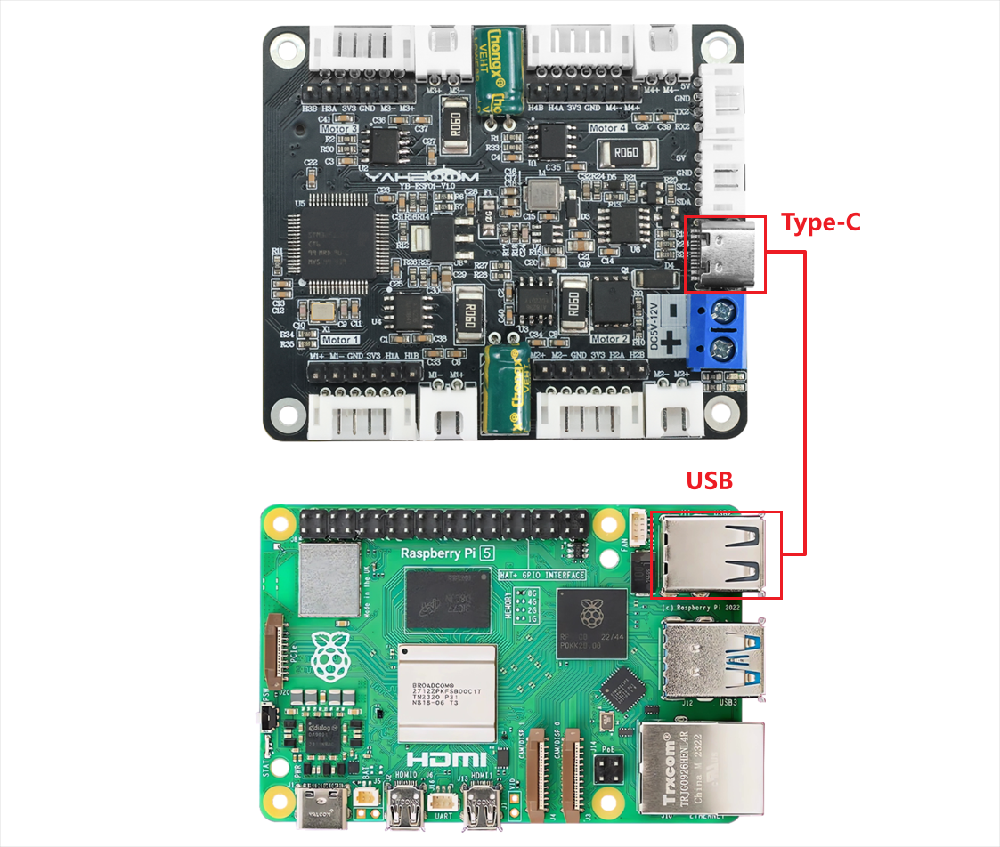

# Drive motor and read encoder-USART

1.1 Explanation Please read 《0. Motor introduction and usage》first to understand the motor parameters, wiring method, and power supply voltage you are currently using. To avoid improper operation and damage to the driver board or motor. I2C and serial communication cannot be shared, only one can be selected. Hardware wiring:



**1.2** **Instructions**

After the Raspberry Pi 5 board is connected to the USB of the driver
board, you can use the following command to check whether the serial
port is recognized.

```
ls /dev/ttyUSB*
```

In normally, /dev/ttyUSB0 will be displayed. If there is no ttyUSB0 but ttyUSB1, you need to change port='/dev/ttyUSB0' at the beginning of the code to port='/dev/ttyUSB1'

Then, use file transfer software, such as WinSCP, which needs to be searched and downloaded by yourself.

Transfer the py file to the root directory of the RDK board through the software, then open the terminal and run the command.

```
sudo python ~/USART.py
```


**1.3** **Code** **analysis**

```
UPLOAD_DATA = 3 #0:不接受数据 1:接收总的编码器数据 2:接收实时的编码器 3:接收电机当前速度
mm/s
#0: Do not receive data 1: Receive total encoder data 2:
Receive real-time encoder 3: Receive current motor speed mm/s
MOTOR_TYPE = 1 #1:520电机 2:310电机 3:测速码盘TT电机 4:TT直流减速电机 5:L型520电机
#1:520 motor 2:310 motor 3:speed code disc TT motor 4:TT DC
reduction motor 5:L type 520 motor
```

UPLOAD_DATA = 3 #0:不接受数据 1:接收总的编码器数据 2:接收实时的编码器 3:接收电机当前速度 mm/s #0: Do not receive data 1: Receive total encoder data 2: Receive real-time encoder 3: Receive current motor speed mm/s MOTOR_TYPE = 1 #1:520电机 2:310电机 3:测速码盘TT电机 4:TT直流减速电机 5:L型520电机 #1:520 motor 2:310 motor 3:speed code disc TT motor 4:TT DC reduction motor 5:L type 520 motor

If you need to drive the motor and observe the data, just modify the two
numbers at the beginning of the program. No changes are required to the
rest of the code.rinted motor value in the terminal
constantly changing.

