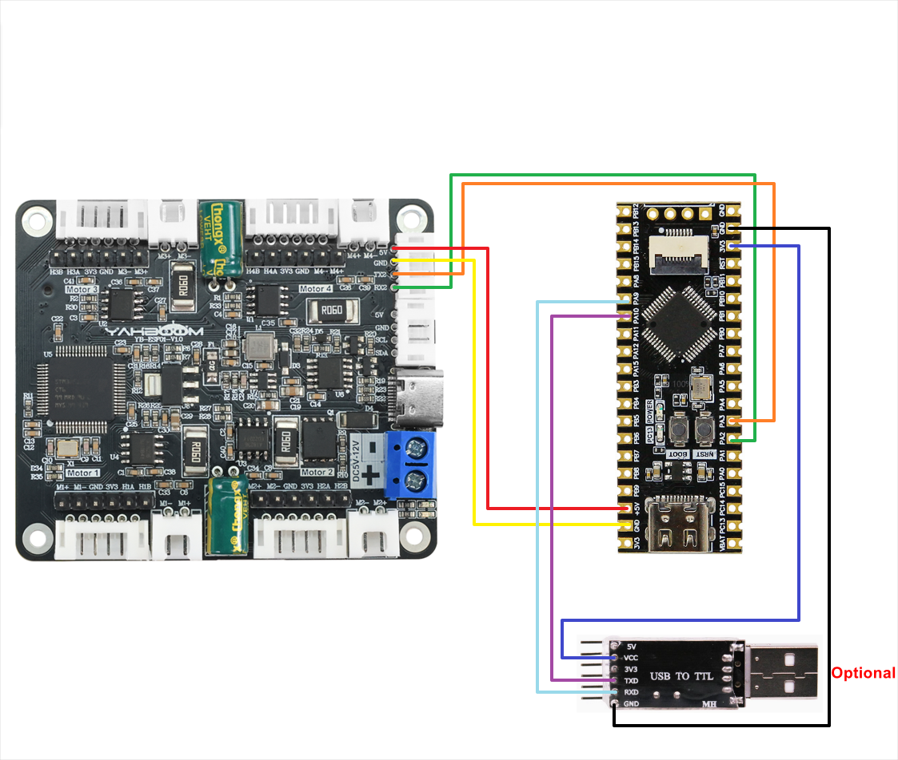
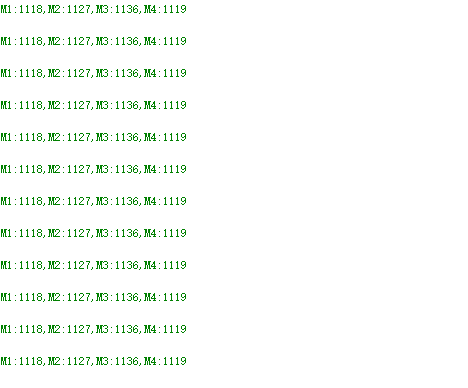

## For STM32

# Kontrol mobil dan baca encoder-USART

## 1.1 Penjelasan

Harap baca "0. Pengenalan dan Penggunaan Motor" terlebih dahulu untuk memahami parameter motor, metode pengkabelan, dan tegangan catu daya yang Anda gunakan. Hal ini untuk menghindari pengoperasian yang tidak tepat dan kerusakan pada papan driver atau motor.

Komunikasi I2C dan serial tidak dapat digunakan bersama, hanya satu yang dapat dipilih. STM32C8T6 dan RCT6 kompatibel dengan proyek ini.

**4 antarmuka motor pada modul sesuai dengan motor pada mobil robot, seperti yang ditunjukkan di bawah ini**

M1 -> Motor kiri atas (roda depan kiri mobil)

M2 -> Motor kiri bawah (roda belakang kiri mobil)

M3 -> Motor kanan atas (roda depan kanan mobil)

M4 -> Motor kanan bawah (roda belakang kanan mobil)

##### Pengkabelan perangkat keras:



| **4-channel motor drive board** | STM32C8T6/STM32RCT6 |
| :-----------------------------: | :-----------------: |
|               RX2               |         PA2         |
|               TX2               |         PA3         |
|               GND               |         GND         |
|               5V                |         5V          |

| Motor | **4-channel motor drive board**(Motor) |
| :---: | :------------------------------------: |
|  M2   |                   M-                   |
|   V   |                  3V3                   |
|   A   |                  H1B                   |
|   B   |                  H1A                   |
|   G   |                  GND                   |
|  M1   |                   M+                   |

Modul port serial USB ke TTL perlu dihubungkan untuk mencetak data encoder yang diproses.

Jika Anda menggunakan Yahboom STM32, Anda dapat langsung menghubungkan antarmuka TYPE-C pada papan pengembangan STM32 ke port USB komputer, dan Anda juga dapat mencapai pencetakan port serial, jadi Anda tidak perlu menghubungkan modul port serial USB ke TTL.

| USB TO TTL | STM32C8T6/STM32RCT6 |
| :--------: | :-----------------: |
|    VCC     |         3V3         |
|    GND     |         GND         |
|    RXD     |         PA9         |
|    TXD     |        PA10         |

Konfigurasi port serial: Baud rate 115200, tidak ada pemeriksaan paritas, tidak ada kontrol aliran perangkat keras, 1 stop bit

##### Catatan: Port serial di sini digunakan untuk mencetak data pada asisten port serial, bukan untuk komunikasi dengan papan driver

## 1.2 Analisis kode

```
#define UPLOAD_DATA 2  // 1:接收总的编码器数据 2:接收实时的编码器 1: Receive total encoder data 2: Receive real-time encoder data


#define MOTOR_TYPE 1   //1:520电机 2:310电机 3:测速码盘TT电机 4:TT直流减速电机 5:L型520电机
                       //1:520 motor 2:310 motor 3:speed code disc TT motor 4:TT DC reduction motor 5:L type 520 motor
```

- UPLOAD_DATA: digunakan untuk mengatur data enkoder motor. Atur 1 ke jumlah total pulsa enkoder dan 2 ke data pulsa waktu nyata 10 ms.
- MOTOR_TYPE: digunakan untuk mengatur jenis motor yang digunakan. Cukup ubah angka yang sesuai dengan komentar sesuai motor yang sedang Anda gunakan. Anda tidak perlu mengubah sisa kode.

Jika Anda perlu menggerakkan motor dan mengamati data, cukup ubah dua angka di awal program. Sisa kode tidak perlu diubah.

```
#if MOTOR_TYPE == 1
    send_motor_type(1);  // Konfigurasi tipe motor
    delay_ms(100);
    send_pulse_phase(30);  // Konfigurasi rasio reduksi. Periksa manual motor untuk mengetahuinya
    delay_ms(100);
    send_pulse_line(11);  // Konfigurasi garis cincin magnetik. Periksa manual motor untuk mendapatkan hasilnya
    delay_ms(100);
    send_wheel_diameter(67.00);  // Konfigurasi diameter roda dan ukur
    delay_ms(100);
    send_motor_deadzone(1900);  // Konfigurasi zona mati motor, hasil eksperimen
    delay_ms(100);
    
    #elif MOTOR_TYPE == 2
    send_motor_type(2);
    delay_ms(100);
    send_pulse_phase(20);
    delay_ms(100);
    send_pulse_line(13);
    delay_ms(100);
    send_wheel_diameter(48.00);
    delay_ms(100);
    send_motor_deadzone(1600);
    delay_ms(100);
    
    #elif MOTOR_TYPE == 3
    send_motor_type(3);
    delay_ms(100);
    send_pulse_phase(45);
    delay_ms(100);
    send_pulse_line(13);
    delay_ms(100);
    send_wheel_diameter(68.00);
    delay_ms(100);
    send_motor_deadzone(1250);
    delay_ms(100);
    
    #elif MOTOR_TYPE == 4
    send_motor_type(4);
    delay_ms(100);
    send_pulse_phase(48);
    delay_ms(100);
    send_motor_deadzone(1000);
    delay_ms(100);
    
    #elif MOTOR_TYPE == 5
    send_motor_type(1);
    delay_ms(100);
    send_pulse_phase(40);
    delay_ms(100);
    send_pulse_line(11);
    delay_ms(100);
    send_wheel_diameter(67.00);
    delay_ms(100);
    send_motor_deadzone(1900);
    delay_ms(100);
    #endif
```

Ini digunakan untuk menyimpan parameter motor Yahboom. Dengan memodifikasi parameter MOTOR_TYPE di atas, konfigurasi sekali klik dapat dilakukan.

Biasanya, jangan mengubah kode di sini saat menggunakan motor Yahboom.

Jika Anda menggunakan motor Anda sendiri, atau jika data tertentu perlu dimodifikasi sesuai kebutuhan Anda, Anda dapat memeriksa kursus《1.2 Perintah kontrol》 untuk memahami arti spesifik dari setiap perintah.

```
    while(1)
    {
        if(times>=250)
        {
            #if MOTOR_TYPE == 4
            Car_Move_PWM();
            #else
            Car_Move();
            #endif
            times = 0;
        }
        if(g_recv_flag == 1)
        {
            g_recv_flag = 0;
            
            #if UPLOAD_DATA == 1
                Deal_data_real();
                printf("M1:%d,M2:%d,M3:%d,M4:%d\r\n",Encoder_Now[0],Encoder_Now[1],Encoder_Now[2],Encoder_Now[3]);
            #elif UPLOAD_DATA == 2
                Deal_data_real();
                printf("M1:%d,M2:%d,M3:%d,M4:%d\r\n",Encoder_Offset[0],Encoder_Offset[1],Encoder_Offset[2],Encoder_Offset[3]);
            #elif UPLOAD_DATA == 3
                Deal_data_real();
                printf("M1:%.2f,M2:%.2f,M3:%.2f,M4:%.2f\r\n",g_Speed[0],g_Speed[1],g_Speed[2],g_Speed[3]);
            #endif
        }
    }


```

Pengatur waktu 100 ms diatur dalam program. Setiap kali interupsi pengatur waktu dipicu, variabel waktu akan bertambah satu. Ketika mencapai 25 kali, yaitu 2,5 detik, status gerak mobil akan berubah.

Jika tipe motornya 4, yaitu motor tanpa enkoder, maka versi PWM dari fungsi pengalih status mobil digunakan. Pada saat yang sama, data yang dikirim oleh papan driver dibaca dan data tersebut dicetak.

```
// Memeriksa data yang dikirim dari board driver, dan menyimpan data yang memenuhi protokol komunikasi
void Deal_Control_Rxtemp(uint8_t rxtemp)
{
    static u16 step = 0;
    static u8 start_flag = 0;
    if(rxtemp == '$' &&     start_flag == 0)
    {
        start_flag = 1;
        memset(g_recv_buff,0,RXBUFF_LEN);  // Bersihkan data
    }
    
    else if(start_flag == 1)
    {
            if(rxtemp == '#')
            {
                start_flag = 0;
                step = 0;
                g_recv_flag = 1;
                memcpy(g_recv_buff_deal,g_recv_buff,RXBUFF_LEN);  // Hanya yang benar yang akan ditugaskan
            }
            else
            {
                if(step > RXBUFF_LEN)
                {
                    start_flag = 0;
                    step = 0;
                    memset(g_recv_buff,0,RXBUFF_LEN);  // Bersihkan data yang diterima
                }
                else
                {
                    g_recv_buff[step] = rxtemp;
                    step++;
                }
            }
    }
    
}
// Memformat data yang disimpan dari board driver dan mempersiapkannya untuk dicetak
void Deal_data_real(void)
{
    static uint8_t data[RXBUFF_LEN];
    uint8_t  length = 0;
    
    // Encoder keseluruhan
     if ((strncmp("MAll",(char*)g_recv_buff_deal,4)==0))
    {
        length = strlen((char*)g_recv_buff_deal)-5;
        for (uint8_t i = 0; i < length; i++)
        {
            data[i] = g_recv_buff_deal[i+5];  // Hapus titik dua
        }  
                data[length] = '\0';    
                    
                char* strArray[10];  // Array pointer Panjangnya didefinisikan oleh nomor pemisahan char 1 byte char* 4 byte
                char mystr_temp[4][10] = {'\0'}; 
                splitString(strArray,(char*)data, ", ");  // Pisahkan dengan koma
                for (int i = 0; i < 4; i++)
                {
                        strcpy(mystr_temp[i],strArray[i]);
                        Encoder_Now[i] = atoi(mystr_temp[i]);
                }
                
        }
        // Data encoder real-time 10ms
        else if ((strncmp("MTEP",(char*)g_recv_buff_deal,4)==0))
    {
        length = strlen((char*)g_recv_buff_deal)-5;
        for (uint8_t i = 0; i < length; i++)
        {
            data[i] = g_recv_buff_deal[i+5];  // Hapus titik dua
        }  
                data[length] = '\0';        
                char* strArray[10];  // Array pointer Panjangnya didefinisikan oleh nomor pemisahan char 1 byte char* 4 byte
                char mystr_temp[4][10] = {'\0'}; 
                splitString(strArray,(char*)data, ", ");  // Pisahkan dengan koma
                for (int i = 0; i < 4; i++)
                {
                        strcpy(mystr_temp[i],strArray[i]);
                        Encoder_Offset[i] = atoi(mystr_temp[i]);
                }
        }
        // Kecepatan
        else if ((strncmp("MSPD",(char*)g_recv_buff_deal,4)==0))
    {
        length = strlen((char*)g_recv_buff_deal)-5;
        for (uint8_t i = 0; i < length; i++)
        {
            data[i] = g_recv_buff_deal[i+5];  // Hapus titik dua
        }  
                data[length] = '\0';    
                
                char* strArray[10];  // Array pointer Panjangnya didefinisikan oleh nomor pemisahan char 1 byte char* 4 byte
                char mystr_temp[4][10] = {'\0'}; 
                splitString(strArray,(char*)data, ", ");  // Pisahkan dengan koma
                for (int i = 0; i < 4; i++)
                {
                        strcpy(mystr_temp[i],strArray[i]);
                        g_Speed[i] = atof(mystr_temp[i]);
                }
        }
}
```

- Deal_Control_Rxtemp: Saring data yang diterima dan simpan data yang memenuhi protokol komunikasi.
- Deal_data_real: Ekstrak data asli yang disimpan dan rekonstruksi format cetak baru.

## 1.3 Fenomena Eksperimental

Setelah kabel terpasang dengan benar, tulis program ke motherboard. Setelah pengaturan ulang, Anda dapat melihat bahwa mobil akan bergerak maju selama 2,5 detik, mundur selama 2,5 detik, belok kanan selama 2,5 detik, belok kiri selama 2,5 detik, lalu berhenti selama 2,5 detik, dan melanjutkan tindakan pengalihan status di atas.

Pada saat yang sama, Anda dapat melihat bahwa nilai motor yang dicetak terus berubah dalam asisten port serial.



## 